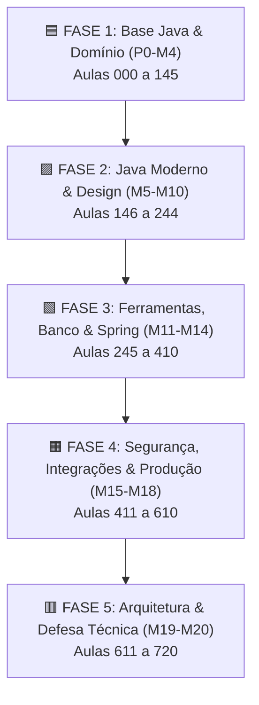

<div align="center">

# ☕ Formação Java Backend — Do Zero à Arquitetura

**Uma jornada prática, guiada e interativa com 721 aulas, simuladores visuais de execução e engenharia de software real.**

[](https://jdk.java.net/21/)
[](https://spring.io/projects/spring-boot)
[](https://www.docker.com/)
[](https://www.postgresql.org/)
[](https://formacao-java.vercel.app)
[](https://formacao-java.vercel.app)

---

### 🌐 [Acesse a Plataforma Web Gratuita](https://formacao-java.vercel.app)

</div>

---

## 📌 Sobre o Projeto

A **Formação Java Backend** é um ecossistema educacional completo construído para capacitar desenvolvedores desde os primeiros passos na programação até o nível de **Engenheiro de Software Backend / Arquiteto Java**.

Ao contrário de abordagens puramente teóricas ou superficiais, este repositório e a plataforma interativa entregam um **aprendizado baseado em evidências de execução**, com simuladores de memória em tempo real, auditorias de ambiente de terminal, clínicas de erros reais e projetos alinhados com os padrões da indústria corporativa.

---

## ⭐ Principais Diferenciais da Plataforma

| Recursos | Descrição |
| :--- | :--- |
| 🎮 **Simuladores Visuais Interativos** | Componentes web para inspeção visual de alocação de memória **Stack vs. Heap**, conversão em **Bytecode**, escopo de variáveis e passagem por valor vs. referência. |
| 🛠️ **Clínicas de Erros Práticos** | Aprendizado focado em diagnósticos reais: leitura de *stack traces*, `NullPointerException`, exceções de concorrência e falhas de compilação. |
| 📂 **Projetos do Mundo Real** | Construção incremental de aplicações CLI, APIs RESTful com Spring Boot, persistência com Hibernate/JPA, pipelines de CI/CD e sistemas orientados a eventos. |
| 🛡️ **Engenharia & Arquitetura** | Cobertura profunda de princípios SOLID, Padrões GoF, **DDD (Domain-Driven Design)**, Event Sourcing, CQRS e Arquitetura Hexagonal. |
| 📜 **100% Livre com Certificado** | Acesso aberto com acompanhamento de progresso salvo localmente e emissão de certificado oficial verficável. |

---

## 🗺️ Estrutura Curricular Completa (5 Fases / 21 Módulos)



### 🟦 FASE 1 — Base Java e Domínio (Aulas 000 a 145)
- **P0 · Abertura:** Metodologia de estudo, rotina de treino técnico e pacto de engenharia.
- **M0 · Ambiente & Ferramentas:** Configuração profissional do ambiente (JDK 21 LTS, IntelliJ IDEA, PowerShell, Git e Docker).
- **M1 · Java Fundamentos Absolutos:** Sintaxe, variáveis, operadores, controle de fluxo (`if`, `switch`, `for`, `while`), arrays e matrizes.
- **M2 · Java Core Profundo:** Arquitetura da JVM, modelo de memória, registros (`records`), leitura de documentação oficial e exceções iniciais.
- **M3 · Métodos & Projetos Console:** Quebra de responsabilidades, coesão, refatoração e desenvolvimento de utilitários em console.
- **M4 · Orientação a Objetos & Domínio:** Encapsulamento, construtores, validação de invariantes, modelagem de domínio e objetos imutáveis.

### 🟪 FASE 2 — Java Moderno, Collections e Design (Aulas 146 a 244)
- **M5 · Collections Framework:** `List`, `Set`, `Map`, `Queue`, algoritmos de ordenação e `Comparator`/`Comparable`.
- **M6 · Generics & Optional:** Tipos genéricos, wildcards (`PECS`), type erasure e encadeamento seguro com `Optional`.
- **M7 · Lambdas & Streams API:** Programação funcional moderna, `FunctionalInterfaces`, method references e Collectors avançados.
- **M8 · Exceptions, I/O & Utilitários:** Manipulação de arquivos, CSV robusto, Java Time API (`java.time`) e UUID.
- **M9 · Princípios SOLID:** Single Responsibility, Open/Closed, Liskov Substitution, Interface Segregation e Dependency Inversion na prática.
- **M10 · Design Patterns Backend:** Padrões GoF aplicados com critério (Strategy, Factory, Adapter, Observer, Template Method, State).

### 🟩 FASE 3 — Ferramentas, Banco de Dados e Spring (Aulas 245 a 410)
- **M11 · Ferramentas Backend:** Gerenciamento com Maven e Gradle, testes unitários com JUnit 5, qualidade com ArchUnit e Docker.
- **M12 · SQL & PostgreSQL:** Modelagem relacional, SQL ANSI, consultas avançadas, índices, transações e diagnósticos de banco.
- **M13 · Persistência Java:** Da origem com JDBC puro e DAO ao ORM avançado com JPA, Hibernate e Spring Data JPA.
- **M14 · Spring Boot & REST APIs:** Criação de APIs RESTful, DTOs, Bean Validation, tratamento global de exceções e documentação OpenAPI/Swagger.

### 🟧 FASE 4 — Segurança, Integrações e Produção (Aulas 411 a 610)
- **M15 · Segurança de Aplicações:** Spring Security 6, autenticação stateless JWT, OAuth2, RBAC e mitigações OWASP Top 10.
- **M16 · Mensageria & Integrações:** Consumo de APIs HTTP externas, mensageria assíncrona com RabbitMQ e Apache Kafka, Padrão Outbox e SAGAs.
- **M17 · DevOps, CI/CD & Cloud:** Conteinerização avançada com Dockerfile multi-stage, pipelines de CI/CD (GitHub Actions), Kubernetes e Cloud.
- **M18 · Observabilidade & Concorrência:** Logs estruturados, métricas com Micrometer/Prometheus, Distributed Tracing, tuning de JVM e `ExecutorService`.

### 🟥 FASE 5 — Arquitetura, DDD e Defesa Técnica (Aulas 611 a 720)
- **M19 · Arquitetura & DDD:** Domain-Driven Design (Aggregates, Value Objects, Domain Events), Arquitetura Limpa, CQRS e Event Sourcing.
- **M20 · Projeto Final & Carreira:** Desenvolvimento do projeto final defensável, estruturação de portfólio no GitHub e simulação de banca técnica.

---

## 🛠️ Stack Tecnológica

| Categoria | Tecnologias Utilizadas |
| :--- | :--- |
| **Linguagem & Runtime** | Java 21 LTS (Eclipse Temurin OpenJDK) |
| **Frameworks** | Spring Boot 3.x, Spring MVC, Spring Data JPA, Spring Security, Spring Cloud |
| **Bancos de Dados** | PostgreSQL, H2 Database, Flyway (Database Migrations) |
| **Mensageria & Filas** | Apache Kafka, RabbitMQ |
| **Testes & Qualidade** | JUnit 5, Mockito, Testcontainers, ArchUnit, WireMock |
| **DevOps & Deploy** | Docker, Docker Compose, Kubernetes, GitHub Actions, Vercel |
| **Ferramentas & IDE** | IntelliJ IDEA Community, Git, PowerShell |

---

## 🚀 Como Executar o Projeto Localmente

### Pré-requisitos
- **Java 21 LTS** ou superior instalado (`java -version`)
- **Node.js 18+** instalado (para a plataforma web)
- **Git** instalado

### 1. Clonar o Repositório
```bash
git clone https://github.com/thipacheco1/formacao-java-thiago.git
cd formacao-java-thiago
```

### 2. Executar a Plataforma Web Localmente
```bash
cd plataforma-curso
npm install
npm run dev
```
Após o comando, acesse no navegador: `http://localhost:5173`

---

## 📁 Estrutura do Repositório

```text
formacao-java-thiago/
├── docs/                        # Documentação técnica, matrizes e diários de estudo
│   └── revisao-aulas/           # Planos de revisão, matrizes das 721 aulas e blueprints
├── plataforma-curso/            # Aplicação Web (React + Vite + Tailwind/CSS)
│   ├── src/
│   │   ├── components/          # Componentes interativos e simuladores de aula
│   │   ├── data/                # Matriz curricular (coursePlan.js) e dados das lições
│   │   └── App.jsx              # Aplicação principal
│   └── package.json
└── README.md                    # Documentação oficial do projeto
```

---

## 👨‍💻 Autor & Contato

<table width="100%">
  <tr>
    <td width="150px" align="center">
      
    </td>
    <td>
      <h3>Thiago Jorge Pacheco</h3>
      <p>Engenheiro de Software & Criador da Formação Java Backend</p>
      <p>
        🌐 <b>Plataforma do Curso:</b> <a href="https://formacao-java.vercel.app">formacao-java.vercel.app</a><br/>
        💻 <b>GitHub:</b> <a href="https://github.com/thipacheco1">@thipacheco1</a>
      </p>
    </td>
  </tr>
</table>

---

<div align="center">

Desenvolvido com ☕ e foco em **Engenharia de Software de Alto Nível**.  
Se este projeto foi útil para seus estudos, considere deixar uma ⭐ **Star** neste repositório!

</div>