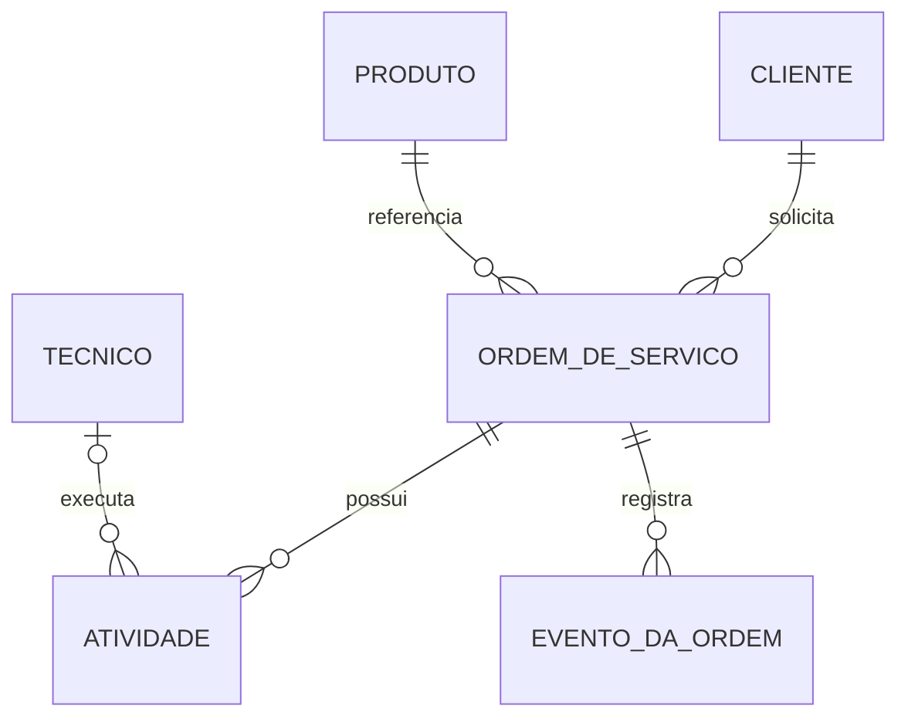

# 281 - M12.11 - Modelagem conceitual entidades atributos relacionamentos

## Apresentacao da aula

Na aula 280, você combinou tabelas com `INNER JOIN`, `LEFT JOIN`, `RIGHT JOIN`, `FULL JOIN` e `CROSS JOIN`. Também analisou multiplicidade, produto cartesiano, filtros no `ON` e no `WHERE` e a diferença entre foreign key e operação de consulta.

Os joins mostraram uma consequência importante do modelo relacional:

```text
os dados são separados em estruturas;
os relacionamentos conectam essas estruturas;
as consultas reúnem as informações quando necessário.
```

Agora vamos voltar um passo e responder uma pergunta anterior ao SQL:

```text
quais conceitos do negócio realmente precisam existir no modelo?
```

Essa pergunta pertence à modelagem conceitual.

Modelagem conceitual representa o domínio sem começar por tabelas, colunas, tipos, primary keys ou foreign keys. Ela busca entender:

- quais entidades existem;
- quais atributos descrevem cada entidade;
- como as entidades se relacionam;
- quais regras governam esses relacionamentos;
- qual é a identidade de cada conceito;
- quais informações podem ou devem existir;
- qual é a fronteira do problema que será modelado.

O modelo conceitual deve ser compreensível para pessoas técnicas e de negócio.

Em vez de começar com:

```text
cliente_id bigint;
ordem_servico_id bigint;
status varchar(30);
```

você começa com:

```text
Cliente solicita Ordem de Serviço;
Ordem de Serviço possui Atividades;
Produto é atendido por uma Ordem de Serviço;
Técnico executa Atividade;
Evento registra fatos importantes da Ordem de Serviço.
```

O objetivo não é produzir um diagrama bonito sem conteúdo. O modelo precisa traduzir regras reais.

Nesta aula, você vai construir uma primeira versão formal do domínio de Ordem de Serviço. O trabalho será feito em documentos Markdown, sem alterar o banco.

Você não vai criar:

```text
tabelas;
colunas;
tipos PostgreSQL;
primary keys;
foreign keys;
constraints;
scripts DDL.
```

Essas decisões pertencem à modelagem lógica e física.

A aula 282 transformará o modelo conceitual em um modelo lógico com cardinalidade, chaves e estruturas relacionais mais precisas.

Ao final desta aula, você deverá conseguir:

- diferenciar domínio, modelo e banco de dados;
- identificar entidades relevantes;
- separar entidade de atributo;
- reconhecer atributos simples, compostos, opcionais e derivados;
- registrar identidade conceitual sem escolher a chave física;
- nomear relacionamentos com verbos;
- descrever regras de negócio em linguagem clara;
- reconhecer cardinalidade e opcionalidade em nível conceitual;
- definir a fronteira do modelo;
- evitar modelagem orientada por tela ou tabela;
- produzir um dicionário conceitual;
- criar um diagrama inicial de Ordem de Serviço;
- preparar a transição para a modelagem lógica da aula 282.

---

## Onde estamos na formacao

A sequência imediata do M12 é:

```text
278:
consultas básicas.

279:
operadores e filtros.

280:
joins.

281:
modelagem conceitual.

282:
modelagem lógica, cardinalidade e chaves.

283:
normalização.
```

Até a aula 280, você trabalhou com um modelo já materializado no PostgreSQL.

Agora vai analisar o modelo a partir do negócio.

Isso é importante porque um banco não deveria nascer apenas de:

- telas existentes;
- planilhas antigas;
- nomes usados em uma API;
- classes Java atuais;
- tabelas de um sistema legado;
- convenções copiadas de outro projeto.

Essas fontes ajudam, mas não substituem o entendimento do domínio.

Uma tela pode misturar vários conceitos.

Uma classe Java pode estar adaptada a uma necessidade temporária.

Uma tabela legada pode carregar decisões antigas.

A modelagem conceitual pergunta:

```text
o que existe no negócio?
o que cada conceito representa?
qual regra precisa ser verdadeira?
```

O modelo conceitual não é independente da realidade técnica, mas ele não deve ser dominado por detalhes de implementação.

---

## Objetivo pratico

Você vai criar o laboratório:

```text
labs/m12/aula-281-modelagem-conceitual-entidades-atributos-relacionamentos
```

Estrutura final:

```text
labs
└── m12
    └── aula-281-modelagem-conceitual-entidades-atributos-relacionamentos
        ├── README.md
        ├── 01-fronteira-do-dominio.md
        ├── 02-entidades-e-definicoes.md
        ├── 03-atributos-conceituais.md
        ├── 04-relacionamentos-e-regras.md
        ├── 05-modelo-conceitual.md
        └── 06-revisao-do-modelo.md
```

O laboratório será documental.

Você vai:

1. definir a fronteira inicial do domínio;
2. levantar termos usados no negócio;
3. separar entidades, atributos e valores;
4. escrever definições conceituais;
5. identificar relacionamentos;
6. registrar regras em português;
7. representar cardinalidade de forma inicial;
8. criar um diagrama conceitual;
9. revisar ambiguidades e ausências;
10. preparar decisões para a aula 282.

O banco da aula 280 continua disponível, mas não será alterado.

Você pode consultá-lo para comparar nomes, porém o modelo conceitual não deve copiar automaticamente a estrutura física.

---

## Conceito essencial

### Dominio

Domínio é a área de conhecimento e regras que o sistema precisa representar.

Nesta formação, o recorte principal é:

```text
gestão de ordens de serviço e suas atividades.
```

Esse domínio pode envolver:

- clientes;
- produtos;
- ordens;
- atividades;
- técnicos;
- agendamentos;
- eventos;
- contratos;
- pagamentos;
- ocorrências;
- comunicação;
- auditoria.

Nem todos os conceitos precisam entrar na primeira versão.

Modelar também é decidir o que fica fora.

---

### Fronteira do modelo

A fronteira define o que será representado agora.

Para esta aula, a fronteira inicial será:

```text
Cliente;
Produto;
Ordem de Serviço;
Atividade;
Técnico;
Evento da Ordem de Serviço.
```

Ficarão fora da primeira versão:

```text
Contrato;
Pagamento;
Estoque;
Mensageria;
Checklist;
Cotação;
Endereço detalhado;
Usuário de autenticação.
```

Isso não significa que esses conceitos não existem.

Significa que eles não fazem parte do objetivo atual.

Uma fronteira clara evita um modelo que tenta resolver todo o sistema de uma vez.

---

### Modelo conceitual

Modelo conceitual é uma representação de alto nível dos conceitos e relacionamentos do domínio.

Ele deve responder:

```text
quais coisas relevantes existem?
como são reconhecidas?
quais propriedades possuem?
como se relacionam?
quais regras precisam ser verdadeiras?
```

Ele não deve começar por:

```text
tipo bigint;
varchar(100);
nome de schema;
índice;
sequence;
constraint SQL.
```

Esses elementos pertencem a níveis posteriores.

---

### Modelo conceitual, logico e fisico

#### Conceitual

Representa o negócio.

Exemplo:

```text
Cliente solicita Ordem de Serviço.
```

#### Lógico

Traduz o modelo para estruturas relacionais, ainda sem depender totalmente de um SGBD específico.

Exemplo:

```text
CLIENTE;
ORDEM_SERVICO;
relacionamento 1:N;
chave do cliente propagada para a ordem.
```

#### Físico

Define a implementação no PostgreSQL.

Exemplo:

```sql
cliente_id bigint NOT NULL
REFERENCES app.cliente (id)
```

A progressão correta é:

```text
negócio;
estrutura lógica;
implementação física.
```

Na prática profissional, ajustes entre os níveis acontecem. Mesmo assim, misturar tudo desde o início enfraquece o raciocínio.

---

### Entidade

Entidade é um conceito do domínio sobre o qual o sistema precisa manter informação e identidade.

Exemplos:

```text
Cliente;
Produto;
Ordem de Serviço;
Atividade;
Técnico.
```

Uma entidade costuma:

- possuir identidade;
- existir ao longo do tempo;
- ter atributos;
- participar de relacionamentos;
- sofrer mudanças de estado;
- ser referenciada por outros conceitos.

Exemplo:

```text
Ordem de Serviço:
é criada;
é agendada;
muda de status;
recebe atividades;
gera eventos;
pode ser concluída ou cancelada.
```

Isso mostra que ela possui ciclo de vida próprio.

---

### Entidade nao e tabela

No modelo físico, uma entidade frequentemente se torna uma tabela.

Mas a equivalência não é automática.

Uma entidade pode exigir:

- mais de uma tabela;
- uma tabela compartilhada;
- estruturas auxiliares;
- histórico separado;
- componentes incorporados;
- herança;
- documentos;
- projeções.

O modelo conceitual não deve ser limitado pela pergunta:

```text
qual tabela vou criar?
```

Primeiro pergunte:

```text
qual conceito preciso representar?
```

---

### Entidade forte e conceito dependente

Alguns conceitos possuem identidade e ciclo de vida independentes.

Exemplo:

```text
Cliente.
```

Outros dependem de um contexto.

Exemplo:

```text
Atividade de uma Ordem de Serviço.
```

Uma atividade não faz sentido no domínio sem a ordem à qual pertence.

Isso não significa que ela não é entidade.

Ela ainda pode possuir:

- identidade;
- status;
- descrição;
- duração;
- técnico responsável;
- datas próprias.

A dependência será refletida no relacionamento.

---

### Atributo

Atributo descreve uma entidade.

Exemplos de Cliente:

```text
nome;
documento;
email;
situação.
```

Exemplos de Ordem de Serviço:

```text
código;
status;
prioridade;
data agendada;
descrição do problema.
```

O atributo não existe como conceito independente no mesmo nível da entidade.

Pergunta útil:

```text
o sistema precisa manter identidade e ciclo de vida próprios para isso?
```

Se não, provavelmente é um atributo.

---

### Entidade ou atributo

Considere:

```text
Endereço.
```

Ele pode ser apenas um atributo composto do cliente:

```text
logradouro;
número;
cidade;
CEP.
```

Mas pode ser uma entidade quando:

- vários registros o referenciam;
- possui identidade própria;
- precisa de histórico;
- participa de regras;
- é reutilizado;
- muda independentemente.

A resposta depende do domínio.

Não existe uma lista universal dizendo que determinado termo é sempre entidade ou sempre atributo.

---

### Atributo simples

Atributo simples é tratado como uma unidade conceitual.

Exemplos:

```text
nome;
status;
prioridade;
valor;
data de abertura.
```

Mesmo que o valor possua estrutura interna, o domínio atual pode tratá-lo como unidade.

---

### Atributo composto

Atributo composto pode ser dividido em partes com significado.

Exemplo:

```text
Nome completo:
nome;
sobrenome.
```

Exemplo:

```text
Endereço:
logradouro;
número;
complemento;
bairro;
cidade;
estado;
CEP.
```

A decisão depende das operações necessárias.

Se o sistema precisa filtrar por cidade, cidade não deveria ficar escondida em um texto livre de endereço.

---

### Atributo multivalorado

Um atributo multivalorado pode possuir vários valores para a mesma entidade.

Exemplo:

```text
telefones do cliente.
```

Se o cliente pode possuir vários telefones, tratar tudo como um único texto pode causar problemas:

```text
"11999990000; 1133334444"
```

No modelo conceitual, registre:

```text
Cliente possui zero ou mais Telefones.
```

Isso pode levar à identificação de uma nova entidade ou conceito dependente no modelo lógico.

Nesta aula, Telefone ficará fora do diagrama principal, mas será usado no exercício.

---

### Atributo derivado

Atributo derivado pode ser calculado a partir de outros dados.

Exemplos:

```text
idade:
derivada da data de nascimento.

duração real:
derivada de início e fim.

valor total da ordem:
derivado das atividades ou itens.

quantidade de atividades:
derivada do relacionamento.
```

Pergunte:

```text
precisa ser armazenado?
pode ser calculado?
o valor precisa de histórico?
o cálculo pode mudar?
```

Não armazene toda informação calculável sem analisar consistência e custo.

---

### Atributo opcional

Atributo opcional pode estar ausente em determinado momento.

Exemplos:

```text
email do cliente;
data de agendamento antes do planejamento;
início real antes da execução;
fim real antes da conclusão.
```

Opcionalidade não significa falta de qualidade.

Ela pode representar um estado legítimo do ciclo de vida.

---

### Identidade conceitual

Identidade responde:

```text
como reconhecemos que este é o mesmo objeto do domínio?
```

No modelo conceitual, não é necessário decidir imediatamente se a implementação usará:

```text
bigint;
UUID;
chave natural;
chave composta.
```

Você deve registrar:

```text
Cliente possui uma identidade própria.

Ordem de Serviço possui identidade própria e um código de negócio.

Atividade possui identidade dentro do ciclo da ordem.

Produto possui identidade e código de negócio.
```

A aula 282 transformará essas ideias em chaves lógicas.

---

### Identidade e codigo de negocio

Uma entidade pode ter:

```text
identidade técnica;
identificador de negócio.
```

Exemplo:

```text
Ordem de Serviço:
identidade interna;
código visível ao negócio.
```

O código pode ser usado em atendimento e integração.

A identidade interna pode garantir estabilidade mesmo se o código mudar.

No modelo conceitual, registre os dois papéis sem escolher ainda o tipo físico.

---

### Relacionamento

Relacionamento representa uma associação significativa entre entidades.

Exemplos:

```text
Cliente solicita Ordem de Serviço.

Ordem de Serviço refere-se a Produto.

Ordem de Serviço possui Atividade.

Técnico executa Atividade.

Ordem de Serviço registra Evento.
```

Nomeie relacionamentos com verbos.

Evite linhas sem significado:

```text
Cliente — Ordem.
```

Prefira:

```text
Cliente solicita Ordem de Serviço.
```

O verbo comunica a natureza da associação.

---

### Papel no relacionamento

Uma entidade pode participar de relacionamentos diferentes.

Exemplo:

```text
Técnico executa Atividade.

Supervisor aprova Atividade.
```

Mesmo que Técnico e Supervisor sejam pessoas, os papéis são diferentes.

O modelo deve representar o papel relevante.

Não use nomes genéricos quando o relacionamento possui significado específico.

---

### Cardinalidade conceitual

Cardinalidade responde quantas ocorrências podem participar do relacionamento.

Exemplos iniciais:

```text
um Cliente pode solicitar várias Ordens de Serviço;

cada Ordem de Serviço pertence a um Cliente;

uma Ordem de Serviço pode possuir várias Atividades;

cada Atividade pertence a uma Ordem de Serviço.
```

Representação simplificada:

```text
Cliente 1 ---- N Ordem de Serviço

Ordem de Serviço 1 ---- N Atividade
```

A aula 282 aprofundará notação, chaves e implementação lógica.

Nesta aula, o foco é escrever a regra corretamente em linguagem do domínio.

---

### Opcionalidade do relacionamento

Opcionalidade responde se a participação é obrigatória.

Exemplo:

```text
uma Ordem de Serviço precisa possuir Cliente.

um Cliente pode existir sem Ordem de Serviço.

uma Atividade pode ainda não possuir Técnico.

um Técnico pode existir sem Atividade atribuída.
```

Representação conceitual:

```text
Cliente:
zero ou muitas ordens.

Ordem de Serviço:
exatamente um cliente.

Atividade:
zero ou um técnico responsável.

Técnico:
zero ou muitas atividades.
```

As regras precisam refletir o ciclo de vida.

---

### Regra de negocio

Regra de negócio é uma condição que o domínio exige.

Exemplos:

```text
toda Ordem de Serviço pertence a um Cliente;

toda Atividade pertence a uma Ordem de Serviço;

uma Atividade concluída deve possuir fim real;

uma Ordem cancelada não recebe novas Atividades;

um Técnico inativo não pode receber nova atribuição;

um Evento registra um fato ocorrido na Ordem.
```

Nem toda regra será representada apenas pelo diagrama.

Por isso, o modelo conceitual deve incluir texto.

---

### Evento como entidade

Evento da Ordem de Serviço registra um fato relevante.

Exemplos:

```text
ordem criada;
agendamento realizado;
atendimento iniciado;
status alterado;
ordem concluída.
```

Ele possui:

- identidade;
- tipo;
- descrição;
- momento;
- relação com a ordem.

Um evento não é apenas um atributo porque existem várias ocorrências ao longo do tempo.

---

### Status como atributo ou entidade

No modelo atual, Status será tratado como atributo da Ordem e da Atividade.

Isso é adequado quando:

- o conjunto é pequeno;
- não precisa de identidade própria;
- não possui metadados complexos;
- não precisa ser parametrizado.

Status poderia se tornar entidade ou conceito próprio se possuísse:

- nome configurável;
- ordem de fluxo;
- permissões;
- transições;
- regras externas;
- tradução;
- vigência.

A decisão depende da complexidade do domínio.

---

### Tecnico como entidade

Técnico possui identidade e ciclo de vida próprios.

Atributos possíveis:

```text
código;
nome;
documento;
email;
tipo;
situação.
```

Relacionamento inicial:

```text
Técnico executa Atividade.
```

Uma atividade pode ainda não possuir técnico enquanto aguarda distribuição.

A opcionalidade precisa aparecer no modelo.

---

### Fronteira e conceitos externos

Cliente, Produto e Técnico podem ser administrados por outros módulos.

Mesmo assim, aparecem no modelo porque a Ordem de Serviço se relaciona com eles.

O modelo conceitual pode marcar:

```text
entidade interna ao domínio;
entidade de referência externa;
conceito compartilhado.
```

Nesta aula:

```text
Ordem de Serviço;
Atividade;
Evento:
núcleo do recorte.

Cliente;
Produto;
Técnico:
entidades de referência relacionadas.
```

---

### Nomes do dominio

Use nomes reconhecidos por pessoas do negócio.

Evite siglas técnicas sem definição.

Exemplo ruim:

```text
OS_HDR;
OS_DTL;
EVT_LOG.
```

Exemplo conceitual:

```text
Ordem de Serviço;
Atividade;
Evento da Ordem de Serviço.
```

No modelo físico, nomes podem seguir convenções técnicas.

No modelo conceitual, clareza de negócio é prioridade.

---

### Modelo orientado por tela

Uma tela chamada “Cadastro de Ordem” pode possuir campos de:

- cliente;
- produto;
- técnico;
- atividades;
- endereço;
- pagamento.

Isso não significa que tudo pertence a uma única entidade.

Tela organiza interação.

Modelo organiza conceitos e regras.

Não crie uma entidade por tela nem uma entidade para cada seção visual sem analisar o domínio.

---

### Modelo orientado por classe

Uma classe Java pode combinar dados para responder uma API.

Exemplo:

```text
OrdemDetalhadaResponse
```

Ela pode reunir:

- ordem;
- cliente;
- produto;
- atividades.

Isso não significa que `OrdemDetalhadaResponse` é entidade do domínio.

DTOs, responses e views são formas de transporte ou apresentação.

O modelo conceitual representa o negócio.

---

### Modelo orientado por tabela legada

Uma tabela antiga pode conter:

```text
cliente_nome;
produto_nome;
ordem_codigo;
atividade_descricao;
tecnico_nome.
```

O modelo conceitual não deve assumir que essa estrutura é correta.

Use o legado como fonte de descoberta, não como verdade automática.

---

## Mao na massa guiada

### 1. Criar o laboratorio

Na raiz do repositório:

```powershell
New-Item -ItemType Directory -Force `
  -Path "labs\m12\aula-281-modelagem-conceitual-entidades-atributos-relacionamentos"

Set-Location `
  "labs\m12\aula-281-modelagem-conceitual-entidades-atributos-relacionamentos"
```

Nenhum arquivo SQL será criado.

---

### 2. Criar 01-fronteira-do-dominio.md

Crie:

```text
01-fronteira-do-dominio.md
```

Registre o objetivo:

```text
Representar o núcleo de gestão de Ordens de Serviço,
suas Atividades, referências e eventos.
```

Inclua:

```text
Dentro da fronteira:

Cliente;
Produto;
Ordem de Serviço;
Atividade;
Técnico;
Evento da Ordem de Serviço.
```

E:

```text
Fora da fronteira nesta versão:

Contrato;
Pagamento;
Estoque;
Mensageria;
Checklist;
Cotação;
Autenticação;
Endereço detalhado.
```

Para cada item fora, escreva uma frase justificando que ele poderá ser integrado em versões futuras.

---

### 3. Criar 02-entidades-e-definicoes.md

Crie:

```text
02-entidades-e-definicoes.md
```

Use a estrutura:

```text
Nome;
Definição;
Responsabilidade;
Ciclo de vida;
Identidade conceitual;
Relacionamentos principais.
```

Defina:

#### Cliente

```text
Pessoa ou organização que solicita ou recebe o atendimento.
```

#### Produto

```text
Bem relacionado à necessidade de atendimento.
```

#### Ordem de Serviço

```text
Registro central que organiza uma demanda de atendimento.
```

#### Atividade

```text
Unidade de trabalho executada dentro de uma Ordem de Serviço.
```

#### Técnico

```text
Profissional que pode ser responsável pela execução de uma Atividade.
```

#### Evento da Ordem de Serviço

```text
Registro de um fato relevante ocorrido no ciclo da Ordem.
```

Não use nomes de tabelas ou tipos SQL.

---

### 4. Criar 03-atributos-conceituais.md

Crie:

```text
03-atributos-conceituais.md
```

Monte uma tabela para cada entidade.

Exemplo:

| Entidade | Atributo | Significado | Obrigatório no conceito? | Observação |
|---|---|---|---|---|
| Cliente | Nome | Nome reconhecido no atendimento | Sim | Não pode ser vazio |
| Cliente | Documento | Identificação de negócio | Sim | Deve ser único no contexto |
| Cliente | Email | Canal eletrônico | Não | Pode ser desconhecido |
| Cliente | Situação | Indica se pode participar de novos fluxos | Sim | Ativo ou inativo |

Faça o mesmo para as seis entidades.

Use nomes conceituais:

```text
Momento de criação;
Data de agendamento;
Início real;
Fim real;
Duração prevista;
Valor previsto;
Prioridade;
Situação.
```

Não use:

```text
timestamptz;
numeric;
boolean;
bigint.
```

---

### 5. Classificar atributos

No mesmo arquivo, classifique exemplos:

```text
simples;
composto;
opcional;
derivado;
multivalorado.
```

Registre:

```text
Duração real da Atividade:
derivada de início real e fim real.

Email do Cliente:
opcional.

Telefones do Cliente:
multivalorado e fora do modelo principal.

Endereço:
composto e fora da fronteira atual.

Valor total da Ordem:
possivelmente derivado das Atividades.
```

Explique por que cada classificação importa.

---

### 6. Criar 04-relacionamentos-e-regras.md

Crie:

```text
04-relacionamentos-e-regras.md
```

Registre os relacionamentos:

```text
Cliente solicita Ordem de Serviço.

Ordem de Serviço refere-se a Produto.

Ordem de Serviço possui Atividade.

Técnico executa Atividade.

Ordem de Serviço registra Evento da Ordem de Serviço.
```

Para cada relacionamento, responda:

```text
Qual é o verbo?

Qual entidade participa de cada lado?

A participação é obrigatória?

Quantas ocorrências podem existir?

Qual regra de negócio sustenta a relação?
```

Exemplo:

```text
Relacionamento:
Cliente solicita Ordem de Serviço.

Regra:
Toda Ordem de Serviço pertence a exatamente um Cliente.

Regra:
Um Cliente pode existir sem Ordem de Serviço.

Regra:
Um Cliente pode solicitar várias Ordens de Serviço.
```

---

### 7. Criar 05-modelo-conceitual.md

Crie:

```text
05-modelo-conceitual.md
```

Adicione a representação textual:

```text
CLIENTE
  solicita
ORDEM DE SERVICO
  refere-se a
PRODUTO

ORDEM DE SERVICO
  possui
ATIVIDADE

TECNICO
  executa
ATIVIDADE

ORDEM DE SERVICO
  registra
EVENTO DA ORDEM
```

Depois adicione cardinalidade inicial:

```text
CLIENTE 1 -------- 0..N ORDEM DE SERVICO

PRODUTO 1 -------- 0..N ORDEM DE SERVICO

ORDEM DE SERVICO 1 -------- 0..N ATIVIDADE

TECNICO 0..1 -------- 0..N ATIVIDADE

ORDEM DE SERVICO 1 -------- 0..N EVENTO DA ORDEM
```

Explique em português cada linha.

A notação será refinada na aula 282.

---

### 8. Criar um diagrama Mermaid

Ainda em `05-modelo-conceitual.md`, adicione:



O diagrama é uma representação inicial.

Não adicione tipos ou nomes de colunas.

---

### 9. Registrar regras de negocio

Abaixo do diagrama, registre pelo menos dez regras:

1. toda Ordem de Serviço pertence a um Cliente;
2. toda Ordem de Serviço refere-se a um Produto;
3. um Cliente pode existir sem Ordem;
4. um Produto pode existir sem Ordem;
5. uma Ordem pode ser criada antes de possuir Atividades;
6. toda Atividade pertence a uma Ordem;
7. uma Atividade pode aguardar Técnico;
8. um Técnico pode executar várias Atividades;
9. toda ocorrência de Evento pertence a uma Ordem;
10. uma Atividade concluída deve possuir início e fim reais;
11. fim real não pode ser anterior ao início;
12. uma Ordem cancelada não deve receber nova Atividade.

Diferencie:

```text
regra estrutural;
regra de estado;
regra temporal;
regra operacional.
```

---

### 10. Criar 06-revisao-do-modelo.md

Crie:

```text
06-revisao-do-modelo.md
```

Use um checklist crítico:

```text
Cada entidade possui definição?

Cada entidade possui identidade conceitual?

Os atributos pertencem à entidade correta?

Existe atributo que deveria ser entidade?

Existe entidade que é apenas atributo?

Os relacionamentos possuem verbos?

A opcionalidade está coerente com o ciclo de vida?

A cardinalidade está descrita em português?

Existem conceitos fora da fronteira?

Há nomes técnicos demais?

O modelo foi copiado da tabela física?

Existem regras não representadas no diagrama?

O modelo responde ao objetivo definido?
```

Para cada item, registre a conclusão.

---

### 11. Criar README.md

Crie:

```text
README.md
```

Registre:

```text
Título:
Aula 281 - Modelagem conceitual entidades atributos relacionamentos.

Objetivo:
representar o domínio antes da estrutura lógica e física.

Fronteira:
Cliente, Produto, Ordem de Serviço, Atividade, Técnico e Evento.

Regra:
não criar tabelas, tipos, PKs, FKs ou scripts SQL.

Entregáveis:
fronteira, entidades, atributos, relacionamentos, diagrama e revisão.

Próxima aula:
modelagem lógica, cardinalidade e chaves.
```

Liste os arquivos produzidos.

---

## Entendendo o que foi feito

### O modelo deixou de ser apenas estrutura de banco

Você passou a falar em:

```text
Cliente;
Ordem de Serviço;
Atividade;
Técnico;
Evento.
```

Em vez de começar por:

```text
tabela;
coluna;
tipo;
constraint.
```

Isso aproxima o modelo do negócio.

---

### Entidade foi separada de atributo

Você analisou se um conceito possui:

- identidade;
- ciclo de vida;
- relacionamentos;
- regras próprias.

Essa análise evita transformar tudo em coluna ou criar entidades artificiais.

---

### Relacionamentos receberam significado

O modelo não possui apenas linhas entre caixas.

Ele possui verbos:

```text
solicita;
refere-se;
possui;
executa;
registra.
```

O verbo torna a relação compreensível.

---

### Opcionalidade refletiu o ciclo de vida

Uma atividade pode existir sem técnico atribuído.

Uma ordem pode existir antes de receber atividades.

Um cliente pode existir sem possuir ordem.

Essas ausências são estados válidos, não necessariamente erros.

---

### O diagrama nao substituiu as regras

O diagrama resumiu a estrutura.

Os documentos explicaram:

- significado;
- obrigatoriedade;
- cardinalidade;
- estado;
- tempo;
- operação.

Um modelo conceitual completo combina representação visual e texto.

---

## Erros comuns importantes

### Comecar por tabela

Sintoma:

```text
a discussão começa por varchar, bigint e foreign key.
```

Correção:

```text
volte ao conceito, à regra e ao relacionamento.
```

---

### Transformar toda palavra em entidade

Nem todo substantivo precisa de identidade própria.

Pergunte se possui ciclo de vida, regras e relacionamentos.

---

### Copiar a tela

Uma tela pode reunir dados de várias entidades.

Modele o domínio, não a disposição visual.

---

### Relacionamento sem verbo

Uma linha sem nome não explica o significado.

Use uma frase que possa ser lida nos dois sentidos.

---

### Cardinalidade baseada em caso atual

O dataset possui três clientes e quatro ordens, mas cardinalidade não é contagem atual.

Ela representa a regra possível do domínio.

---

## Comandos uteis

Esta aula não possui comandos SQL.

Comandos de arquivos:

```powershell
Get-ChildItem -Recurse `
  "labs\m12\aula-281-modelagem-conceitual-entidades-atributos-relacionamentos"

git status
git diff
```

---

## Exercicio guiado

### Parte 1 - Incluir Agendamento

Analise o conceito:

```text
Agendamento.
```

Decida se ele deve ser:

```text
atributo da Ordem;
atributo da Atividade;
entidade própria;
conceito fora da fronteira.
```

Considere:

- pode existir mais de um reagendamento;
- precisa de histórico;
- possui período;
- possui motivo;
- pode ser cancelado;
- pode referir-se a uma atividade específica.

Escreva uma decisão justificada.

Não altere o diagrama principal antes de concluir a análise.

---

### Parte 2 - Incluir Telefone

Analise:

```text
Cliente pode possuir vários Telefones.
```

Responda:

1. Telefone é atributo simples?
2. É multivalorado?
3. Precisa de tipo, prioridade ou confirmação?
4. Pode ser entidade dependente?
5. Está dentro da fronteira atual?

Registre a decisão.

---

### Parte 3 - Revisar Status

Compare:

```text
Status como atributo.

Status como entidade.
```

Liste vantagens e custos de cada opção.

Mantenha Status como atributo no modelo atual, salvo se sua justificativa demonstrar necessidade real de entidade.

---

### Parte 4 - Identificar atributos derivados

Marque como derivados ou armazenados:

```text
duração real;
valor total da ordem;
quantidade de atividades;
situação atual;
data da última alteração.
```

Explique quais riscos existem ao armazenar valores calculáveis.

---

### Parte 5 - Regra nao representada no diagrama

Escolha três regras que não ficam totalmente visíveis no diagrama.

Exemplos:

```text
fim real não pode ser anterior ao início;

ordem cancelada não recebe atividade;

técnico inativo não recebe atribuição.
```

Registre onde essas regras serão documentadas e futuramente implementadas.

---

### Parte 6 - Revisao por perguntas

Responda:

1. Qual é a entidade central?
2. Quais entidades são referências externas?
3. Qual entidade depende da Ordem?
4. Qual relacionamento é opcional?
5. Qual conceito possui histórico?
6. Qual atributo pode ser derivado?
7. Qual conceito ficou fora da fronteira?
8. Qual regra exige mais do que cardinalidade?
9. Qual decisão deve esperar a aula 282?
10. Qual parte do banco atual pode estar influenciando indevidamente o modelo?

---

## Criterios de aceite

- o laboratório oficial da aula 281 existe;
- nenhum arquivo SQL foi criado;
- nenhuma tabela foi alterada;
- a fronteira do domínio foi definida;
- conceitos dentro e fora da fronteira foram registrados;
- seis entidades principais foram definidas;
- cada entidade possui responsabilidade e identidade conceitual;
- entidade e atributo foram diferenciados;
- atributos simples, compostos, opcionais, derivados e multivalorados foram analisados;
- identidade conceitual foi separada de chave física;
- código de negócio foi separado de identidade;
- relacionamentos receberam verbos;
- cardinalidade foi descrita em português;
- opcionalidade refletiu o ciclo de vida;
- regras estruturais, temporais e operacionais foram registradas;
- o diagrama conceitual foi criado;
- o diagrama não possui tipos SQL;
- telas, classes e tabelas legadas não foram tratadas como verdade automática;
- Agendamento, Telefone e Status foram analisados no exercício;
- o modelo foi revisado criticamente;
- README e documentos estão prontos;
- commit recomendado pode ser realizado.

---

## Commit recomendado

Na raiz:

```powershell
git status
git diff
```

Adicione:

```powershell
git add `
  labs/m12/aula-281-modelagem-conceitual-entidades-atributos-relacionamentos
```

Confira:

```powershell
git status
```

Commit recomendado:

```powershell
git commit -m "docs(m12): modelar dominio conceitualmente"
```

Valide:

```powershell
git log -1 --oneline
```

O commit representa:

```text
fronteira do domínio;
entidades;
atributos;
relacionamentos;
regras;
diagrama conceitual.
```

---

## Fechamento e ponte para a proxima aula

Nesta aula, você saiu da sintaxe SQL e voltou ao domínio.

Aprendeu:

```text
domínio;
fronteira;
modelo conceitual;
entidade;
atributo;
identidade conceitual;
relacionamento;
verbo;
cardinalidade;
opcionalidade;
regra de negócio;
atributo composto;
atributo multivalorado;
atributo derivado.
```

As regras principais foram:

```text
modele conceitos antes de tabelas;

não confunda entidade com atributo;

não crie entidade por tela;

não copie tabela legada automaticamente;

nomeie relacionamentos com verbos;

descreva cardinalidade em linguagem clara;

trate ausência como parte possível do ciclo de vida;

registre regras que o diagrama não mostra;

defina uma fronteira;
não modele o sistema inteiro de uma vez.
```

A próxima aula será:

```text
282 - M12.12 - Modelagem logica cardinalidade chaves e estrutura relacional
```

Nela, você vai transformar o modelo conceitual em estrutura lógica:

- entidades lógicas;
- atributos estruturados;
- chaves candidatas;
- chave primária lógica;
- chaves estrangeiras;
- cardinalidade;
- opcionalidade;
- relacionamento um para um;
- relacionamento um para muitos;
- relacionamento muitos para muitos;
- entidades associativas;
- propagação de chaves;
- dicionário lógico;
- preparação para normalização na aula 283.

Não altere o modelo físico agora.

Primeiro conclua e revise os documentos conceituais.

---

# Material complementar

## Checkpoint final

- [ ] Defini a fronteira e as entidades do domínio.
- [ ] Classifiquei atributos e identidades conceituais.
- [ ] Nomeei relacionamentos e registrei regras.
- [ ] Criei o diagrama, revisei o modelo e fiz o commit.

---

## Troubleshooting adicional

### Diagrama ficou grande demais

Reduza a fronteira.

Crie modelos por contexto e mantenha referências externas apenas quando necessárias.

### Entidade sem identidade

Reavalie se o conceito é realmente entidade ou atributo.

Também verifique se a identidade ainda não foi descoberta.

### Atributo com muitos campos misturados

Pode ser atributo composto ou entidade dependente.

Analise operações e regras.

### Relacionamento ambiguo

Substitua a linha por uma frase:

```text
quem faz o quê com quem?
```

### Regra conflitante

Registre a dúvida.

Modelagem também revela perguntas que precisam ser respondidas pelo negócio.

---

## Perguntas de revisao

1. O que é domínio?
2. O que é fronteira?
3. O que o modelo conceitual representa?
4. Qual a diferença entre modelo conceitual, lógico e físico?
5. O que caracteriza uma entidade?
6. Por que entidade não é sinônimo de tabela?
7. O que é atributo?
8. Como decidir entre entidade e atributo?
9. O que é atributo composto?
10. O que é atributo multivalorado?
11. O que é atributo derivado?
12. O que é identidade conceitual?
13. Qual a diferença entre identidade e código de negócio?
14. O que é relacionamento?
15. Por que usar verbos?
16. O que é cardinalidade?
17. O que é opcionalidade?
18. Por que o diagrama não basta?

---

## Roteiro de resposta

1. Área de conhecimento e regras do sistema.
2. Recorte que define o que será modelado.
3. Conceitos, atributos, relacionamentos e regras do negócio.
4. Conceitual descreve o negócio; lógico estrutura relações; físico implementa no SGBD.
5. Identidade, ciclo de vida, atributos e relacionamentos.
6. A implementação pode exigir estruturas diferentes.
7. Propriedade que descreve uma entidade.
8. Analise identidade, ciclo de vida e regras próprias.
9. Atributo divisível em partes com significado.
10. Atributo com vários valores para a mesma entidade.
11. Valor calculável a partir de outros.
12. Forma de reconhecer o mesmo conceito ao longo do tempo.
13. Código é identificador de negócio; identidade pode ser interna e estável.
14. Associação significativa entre entidades.
15. O verbo explica a natureza da associação.
16. Quantidade possível de participantes.
17. Obrigatoriedade da participação.
18. Regras temporais e operacionais precisam de texto.

---

## Desafio opcional

Modele conceitualmente:

```text
Checklist da Atividade.
```

Considere:

- uma Atividade pode possuir Checklist;
- Checklist possui Perguntas;
- Pergunta pode depender de resposta anterior;
- Resposta é registrada para uma Pergunta;
- perguntas exibidas podem ser obrigatórias;
- versões do Checklist podem existir.

Defina:

- fronteira;
- entidades;
- atributos;
- relacionamentos;
- regras;
- dúvidas abertas.

Não crie tabelas.

---

## Atualizacao do diario de bordo

Adicione ao arquivo:

```text
docs/diario-de-bordo.md
```

O bloco:

```markdown
### Aula 281 - M12.11 - Modelagem conceitual entidades atributos relacionamentos

- Diferenciei domínio, fronteira e modelo.
- Entendi a diferença entre modelos conceitual, lógico e físico.
- Identifiquei entidades pelo ciclo de vida, identidade e regras.
- Diferenciei entidade de atributo.
- Analisei atributos simples, compostos, opcionais, derivados e multivalorados.
- Separei identidade conceitual de chave física e código de negócio.
- Nomeei relacionamentos com verbos.
- Registrei cardinalidade e opcionalidade em linguagem do domínio.
- Defini Cliente, Produto, Ordem de Serviço, Atividade, Técnico e Evento.
- Criei um diagrama conceitual sem detalhes SQL.
- Registrei regras estruturais, temporais e operacionais.
- Revisei o modelo sem copiar automaticamente telas, classes ou tabelas.
- Próxima aula: modelagem lógica, cardinalidade, chaves e estrutura relacional.
```

---

## Referencia tecnica curta

```text
Dominio:
área de conhecimento.

Fronteira:
recorte modelado.

Entidade:
conceito com identidade e ciclo de vida.

Atributo:
propriedade da entidade.

Relacionamento:
associação significativa.

Cardinalidade:
quantidade possível.

Opcionalidade:
participação obrigatória ou não.

Modelo conceitual:
visão do negócio.

Modelo lógico:
estrutura relacional.

Modelo físico:
implementação no PostgreSQL.
```

Regra final:

```text
antes de decidir como armazenar, descubra o que o negócio precisa representar.
```
