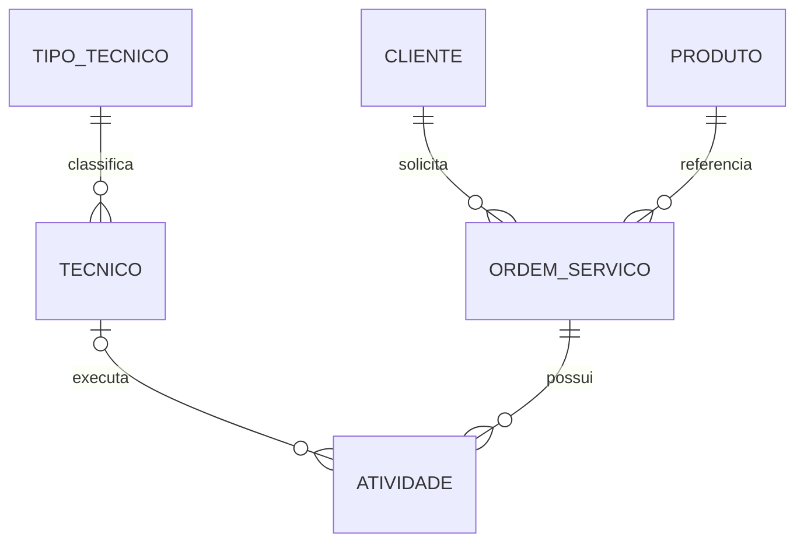

# 283 - M12.13 - Normalizacao primeira segunda e terceira forma normal

## Apresentacao da aula

Na aula 282, você transformou o modelo conceitual de Ordem de Serviço em um modelo lógico com relações, atributos, chaves candidatas, primary keys lógicas, alternate keys, foreign keys, cardinalidades e entidades associativas.

Agora surge uma pergunta decisiva:

```text
as relações foram organizadas de forma que cada fato seja armazenado no lugar correto?
```

Um modelo pode possuir chaves e relacionamentos e ainda assim apresentar:

- dados repetidos;
- grupos de valores dentro do mesmo atributo;
- dependências parciais;
- dependências transitivas;
- dificuldades para inserir informação;
- alterações que precisam ser repetidas em várias linhas;
- exclusões que apagam fatos que deveriam permanecer;
- inconsistências entre cópias do mesmo dado.

A normalização é um processo de análise e decomposição de relações para reduzir essas anomalias e representar dependências com mais clareza.

Nesta aula, você vai estudar:

```text
redundância;
anomalia de inserção;
anomalia de atualização;
anomalia de exclusão;
dependência funcional;
determinante;
dependente;
primeira forma normal;
segunda forma normal;
terceira forma normal;
dependência parcial;
dependência transitiva;
decomposição;
junção sem perda;
preservação de dependências.
```

O objetivo não é dividir tabelas indiscriminadamente. Normalizar não significa transformar cada atributo em uma relação separada.

O processo correto começa pelas regras do domínio:

```text
qual atributo determina qual outro atributo?
qual é a chave candidata?
o fato pertence a esta relação?
a informação está sendo repetida?
a decomposição preserva o significado?
```

Você vai trabalhar com uma relação deliberadamente problemática e normalizá-la em etapas. Depois aplicará o mesmo raciocínio ao modelo lógico da aula 282.

Ainda não vamos escrever `CREATE TABLE`, escolher tipos PostgreSQL ou implementar constraints. Também não vamos aprofundar BCNF, quarta forma normal ou desnormalização. Esses assuntos podem aparecer mais adiante, quando houver necessidade real.

Ao final, você deverá conseguir:

- identificar anomalias causadas por redundância;
- escrever dependências funcionais;
- localizar a chave candidata de uma relação;
- verificar a primeira forma normal;
- remover grupos repetitivos e atributos não atômicos;
- identificar dependências parciais;
- verificar a segunda forma normal;
- identificar dependências transitivas;
- verificar a terceira forma normal;
- decompor relações sem perder informação;
- diferenciar normalização de simples separação física;
- revisar o modelo lógico de Ordem de Serviço;
- preparar os relacionamentos práticos das aulas 284 e 285.

---

## Onde estamos na formacao

A sequência atual do M12 é:

```text
281:
modelagem conceitual.

282:
modelagem lógica, cardinalidade e chaves.

283:
primeira, segunda e terceira forma normal.

284:
relacionamento um para muitos.

285:
relacionamento muitos para muitos.

286:
GROUP BY, HAVING e agregações.
```

Na aula 282, você criou relações como:

```text
CLIENTE;
PRODUTO;
TECNICO;
ORDEM_SERVICO;
ATIVIDADE;
EVENTO_ORDEM_SERVICO.
```

Também modelou exemplos de relações associativas, como:

```text
ATIVIDADE_COMPETENCIA.
```

A normalização vai revisar essas relações antes da implementação prática.

A ordem é importante:

```text
entender o domínio;
criar o modelo conceitual;
transformar em modelo lógico;
analisar dependências;
normalizar;
implementar relacionamentos.
```

Essa sequência reduz a chance de criar estruturas físicas que depois exigem correções profundas.

---

## Objetivo pratico

Você vai criar o laboratório:

```text
labs/m12/aula-283-normalizacao-primeira-segunda-terceira-forma-normal
```

Estrutura final:

```text
labs
└── m12
    └── aula-283-normalizacao-primeira-segunda-terceira-forma-normal
        ├── README.md
        ├── 01-relacao-problematica.md
        ├── 02-dependencias-funcionais.md
        ├── 03-primeira-forma-normal.md
        ├── 04-segunda-forma-normal.md
        ├── 05-terceira-forma-normal.md
        ├── 06-modelo-normalizado.md
        └── 07-revisao-modelo-aula-282.md
```

O laboratório será documental.

Você vai:

1. analisar uma relação não normalizada;
2. identificar redundâncias e anomalias;
3. registrar dependências funcionais;
4. encontrar a chave candidata;
5. aplicar 1FN;
6. aplicar 2FN;
7. aplicar 3FN;
8. validar a decomposição;
9. revisar o modelo lógico da aula 282;
10. registrar dúvidas e decisões;
11. fazer o commit.

Nenhum arquivo SQL será criado.

---

## Conceito essencial

### Por que normalizar

Considere uma relação única:

```text
ORDEM_COMPLETA
```

Ela armazena na mesma estrutura:

- dados da ordem;
- dados do cliente;
- dados do produto;
- dados da atividade;
- dados do técnico.

Uma linha hipotética:

```text
ordem_codigo:
OS-001.

cliente_documento:
123.

cliente_nome:
Cliente Alfa.

produto_codigo:
PROD-10.

produto_nome:
Produto X.

atividade_codigo:
DIAGNOSTICO.

atividade_descricao:
Diagnosticar equipamento.

tecnico_codigo:
TEC-5.

tecnico_nome:
Maria.
```

Se a mesma ordem possui três atividades, os dados da ordem, cliente e produto aparecem três vezes.

A repetição não é apenas desperdício de espaço. Ela cria risco de inconsistência.

---

### Redundancia

Redundância ocorre quando o mesmo fato é armazenado repetidamente.

Exemplo:

```text
cliente_documento 123 determina cliente_nome Cliente Alfa.
```

Se dez linhas repetem esses valores, o nome do cliente aparece dez vezes.

Caso uma linha seja atualizada para:

```text
Cliente Alfa Ltda.
```

e as outras permaneçam com o nome antigo, o banco passa a representar versões conflitantes do mesmo fato.

Nem toda repetição em um resultado de join é redundância armazenada.

Na aula 280, o nome do cliente apareceu em várias linhas porque a consulta expandiu uma relação 1:N. O dado continuava armazenado uma vez em `CLIENTE`.

A normalização analisa a redundância persistida na estrutura, não a repetição visual de uma consulta.

---

### Anomalia de atualizacao

Acontece quando alterar um fato exige modificar várias linhas.

Exemplo:

```text
o nome do Produto X aparece em vinte atividades.
```

A alteração precisa atingir as vinte linhas.

Se uma for esquecida, o modelo fica inconsistente.

Em uma estrutura normalizada, o nome do produto fica em uma relação própria e é alterado uma vez.

---

### Anomalia de insercao

Acontece quando não é possível registrar um fato sem inventar outro.

Exemplo:

```text
quero cadastrar um Técnico antes de atribuí-lo a uma Atividade.
```

Se os dados do técnico existem somente dentro de `ORDEM_COMPLETA`, seria necessário criar uma ordem ou atividade fictícia.

Isso indica que Técnico possui existência independente e deveria ter relação própria.

Outro exemplo:

```text
quero cadastrar um Produto antes de existir uma Ordem.
```

Uma estrutura única pode impedir essa inserção legítima.

---

### Anomalia de exclusao

Acontece quando remover uma linha apaga um fato adicional.

Exemplo:

```text
a única atividade atribuída ao Técnico Maria é removida.
```

Se os dados do técnico estavam armazenados apenas nessa linha, a exclusão também apaga o cadastro da técnica.

O fato:

```text
Atividade foi removida
```

não deveria implicar:

```text
Técnico deixou de existir.
```

A decomposição separa os ciclos de vida.

---

### Dependencia funcional

Dependência funcional descreve uma relação entre atributos.

Notação:

```text
X -> Y
```

Leitura:

```text
X determina Y.
```

Significa que, para cada valor de `X`, existe no máximo um valor correspondente de `Y` dentro da regra modelada.

Exemplo:

```text
cliente_id -> cliente_nome
```

Se duas tuplas possuem o mesmo `cliente_id`, elas precisam possuir o mesmo `cliente_nome`.

Outro exemplo:

```text
produto_codigo -> produto_nome
```

Isso só é verdadeiro quando `produto_codigo` é único no domínio.

Dependência funcional é uma regra semântica. Ela não deve ser inferida apenas observando poucos dados de teste.

---

### Determinante e dependente

Na dependência:

```text
cliente_id -> cliente_nome
```

Temos:

```text
cliente_id:
determinante.

cliente_nome:
atributo dependente.
```

Um determinante pode possuir vários atributos:

```text
ordem_servico_id + atividade_codigo
    -> atividade_descricao
```

A combinação determina a descrição da atividade quando o código é único dentro da ordem.

---

### Dependencia trivial

Uma dependência é trivial quando o lado direito já faz parte do lado esquerdo.

Exemplo:

```text
{ordem_id, atividade_id} -> ordem_id
```

Ela é verdadeira pela própria composição do conjunto.

Na normalização, as dependências não triviais são as mais informativas.

---

### Fecho de atributos

O fecho de um conjunto de atributos representa tudo que pode ser determinado a partir dele.

Notação conceitual:

```text
X+
```

Se:

```text
ordem_id -> cliente_id
cliente_id -> cliente_nome
```

então, por transitividade:

```text
ordem_id -> cliente_nome
```

O fecho de `ordem_id` inclui:

```text
ordem_id;
cliente_id;
cliente_nome;
```

O cálculo formal do fecho pode ajudar a identificar chaves candidatas. Nesta aula, você fará o raciocínio de forma guiada, sem transformar o conteúdo em um exercício matemático abstrato.

---

### Chave candidata e dependencias

Uma chave candidata precisa determinar todos os atributos da relação.

Considere:

```text
ORDEM_ATIVIDADE (
    ordem_id,
    atividade_codigo,
    ordem_status,
    cliente_id,
    cliente_nome,
    atividade_descricao
)
```

Se uma atividade é identificada dentro da ordem pelo código:

```text
{ordem_id, atividade_codigo}
```

pode ser chave candidata.

A chave determina toda a tupla:

```text
{ordem_id, atividade_codigo}
    -> ordem_status
    -> cliente_id
    -> cliente_nome
    -> atividade_descricao
```

A forma escrita acima simplifica relações diferentes. O documento de dependências deve listar cada dependência diretamente.

---

### Primeira forma normal

Uma relação está em primeira forma normal quando:

- cada atributo possui um valor único por tupla;
- não existem grupos repetitivos;
- não existem listas internas representando múltiplas ocorrências;
- as tuplas podem ser identificadas.

A definição de “atômico” depende do uso do domínio.

Um endereço pode ser tratado como valor único quando nunca precisa ser decomposto. Se o sistema consulta cidade, estado e CEP separadamente, um texto único pode não ser adequado.

1FN não significa que todo texto precisa ser dividido em caracteres ou palavras. Significa que cada atributo deve representar um valor do domínio definido para ele.

---

### Violacao de 1FN por lista

Exemplo problemático:

```text
ORDEM (
    ordem_id,
    codigo,
    atividades
)
```

Valor:

```text
atividades =
"DIAGNOSTICO; MANUTENCAO; TESTE"
```

Problemas:

- quantidade variável dentro de um atributo;
- dificuldade de validar;
- dificuldade de relacionar técnico;
- dificuldade de consultar uma atividade;
- impossibilidade de aplicar chave por atividade;
- atualização por manipulação de texto.

Solução lógica:

```text
ORDEM_SERVICO (
    ordem_servico_id,
    codigo
)

ATIVIDADE (
    atividade_id,
    ordem_servico_id,
    codigo,
    descricao
)
```

Cada atividade torna-se uma tupla.

---

### Grupo repetitivo

Outra estrutura problemática:

```text
ORDEM (
    atividade_1_codigo,
    atividade_1_descricao,
    atividade_2_codigo,
    atividade_2_descricao,
    atividade_3_codigo,
    atividade_3_descricao
)
```

Ela impõe um limite artificial e repete grupos de atributos.

A solução também é criar uma relação para as ocorrências repetidas.

---

### Valor composto e 1FN

Considere:

```text
periodo_agendamento =
"2026-07-20 MANHA"
```

Se data e período possuem regras, filtros e significados independentes, o modelo lógico pode separar:

```text
data_agendada;
periodo.
```

A análise não deve ser mecânica. O critério é o domínio e as operações necessárias.

---

### Segunda forma normal

Uma relação está em 2FN quando:

1. está em 1FN;
2. todo atributo não chave depende da chave candidata inteira;
3. não existem dependências parciais de parte de uma chave composta.

A 2FN é especialmente relevante quando a chave candidata é composta.

Se a primary key possui apenas um atributo, não pode existir dependência parcial dessa chave. Nesse caso, estando em 1FN, a relação atende automaticamente à condição específica da 2FN.

Isso não significa que ela esteja em 3FN.

---

### Dependencia parcial

Considere:

```text
ITEM_ORDEM (
    ordem_id,
    produto_id,
    ordem_data,
    produto_nome,
    quantidade,
    valor_unitario
)

PK:
ordem_id + produto_id.
```

Dependências:

```text
ordem_id -> ordem_data

produto_id -> produto_nome

{ordem_id, produto_id}
    -> quantidade, valor_unitario
```

Problema:

```text
ordem_data depende apenas de ordem_id;

produto_nome depende apenas de produto_id.
```

Esses atributos dependem de parte da chave composta.

A relação não está em 2FN.

---

### Decomposicao para 2FN

Resultado:

```text
ORDEM (
    ordem_id,
    ordem_data
)

PRODUTO (
    produto_id,
    produto_nome
)

ITEM_ORDEM (
    ordem_id,
    produto_id,
    quantidade,
    valor_unitario
)
```

Agora:

```text
ordem_data depende da chave de ORDEM;

produto_nome depende da chave de PRODUTO;

quantidade e valor_unitario dependem da combinação do item.
```

Cada fato foi colocado na relação cujo identificador o determina.

---

### Atributo do relacionamento

No exemplo anterior:

```text
quantidade;
valor_unitario negociado.
```

podem pertencer ao relacionamento entre Ordem e Produto.

O valor unitário negociado pode variar por ordem, mesmo que Produto possua um preço de referência.

Por isso:

```text
produto_id -> valor_unitario negociado
```

não é necessariamente verdadeiro.

A dependência correta pode ser:

```text
{ordem_id, produto_id} -> valor_unitario_negociado
```

O domínio define a dependência.

---

### Terceira forma normal

Uma relação está em 3FN quando:

1. está em 2FN;
2. atributos não chave não dependem transitivamente de uma chave por meio de outro atributo não chave.

Forma intuitiva:

```text
cada atributo não chave deve depender da chave,
da chave inteira
e de nada além da chave.
```

Essa frase é útil para estudo, mas a análise formal depende das chaves candidatas e dependências funcionais.

---

### Dependencia transitiva

Considere:

```text
ORDEM_SERVICO (
    ordem_id,
    cliente_id,
    cliente_nome,
    cliente_documento,
    codigo,
    status
)
```

Dependências:

```text
ordem_id -> cliente_id

cliente_id -> cliente_nome, cliente_documento
```

Logo:

```text
ordem_id -> cliente_nome, cliente_documento
```

por meio de `cliente_id`.

`cliente_nome` e `cliente_documento` não descrevem a ordem. Eles descrevem o cliente.

A relação possui dependência transitiva.

---

### Decomposicao para 3FN

Resultado:

```text
CLIENTE (
    cliente_id,
    cliente_nome,
    cliente_documento
)

ORDEM_SERVICO (
    ordem_id,
    cliente_id,
    codigo,
    status
)
```

A ordem mantém a referência ao cliente.

Os dados descritivos do cliente ficam em `CLIENTE`.

A consulta usa join quando precisa reunir os fatos.

---

### Outro exemplo de dependencia transitiva

Considere:

```text
TECNICO (
    tecnico_id,
    tipo_codigo,
    tipo_descricao,
    nome
)
```

Se:

```text
tecnico_id -> tipo_codigo

tipo_codigo -> tipo_descricao
```

então `tipo_descricao` depende transitivamente de `tecnico_id`.

Uma decomposição possível:

```text
TIPO_TECNICO (
    tipo_codigo,
    tipo_descricao
)

TECNICO (
    tecnico_id,
    tipo_codigo,
    nome
)
```

Mas essa separação só é útil quando Tipo de Técnico é realmente um conceito controlado pelo domínio.

Não crie relação de domínio para cada texto apenas para “chegar à 3FN”. Primeiro confirme a dependência e o significado.

---

### Dependencia funcional nao e coincidencia

No dataset atual, talvez cada prioridade apareça associada a um único status.

Isso não prova:

```text
prioridade -> status
```

Dependências funcionais vêm das regras possíveis, não do pequeno conjunto atual.

Pergunte:

```text
podem existir duas ordens com a mesma prioridade e status diferentes?
```

Se sim, a dependência não existe.

---

### Decomposicao

Decompor significa substituir uma relação por relações menores que representam os mesmos fatos de forma mais adequada.

A decomposição precisa ser avaliada.

Não basta separar atributos em arquivos ou tabelas.

Critérios importantes:

- cada nova relação possui significado;
- as dependências são representadas;
- os dados podem ser reunidos;
- não surgem tuplas falsas;
- nenhuma informação necessária é perdida.

---

### Juncao sem perda

Uma decomposição é sem perda quando a junção das relações decompostas reconstrói exatamente as tuplas válidas da relação original.

Exemplo:

```text
CLIENTE (
    cliente_id,
    nome
)

ORDEM (
    ordem_id,
    cliente_id
)
```

A junção por `cliente_id` reconstrói a associação entre ordem e nome do cliente.

Se a decomposição não possuir atributo comum adequado ou regra de referência, a junção pode perder correspondências ou criar combinações indevidas.

Nesta fase, use a pergunta:

```text
consigo reconstruir o fato original por uma junção baseada em chave?
```

A teoria formal de decomposição sem perda pode ser aprofundada futuramente.

---

### Preservacao de dependencias

Uma decomposição preserva dependências quando as regras funcionais podem ser verificadas nas relações resultantes sem exigir uma junção complexa.

Exemplo:

```text
produto_id -> produto_nome
```

fica preservada em `PRODUTO`.

A regra:

```text
{ordem_id, produto_id} -> quantidade
```

fica preservada em `ITEM_ORDEM`.

Se uma regra importante ficar distribuída de forma que só possa ser verificada reunindo várias relações, a decomposição pode dificultar integridade.

Nem sempre todos os objetivos são alcançados simultaneamente, mas a decisão precisa ser consciente.

---

### Validar antes de aceitar a decomposicao

Depois de decompor uma relação, não encerre a análise apenas porque os nomes parecem organizados.

Faça três verificações:

```text
Identidade:
cada relação possui uma chave candidata clara?

Reconstrucao:
as relações podem ser reunidas por chaves sem criar fatos falsos?

Dependencias:
as regras importantes continuam representadas e verificáveis?
```

Também compare as anomalias anteriores com o novo modelo.

Pergunte:

```text
consigo cadastrar Cliente sem inventar Ordem?

consigo alterar Produto em um único lugar?

consigo remover uma Atividade sem apagar Técnico?

consigo registrar várias Atividades sem lista interna?
```

Se as respostas melhoraram e os fatos continuam reconstruíveis, a decomposição avançou na direção correta.

Essa validação conecta teoria e domínio. Uma forma normal não deve ser tratada apenas como rótulo; ela precisa eliminar problemas concretos sem perder informação.

---

### Normalizacao nao e fragmentacao

Criar várias relações pequenas não garante qualidade.

Exemplo exagerado:

```text
CLIENTE_NOME (
    cliente_id,
    nome
)

CLIENTE_EMAIL (
    cliente_id,
    email
)

CLIENTE_SITUACAO (
    cliente_id,
    situacao
)
```

Se todos os atributos dependem diretamente de `cliente_id`, não existe motivo normalizador para separar apenas por serem atributos diferentes.

A fragmentação pode aumentar joins sem resolver anomalia.

Normalização segue dependências, não quantidade de colunas.

---

### Desnormalizacao nao e assunto desta aula

Em alguns sistemas, dados são duplicados intencionalmente para:

- leitura;
- histórico;
- integração;
- analytics;
- performance;
- isolamento de contexto.

Isso é desnormalização planejada.

Ela exige:

- justificativa;
- origem de verdade;
- mecanismo de sincronização;
- tratamento de inconsistência;
- observabilidade.

Não use a possibilidade de desnormalização como desculpa para ignorar 1FN, 2FN e 3FN durante a modelagem inicial.

---

## Mao na massa guiada

### 1. Criar o laboratorio

Na raiz do repositório:

```powershell
New-Item -ItemType Directory -Force `
  -Path "labs\m12\aula-283-normalizacao-primeira-segunda-terceira-forma-normal"

Set-Location `
  "labs\m12\aula-283-normalizacao-primeira-segunda-terceira-forma-normal"
```

---

### 2. Criar 01-relacao-problematica.md

Crie:

```text
01-relacao-problematica.md
```

Registre a relação:

```text
ATENDIMENTO_NAO_NORMALIZADO (
    ordem_id,
    ordem_codigo,
    ordem_status,
    data_agendada,
    cliente_id,
    cliente_documento,
    cliente_nome,
    produto_id,
    produto_codigo,
    produto_nome,
    atividades,
    tecnico_id,
    tecnico_codigo,
    tecnico_nome,
    tecnico_tipo_codigo,
    tecnico_tipo_descricao
)
```

Defina `atividades` como uma lista textual:

```text
DIAGNOSTICO|Diagnosticar;
REPARO|Executar reparo
```

Inclua três linhas fictícias:

- duas atividades da mesma ordem;
- o mesmo cliente repetido;
- o mesmo produto repetido;
- o mesmo técnico em mais de uma linha;
- uma ordem sem técnico.

Depois registre exemplos de:

```text
redundância;
anomalia de inserção;
anomalia de atualização;
anomalia de exclusão.
```

---

### 3. Criar 02-dependencias-funcionais.md

Crie:

```text
02-dependencias-funcionais.md
```

Registre as dependências assumidas pelo domínio:

```text
ordem_id
    -> ordem_codigo,
       ordem_status,
       data_agendada,
       cliente_id,
       produto_id

cliente_id
    -> cliente_documento,
       cliente_nome

produto_id
    -> produto_codigo,
       produto_nome

tecnico_id
    -> tecnico_codigo,
       tecnico_nome,
       tecnico_tipo_codigo

tecnico_tipo_codigo
    -> tecnico_tipo_descricao

{ordem_id, atividade_codigo}
    -> atividade_descricao,
       tecnico_id
```

Registre chaves candidatas possíveis da versão que já separa as atividades em tuplas:

```text
{ordem_id, atividade_codigo}
```

Explique por que `ordem_id` sozinho não identifica uma atividade e por que `atividade_codigo` pode repetir entre ordens.

---

### 4. Criar 03-primeira-forma-normal.md

Crie:

```text
03-primeira-forma-normal.md
```

Liste as violações:

```text
atributo atividades contém vários valores;

cada item da lista possui código e descrição;

não existe uma tupla por atividade;

não é possível criar referência individual.
```

Transforme a lista em linhas:

```text
ORDEM_ATIVIDADE_1FN (
    ordem_id,
    atividade_codigo,
    atividade_descricao,
    tecnico_id,
    ordem_codigo,
    ordem_status,
    data_agendada,
    cliente_id,
    cliente_documento,
    cliente_nome,
    produto_id,
    produto_codigo,
    produto_nome,
    tecnico_codigo,
    tecnico_nome,
    tecnico_tipo_codigo,
    tecnico_tipo_descricao
)
```

Chave candidata:

```text
ordem_id + atividade_codigo
```

Registre:

```text
a relação está em 1FN;
ainda possui dependências parciais e transitivas.
```

---

### 5. Criar 04-segunda-forma-normal.md

Crie:

```text
04-segunda-forma-normal.md
```

Parta da chave composta:

```text
ordem_id + atividade_codigo
```

Identifique dependências parciais.

Dependem apenas de `ordem_id`:

```text
ordem_codigo;
ordem_status;
data_agendada;
cliente_id;
produto_id;
```

Dependem da atividade dentro da ordem:

```text
atividade_descricao;
tecnico_id.
```

Decomponha:

```text
ORDEM_2FN (
    ordem_id,
    ordem_codigo,
    ordem_status,
    data_agendada,
    cliente_id,
    cliente_documento,
    cliente_nome,
    produto_id,
    produto_codigo,
    produto_nome
)

ATIVIDADE_2FN (
    ordem_id,
    atividade_codigo,
    atividade_descricao,
    tecnico_id,
    tecnico_codigo,
    tecnico_nome,
    tecnico_tipo_codigo,
    tecnico_tipo_descricao
)
```

Registre que as dependências parciais da chave composta foram removidas.

Também registre:

```text
as relações ainda possuem dependências transitivas.
```

---

### 6. Criar 05-terceira-forma-normal.md

Crie:

```text
05-terceira-forma-normal.md
```

Na relação `ORDEM_2FN`, identifique:

```text
ordem_id -> cliente_id
cliente_id -> cliente_documento, cliente_nome

ordem_id -> produto_id
produto_id -> produto_codigo, produto_nome
```

Na relação `ATIVIDADE_2FN`, identifique:

```text
{ordem_id, atividade_codigo} -> tecnico_id
tecnico_id -> tecnico_codigo, tecnico_nome, tecnico_tipo_codigo
tecnico_tipo_codigo -> tecnico_tipo_descricao
```

Decomponha em:

```text
CLIENTE (
    cliente_id,
    cliente_documento,
    cliente_nome
)

PRODUTO (
    produto_id,
    produto_codigo,
    produto_nome
)

TIPO_TECNICO (
    tecnico_tipo_codigo,
    tecnico_tipo_descricao
)

TECNICO (
    tecnico_id,
    tecnico_codigo,
    tecnico_nome,
    tecnico_tipo_codigo
)

ORDEM_SERVICO (
    ordem_id,
    ordem_codigo,
    ordem_status,
    data_agendada,
    cliente_id,
    produto_id
)

ATIVIDADE (
    ordem_id,
    atividade_codigo,
    atividade_descricao,
    tecnico_id
)
```

Explique por que cada atributo depende da chave da própria relação.

---

### 7. Criar 06-modelo-normalizado.md

Crie:

```text
06-modelo-normalizado.md
```

Registre:

```text
CLIENTE
PK:
cliente_id.

AK:
cliente_documento.

Dependências:
cliente_id -> cliente_documento, cliente_nome.
```

Faça o mesmo para:

```text
PRODUTO;
TIPO_TECNICO;
TECNICO;
ORDEM_SERVICO;
ATIVIDADE.
```

Para `ATIVIDADE`, use:

```text
PK candidata:
ordem_id + atividade_codigo.
```

Depois compare com o modelo da aula 282, que escolheu uma chave substituta `atividade_id` e manteve:

```text
ordem_servico_id + codigo
```

como alternate key.

Explique que as duas estratégias podem preservar a dependência, desde que a combinação de negócio continue protegida.

---

### 8. Criar diagrama Mermaid

No mesmo arquivo, adicione:



Não adicione tipos físicos.

---

### 9. Validar juncao sem perda

Ainda em `06-modelo-normalizado.md`, escolha uma ocorrência de ordem e descreva a reconstrução:

```text
ORDEM_SERVICO
JOIN CLIENTE por cliente_id

ORDEM_SERVICO
JOIN PRODUTO por produto_id

ORDEM_SERVICO
JOIN ATIVIDADE por ordem_id

ATIVIDADE
JOIN TECNICO por tecnico_id

TECNICO
JOIN TIPO_TECNICO por tecnico_tipo_codigo
```

Responda:

1. quais fatos são reconstruídos;
2. quais atributos servem de ligação;
3. por que não surgem combinações arbitrárias;
4. onde valores nulos podem representar técnico ainda não atribuído.

Não escreva SQL.

---

### 10. Criar 07-revisao-modelo-aula-282.md

Crie:

```text
07-revisao-modelo-aula-282.md
```

Revise cada relação da aula 282.

#### CLIENTE

Pergunte:

```text
cada atributo depende de cliente_id?
documento é alternate key?
email opcional único cria alguma dependência adicional?
há atributo multivalorado?
```

#### PRODUTO

Pergunte:

```text
valor é preço atual ou histórico?
se o valor varia por contrato, ele pertence a Produto?
```

#### TECNICO

Pergunte:

```text
tipo possui descrição e regras próprias?
tipo deve permanecer atributo ou virar relação?
telefones foram removidos do atributo único?
```

#### ORDEM_SERVICO

Pergunte:

```text
dados de Cliente ou Produto foram copiados?
valor previsto pertence à ordem?
data agendada representa somente o agendamento atual?
histórico exige outra relação?
```

#### ATIVIDADE

Pergunte:

```text
codigo é único dentro da ordem?
tecnico_id representa estado atual ou histórico?
duração real deve ser derivada?
```

#### EVENTO_ORDEM_SERVICO

Pergunte:

```text
tipo é atributo ou entidade de domínio?
descrição depende do evento?
ocorrido_em pertence ao evento?
```

Classifique cada relação como:

```text
aparentemente em 1FN;
aparentemente em 2FN;
aparentemente em 3FN;
dúvida aberta.
```

Use “aparentemente” porque a confirmação depende das regras funcionais reais.

---

### 11. Criar README.md

Crie:

```text
README.md
```

Registre:

```text
Título:
Aula 283 - Normalizacao primeira segunda e terceira forma normal.

Origem:
modelo lógico da aula 282.

Objetivo:
identificar anomalias e decompor relações conforme dependências funcionais.

Escopo:
1FN, 2FN e 3FN.

Fora do escopo:
DDL, tipos PostgreSQL, BCNF, formas normais superiores e desnormalização prática.

Entregáveis:
relação problemática, dependências, decomposição, modelo normalizado e revisão.

Próxima aula:
relacionamento um para muitos.
```

---

## Entendendo o que foi feito

### A normalizacao partiu das dependencias

Você não separou relações por tamanho ou preferência.

Cada decomposição respondeu:

```text
qual determinante controla este fato?
```

Cliente, Produto, Técnico e Tipo de Técnico receberam relações próprias porque seus atributos dependem de suas respectivas identidades.

---

### 1FN removeu valores multiplos

A lista de atividades tornou-se uma ocorrência por tupla.

Isso permitiu identificar, relacionar e validar cada atividade separadamente.

---

### 2FN removeu dependencias parciais

A relação com chave composta misturava fatos da ordem com fatos da atividade.

Os dados da ordem foram separados porque dependiam apenas de `ordem_id`.

---

### 3FN removeu dependencias transitivas

Nome do cliente, nome do produto e descrição do tipo técnico não pertenciam às relações que apenas os referenciavam.

Eles foram movidos para relações em que dependem diretamente da chave.

---

### O resultado pode ser reunido por joins

A normalização distribui fatos, mas não elimina a visão completa.

Consultas reúnem as relações por suas chaves.

A aula 280 já mostrou esse comportamento.

---

## Erros comuns importantes

### Aplicar forma normal sem conhecer a chave

2FN e 3FN dependem de chaves candidatas e dependências.

Identifique-as antes de decompor.

---

### Tratar todo texto como nao atomico

Atomicidade depende do domínio.

Não decomponha um valor apenas porque ele pode ser dividido linguisticamente.

---

### Criar relacao para cada atributo

Isso é fragmentação, não normalização.

Agrupe atributos que dependem da mesma chave.

---

### Inferir dependencia pelos dados atuais

Poucas linhas podem sugerir uma regra inexistente.

Confirme com o domínio.

---

### Usar join como prova suficiente

Conseguir juntar duas relações não garante que a decomposição esteja correta.

Revise chaves, dependências e possibilidade de tuplas indevidas.

---

## Comandos uteis

Esta aula não possui SQL.

Para revisar o laboratório:

```powershell
Get-ChildItem -Recurse `
  "labs\m12\aula-283-normalizacao-primeira-segunda-terceira-forma-normal"

git status
git diff
```

---

## Exercicio guiado

### Parte 1 - Relacao de contato problemática

Analise:

```text
CLIENTE_CONTATOS (
    cliente_id,
    cliente_nome,
    documento,
    telefones,
    email_principal,
    cidade_codigo,
    cidade_nome,
    estado_sigla,
    estado_nome
)
```

Registre:

- violações de 1FN;
- dependências funcionais;
- chaves candidatas;
- dependências transitivas;
- decomposição até 3FN.

---

### Parte 2 - Relacao associativa

Analise:

```text
ATIVIDADE_COMPETENCIA (
    atividade_id,
    competencia_id,
    atividade_descricao,
    competencia_nome,
    nivel_requerido,
    obrigatoria
)
```

PK candidata:

```text
atividade_id + competencia_id
```

Identifique:

- dependências parciais;
- atributos do relacionamento;
- relações resultantes em 2FN e 3FN.

---

### Parte 3 - Agendamento

Analise:

```text
AGENDAMENTO_ORDEM (
    agendamento_id,
    ordem_id,
    ordem_codigo,
    cliente_id,
    cliente_nome,
    data,
    periodo,
    situacao,
    motivo
)
```

Pergunte:

1. quais atributos dependem de agendamento_id?
2. quais dependem de ordem_id?
3. quais dependem de cliente_id?
4. qual decomposição remove dependências transitivas?
5. como manter o histórico de reagendamentos?

---

### Parte 4 - Dependencias duvidosas

Avalie se são verdadeiras:

```text
prioridade -> status

status -> data_agendada

produto_id -> valor_previsto

tecnico_tipo -> tecnico_nome

ordem_id -> cliente_nome
```

Para cada uma, responda com regra do domínio, não com o dataset atual.

---

### Parte 5 - Revisar o modelo principal

Escolha duas relações da aula 282 e produza:

- chave candidata;
- dependências funcionais;
- análise de 1FN;
- análise de 2FN;
- análise de 3FN;
- dúvidas abertas.

---

### Parte 6 - Explicar uma decomposicao

Escolha uma decomposição e explique:

1. qual anomalia existia;
2. qual dependência causava o problema;
3. quais relações foram criadas;
4. quais chaves conectam as relações;
5. como reconstruir o fato;
6. por que a informação não foi perdida.

---

## Criterios de aceite

- o laboratório oficial da aula 283 existe;
- nenhum arquivo SQL foi criado;
- o modelo lógico da aula 282 foi usado como origem;
- redundância foi diferenciada de repetição em resultado de join;
- anomalias de inserção, atualização e exclusão foram identificadas;
- dependências funcionais foram escritas;
- determinantes e dependentes foram identificados;
- uma chave candidata composta foi analisada;
- violações de 1FN foram removidas;
- grupos repetitivos e listas internas foram eliminados;
- dependências parciais foram identificadas;
- a decomposição para 2FN foi realizada;
- dependências transitivas foram identificadas;
- a decomposição para 3FN foi realizada;
- atributos foram movidos para relações determinadas por suas chaves;
- junção sem perda foi discutida;
- preservação de dependências foi discutida;
- normalização foi diferenciada de fragmentação;
- BCNF e desnormalização não foram antecipadas;
- o modelo da aula 282 foi revisado;
- o exercício foi concluído;
- README e documentos estão prontos;
- commit recomendado pode ser realizado.

---

## Commit recomendado

Na raiz:

```powershell
git status
git diff
```

Adicione:

```powershell
git add `
  labs/m12/aula-283-normalizacao-primeira-segunda-terceira-forma-normal
```

Confira:

```powershell
git status
```

Commit recomendado:

```powershell
git commit -m "docs(m12): normalizar modelo relacional ate 3fn"
```

Valide:

```powershell
git log -1 --oneline
```

O commit representa:

```text
dependências funcionais;
1FN;
2FN;
3FN;
decomposição;
revisão do modelo lógico.
```

---

## Fechamento e ponte para a proxima aula

Nesta aula, você analisou o modelo lógico por meio das dependências entre atributos.

Aprendeu:

```text
redundância;
anomalia de inserção;
anomalia de atualização;
anomalia de exclusão;
dependência funcional;
determinante;
dependente;
chave candidata;
primeira forma normal;
segunda forma normal;
terceira forma normal;
dependência parcial;
dependência transitiva;
decomposição;
junção sem perda;
preservação de dependências.
```

As regras principais foram:

```text
1FN elimina grupos repetitivos e valores multivalorados;

2FN remove dependências de parte de uma chave composta;

3FN remove dependências transitivas de atributos não chave;

cada fato deve ficar na relação cuja chave o determina;

normalizar não significa criar uma relação por atributo;

dependências vêm das regras do domínio, não de coincidências do dataset;

a decomposição deve preservar informação e relações.
```

A próxima aula será:

```text
284 - M12.14 - Relacionamento um para muitos
```

Nela, você vai implementar e praticar o relacionamento 1:N com profundidade:

- lado um e lado muitos;
- foreign key no lado N;
- obrigatoriedade e opcionalidade;
- inserção na ordem correta;
- consulta com joins;
- remoção protegida;
- atualização de referência;
- dados órfãos;
- exemplos com Cliente e Ordem;
- exemplos com Ordem e Atividade;
- validação do modelo no PostgreSQL.

A aula 283 garantiu que os fatos estão separados corretamente. A aula 284 mostrará como uma relação 1:N funciona na prática.

---

# Material complementar

## Checkpoint final

- [ ] Identifiquei dependências funcionais e anomalias.
- [ ] Apliquei 1FN, 2FN e 3FN em uma relação problemática.
- [ ] Validei decomposição e revisei o modelo da aula 282.
- [ ] Fiz o commit recomendado.

---

## Troubleshooting adicional

### Nao encontro a chave candidata

Liste as dependências e calcule conceitualmente quais atributos determinam todos os demais.

Se nenhum conjunto parece estável, a identidade do domínio pode não estar clara.

### Toda relacao parece estar em 2FN

Relações com chave simples não possuem dependência parcial da chave.

Ainda podem violar 3FN.

### Nao sei se um atributo e derivado

Registre a fórmula e a origem dos dados.

Depois avalie necessidade de histórico, custo e consistência.

### Decomposicao criou muitos joins

Isso não prova que está errada.

Primeiro valide dependências e anomalias. Performance é uma análise posterior.

### Regra funcional muda com o tempo

Pode haver contexto ou vigência ausente no modelo.

Exemplo: preço do produto pode depender de contrato e período, não apenas de produto.

---

## Perguntas de revisao

1. O que é redundância armazenada?
2. O que é anomalia de atualização?
3. O que é anomalia de inserção?
4. O que é anomalia de exclusão?
5. O que significa `X -> Y`?
6. O que é determinante?
7. Como uma chave candidata se relaciona com dependências?
8. O que a 1FN exige?
9. O que é grupo repetitivo?
10. Quando uma relação viola 2FN?
11. O que é dependência parcial?
12. Quando uma relação viola 3FN?
13. O que é dependência transitiva?
14. O que é decomposição sem perda?
15. O que significa preservar dependências?
16. Por que normalização não é fragmentação?
17. Por que não inferir dependência apenas pelo dataset?
18. Como joins se relacionam com normalização?

---

## Roteiro de resposta

1. O mesmo fato persistido em vários lugares.
2. Um fato precisa ser alterado em várias linhas.
3. Um fato não pode ser inserido sem outro artificial.
4. Remover uma linha apaga outro fato.
5. X determina funcionalmente Y.
6. O lado que determina.
7. A chave candidata determina todos os atributos e é mínima.
8. Valores únicos por atributo e ausência de grupos repetitivos.
9. Conjunto variável de atributos ou valores repetidos na mesma tupla.
10. Quando atributo não chave depende de parte de chave composta.
11. Dependência de subconjunto próprio da chave.
12. Quando existe dependência transitiva indevida de atributo não chave.
13. Chave determina A, e A determina B.
14. A junção reconstrói os fatos válidos sem informação indevida.
15. Regras continuam verificáveis nas relações resultantes.
16. Separação deve seguir dependências.
17. Dados atuais não provam regras gerais.
18. Joins reúnem fatos armazenados em relações normalizadas.

---

## Desafio opcional

Normalize até 3FN:

```text
CHECKLIST_EXECUCAO (
    ordem_id,
    atividade_id,
    checklist_versao,
    checklist_nome,
    perguntas_e_respostas,
    tecnico_id,
    tecnico_nome,
    concluido_em
)
```

Considere:

- várias perguntas por versão;
- uma pergunta pode possuir resposta;
- versões preservam histórico;
- técnico possui identidade independente;
- a mesma pergunta pode aparecer em várias versões somente se a regra permitir.

Entregue:

- dependências;
- chaves candidatas;
- 1FN;
- 2FN;
- 3FN;
- relações finais;
- dúvidas de domínio.

Não escreva DDL.

---

## Atualizacao do diario de bordo

Adicione ao arquivo:

```text
docs/diario-de-bordo.md
```

O bloco:

```markdown
### Aula 283 - M12.13 - Normalizacao primeira segunda e terceira forma normal

- Entendi redundância armazenada e anomalias de inserção, atualização e exclusão.
- Estudei dependências funcionais, determinantes e dependentes.
- Relacionei chaves candidatas com o conjunto de atributos determinados.
- Apliquei primeira forma normal e removi listas e grupos repetitivos.
- Apliquei segunda forma normal e removi dependências parciais.
- Apliquei terceira forma normal e removi dependências transitivas.
- Decompus relações conforme as chaves que determinam cada fato.
- Diferenciei normalização de fragmentação excessiva.
- Analisei junção sem perda e preservação de dependências.
- Revisei o modelo lógico da aula 282.
- Mantive DDL, BCNF e desnormalização fora do escopo.
- Próxima aula: relacionamento um para muitos.
```

---

## Referencia tecnica curta

```text
Dependencia funcional:
X determina Y.

1FN:
valores únicos por atributo e sem grupos repetitivos.

2FN:
sem dependência parcial de chave composta.

3FN:
sem dependência transitiva indevida.

Anomalia de insercao:
não consegue inserir um fato isoladamente.

Anomalia de atualizacao:
precisa alterar cópias do mesmo fato.

Anomalia de exclusao:
remove um fato adicional.

Decomposicao:
separa fatos conforme dependências.
```

Regra final:

```text
cada fato deve ser armazenado na relacao cuja chave o determina.
```
