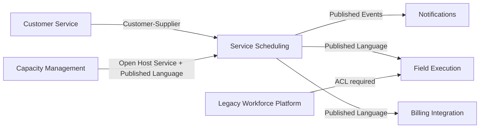

# 622 - M19.12 - Context Map

## Apresentação da aula

Na aula 621, você aprofundou o Bounded Context de Service Scheduling.

Você definiu:

```text
propósito;

responsabilidades;

in-scope;

out-of-scope;

language boundary;

public API;

internal model;

inbound boundary;

outbound boundary;

data ownership;

transaction boundary;

event boundary;

error boundary;

team ownership;

dependency rules.
```

A fronteira deixou de ser apenas uma pasta.

Ela passou a proteger:

- linguagem;
- modelo;
- decisões;
- dados;
- contratos;
- eventos;
- erros;
- evolução.

Agora surge uma nova pergunta:

```text
como esse contexto
se relaciona
com os outros contextos
da organização?
```

Service Scheduling não vive sozinho.

Para assumir e manter um compromisso de atendimento, ele precisa interagir com:

```text
Customer Service;

Capacity Management;

Field Execution;

Notifications;

Billing Integration.
```

Cada um desses contextos possui:

- linguagem própria;
- responsabilidade própria;
- dados próprios;
- ritmo de mudança;
- equipe responsável;
- necessidades de integração;
- riscos.

Uma lista de dependências não é suficiente.

Exemplo:

```text
Scheduling depende de Capacity.
```

Essa frase não responde:

- quem é upstream?
- quem é downstream?
- quem controla o contrato?
- quem precisa adaptar seu modelo?
- qual linguagem é publicada?
- quem pode priorizar mudanças?
- a integração é síncrona ou assíncrona?
- qual consistência é necessária?
- o que acontece quando o upstream falha?
- existe compatibilidade de versões?
- existe risco de acoplamento organizacional?
- existe acesso indevido a dados?
- a dependência deve continuar existindo?

Context Map é o artefato estratégico que torna essas relações explícitas.

Ele representa:

```text
Bounded Contexts;

direção das relações;

tipos de relacionamento;

contratos;

ownership;

riscos;

decisões de integração;

evolução.
```

O Context Map não é apenas um diagrama técnico.

Ele conecta:

- modelo;
- organização;
- comunicação;
- dependência;
- poder de decisão;
- arquitetura;
- estratégia.

A pergunta central desta aula será:

```text
como desenhar
e governar

as relações
entre Bounded Contexts

sem apagar
as fronteiras
que acabamos
de proteger?
```

O laboratório será:

```text
labs/m19/aula-622-context-map/service-scheduling-context-map
```

Você irá mapear os seguintes contextos:

```text
Customer Service;

Service Scheduling;

Capacity Management;

Field Execution;

Notifications;

Billing Integration;

Legacy Workforce Platform.
```

Você irá aplicar e comparar relações como:

- Partnership;
- Shared Kernel;
- Customer-Supplier;
- Conformist;
- Anti Corruption Layer;
- Open Host Service;
- Published Language;
- Separate Ways;
- Big Ball of Mud.

O mapa principal terá como foco:

```text
Service Scheduling.
```

Você irá documentar para cada relação:

- source context;
- target context;
- upstream;
- downstream;
- pattern;
- contrato;
- linguagem;
- mecanismo;
- consistência;
- falha;
- owner;
- compatibilidade;
- observabilidade;
- risco;
- revisão.

A próxima aula oficial será:

```text
623 - M19.13 - Anti Corruption Layer
```

Por isso, a ACL será identificada, delimitada e representada no mapa, mas sua implementação completa ficará para a aula 623.

A aula 624 será:

```text
624 - M19.14 - Entity Value Object revisitados
```

Nenhuma revisão aprofundada de Entity e Value Object será antecipada aqui.

Também não serão implementados:

- microservices;
- mensageria real;
- Kafka;
- transações distribuídas;
- Service Mesh;
- contratos corporativos reais;
- Event Sourcing;
- saga;
- banco compartilhado entre contextos.

A regra central será:

```text
um Context Map
não mostra apenas
quem chama quem;

ele mostra
quem depende de quem,
quem controla o modelo,
como a linguagem atravessa a fronteira
e quais riscos precisam ser governados.
```

---

## Onde estamos na formação

A sequência oficial é:

```text
620:
Ubiquitous Language.

621:
Bounded Context.

622:
Context Map.

623:
Anti Corruption Layer.

624:
Entity Value Object revisitados.
```

A progressão é:

```text
alinhar linguagem;

proteger uma fronteira;

mapear relações;

proteger contra modelos externos;

revisar padrões táticos.
```

Nesta aula:

```text
context inventory:
sim.

relationship inventory:
sim.

upstream:
sim.

downstream:
sim.

Partnership:
sim.

Shared Kernel:
sim.

Customer-Supplier:
sim.

Conformist:
sim.

ACL como decisão:
sim.

Open Host Service:
sim.

Published Language:
sim.

Separate Ways:
sim.

Big Ball of Mud:
sim.

ACL completa:
não.

microservices:
não.

Entity e Value Object revisitados:
não.
```

O mapa será independente de deployment.

Um contexto pode estar:

- no mesmo monólito;
- em outro módulo;
- em outro processo;
- em sistema externo;
- em plataforma legada.

A relação estratégica continua existindo.

---

## Objetivo prático

Será criada a estrutura:

```text
labs/m19/aula-622-context-map/service-scheduling-context-map
├── pom.xml
├── README.md
├── map
│   ├── context-inventory.md
│   ├── context-map-overview.md
│   ├── context-map.mmd
│   ├── relationship-catalog.md
│   ├── upstream-downstream-matrix.md
│   ├── integration-contract-matrix.md
│   ├── language-translation-matrix.md
│   ├── ownership-matrix.md
│   ├── consistency-matrix.md
│   ├── failure-behavior-matrix.md
│   ├── compatibility-matrix.md
│   ├── observability-matrix.md
│   ├── relationship-risk-register.md
│   ├── unresolved-map-questions.md
│   └── context-map-change-log.md
├── relationships
│   ├── customer-service-to-scheduling.md
│   ├── scheduling-to-capacity.md
│   ├── scheduling-to-notifications.md
│   ├── scheduling-to-field-execution.md
│   ├── field-execution-to-legacy-workforce.md
│   ├── scheduling-to-billing.md
│   └── separate-ways-decisions.md
├── src
│   ├── main
│   │   └── java
│   │       └── br/com/formacao/contextmap
│   │           ├── customer
│   │           │   └── CustomerServicePublishedApi.java
│   │           ├── scheduling
│   │           │   └── ServiceSchedulingPublishedApi.java
│   │           ├── capacity
│   │           │   └── CapacityOpenHostService.java
│   │           ├── execution
│   │           │   └── FieldExecutionPublishedApi.java
│   │           ├── notifications
│   │           │   └── SchedulingNotificationSubscriber.java
│   │           ├── billing
│   │           │   └── BillingSchedulingEventConsumer.java
│   │           └── legacy
│   │               └── LegacyWorkforceBoundary.java
│   └── test
│       └── java
│           └── br/com/formacao/contextmap
│               ├── ContextMapStructureTest.java
│               ├── UpstreamDownstreamDirectionTest.java
│               ├── PublishedContractBoundaryTest.java
│               ├── RelationshipPatternTest.java
│               ├── ContextCycleTest.java
│               └── LanguageLeakTest.java
├── contracts
│   ├── context-map-contract.yaml
│   ├── relationship-catalog-policy.yaml
│   ├── upstream-downstream-policy.yaml
│   ├── partnership-policy.yaml
│   ├── shared-kernel-policy.yaml
│   ├── customer-supplier-policy.yaml
│   ├── conformist-policy.yaml
│   ├── open-host-service-policy.yaml
│   ├── published-language-policy.yaml
│   ├── separate-ways-policy.yaml
│   ├── big-ball-of-mud-policy.yaml
│   ├── compatibility-policy.yaml
│   ├── data-quality-policy.yaml
│   └── failure-policy.yaml
└── reports
    ├── context-inventory-report.yaml
    ├── relationship-report.yaml
    ├── direction-report.yaml
    ├── contract-report.yaml
    ├── language-boundary-report.yaml
    ├── compatibility-report.yaml
    ├── risk-report.yaml
    └── context-map-gate-report.yaml
```

Scripts:

```text
scripts/m19/service-scheduling-context-map
├── validate-context-map-contract.ps1
├── validate-context-inventory.ps1
├── validate-relationship-catalog.ps1
├── validate-upstream-downstream.ps1
├── validate-integration-contracts.ps1
├── validate-language-translations.ps1
├── validate-relationship-risks.ps1
├── validate-compatibility-policies.ps1
├── validate-context-map-code-skeleton.ps1
├── run-context-map-tests.ps1
├── collect-context-map-evidence.ps1
└── verify-context-map-gate.ps1
```

Ao final, você terá um mapa estratégico, documentado, testável e revisável.

---

## Conceito essencial

### Context Map

Representação dos Bounded Contexts e das relações entre eles.

---

### Relationship Pattern

Padrão usado para descrever dependência, colaboração ou tradução entre contextos.

---

### Upstream

Contexto que fornece modelo, informação ou contrato.

---

### Downstream

Contexto que consome o contrato ou depende do upstream.

---

### Partnership

Relação cooperativa em que dois contextos evoluem de forma coordenada.

---

### Shared Kernel

Parte pequena do modelo compartilhada e governada em conjunto.

---

### Customer-Supplier

Relação em que o downstream atua como cliente e influencia o contrato do upstream.

---

### Conformist

Relação em que o downstream aceita o modelo do upstream.

---

### Anti Corruption Layer

Camada de tradução que protege o modelo downstream de um modelo externo.

---

### Open Host Service

Serviço estável oferecido por um contexto para múltiplos consumidores.

---

### Published Language

Linguagem documentada e estável usada em integrações.

---

### Separate Ways

Decisão explícita de não integrar dois contextos.

---

### Big Ball of Mud

Área sem modelo coerente, fronteiras ou ownership confiáveis.

---

### Relationship Ownership

Responsabilidade por contrato, compatibilidade e evolução da relação.

---

### Integration Risk

Risco criado por dependência, contrato, acoplamento ou falha entre contextos.

---

## Mão na massa guiada

### 1. Criar o laboratório

Execute:

```powershell
New-Item `
  -ItemType Directory `
  -Force `
  labs/m19/aula-622-context-map/service-scheduling-context-map

Set-Location `
  labs/m19/aula-622-context-map/service-scheduling-context-map
```

---

### 2. Criar contrato principal

Arquivo:

```text
contracts/context-map-contract.yaml
```

Conteúdo:

```yaml
contextMap:
  focus:
    Service-Scheduling

  required:
    - context-inventory
    - purpose
    - owner
    - relationships
    - upstream-downstream
    - relationship-pattern
    - contract
    - language
    - consistency
    - failure-behavior
    - compatibility
    - observability
    - risk
    - change-log
    - architecture-tests

  forbidden:
    - unlabeled-arrow
    - relationship-without-owner
    - direct-internal-access
    - shared-database-as-contract
    - deployment-only-map
    - complete-ACL-implementation

  nextLesson:
    code:
      M19.13
```

---

### 3. Criar inventário de contextos

Arquivo:

```text
map/context-inventory.md
```

Modelo:

```markdown
## Service Scheduling

Propósito:
Assumir e manter compromissos de atendimento.

Owner:
Scheduling Team.

Linguagem:
Appointment;
Confirmation;
Rescheduling;
Cancellation.

Dados:
Appointment;
Appointment History.

Entradas:
Service Request;
Capacity Offer.

Saídas:
Scheduling Events.
```

Repita para todos os contextos.

---

### 4. Registrar Customer Service

Responsabilidade:

```text
capturar e manter
a solicitação do cliente.
```

Dados próprios:

- service request;
- contact;
- requested service;
- requested address;
- eligibility input.

Não é responsável por:

- appointment;
- capacity reservation;
- field execution.

---

### 5. Registrar Capacity Management

Responsabilidade:

```text
calcular,
ofertar,
reservar
e liberar capacidade.
```

Linguagem:

- Capacity Offer;
- Capacity Reservation;
- Service Area;
- Resource Availability.

Não use `Appointment` como objeto interno de Capacity.

Capacity conhece uma demanda de reserva.

---

### 6. Registrar Field Execution

Responsabilidade:

```text
controlar a execução
da atividade em campo.
```

Linguagem:

- Field Activity;
- Technician Assignment;
- Arrival;
- Execution Impediment;
- Completion.

Não trate `Confirmation` de Scheduling como conclusão.

---

### 7. Registrar Notifications

Responsabilidade:

```text
entregar comunicações
por canais controlados.
```

Linguagem:

- Notification;
- Template;
- Delivery Attempt;
- Channel;
- Delivery Status.

Notifications não decide quando um appointment deve ser confirmado.

---

### 8. Registrar Billing Integration

Responsabilidade:

```text
traduzir fatos operacionais
para contratos financeiros.
```

Ele não é owner de Appointment.

Ele consome fatos publicados.

---

### 9. Registrar Legacy Workforce Platform

Classifique como:

```text
sistema legado externo;
fronteiras inconsistentes;
linguagem própria;
ownership limitado.
```

Não finja que é um Bounded Context confiável.

Pode ser marcado como:

```text
Big Ball of Mud.
```

---

### 10. Criar policy de catálogo

Arquivo:

```text
contracts/relationship-catalog-policy.yaml
```

Conteúdo:

```yaml
relationshipCatalog:
  relationship:
    requires:
      - identifier
      - source
      - target
      - upstream
      - downstream
      - pattern
      - contract
      - owner
      - consistency
      - failure-behavior
      - compatibility
      - risk
      - review-date

  unlabeledRelationship:
    forbidden

  unknownContext:
    forbidden
```

---

### 11. Criar mapa visual

Arquivo:

```text
map/context-map.mmd
```

Conteúdo Mermaid:



A seta precisa ser explicada no catálogo.

---

### 12. Criar visão textual

Arquivo:

```text
map/context-map-overview.md
```

Inclua:

- objetivo do mapa;
- data da revisão;
- contextos;
- relações;
- riscos principais;
- decisões abertas;
- mudanças recentes;
- links para contratos.

O diagrama sozinho não basta.

---

### 13. Criar relação Customer Service → Scheduling

Arquivo:

```text
relationships/customer-service-to-scheduling.md
```

Decisão:

```text
Customer Service:
upstream da solicitação.

Service Scheduling:
downstream que assume compromisso.

Padrão:
Customer-Supplier.

Cliente do contrato:
Scheduling.

Fornecedor:
Customer Service.
```

Scheduling precisa influenciar quais dados mínimos são publicados.

---

### 14. Definir contrato de solicitação

Contrato publicado:

```java
public record ServiceRequestAvailable(
        UUID serviceRequestId,
        String serviceType,
        String serviceAreaCode,
        Instant occurredAt,
        int version) {
}
```

Não publique:

- Entity completa;
- dados pessoais desnecessários;
- record de banco;
- objetos internos.

---

### 15. Criar Customer-Supplier policy

Arquivo:

```text
contracts/customer-supplier-policy.yaml
```

Conteúdo:

```yaml
customerSupplier:
  downstream:
    mayInfluence:
      - contract
      - priority
      - compatibility

  upstream:
    owns:
      source-model:
        true

  agreement:
    requires:
      - service-level
      - change-notification
      - compatibility
      - acceptance-tests

  directInternalAccess:
    forbidden
```

---

### 16. Criar relação Capacity → Scheduling

Decisão:

```text
Capacity Management:
upstream.

Service Scheduling:
downstream.

Padrão:
Open Host Service
+
Published Language
+
Customer-Supplier.
```

Capacity oferece um serviço estável.

Scheduling influencia as capacidades necessárias.

---

### 17. Criar contrato de capacidade

```java
public interface CapacityOpenHostService {

    List<CapacityOffer> findOffers(
            CapacityOfferQuery query);

    CapacityReservation reserve(
            CapacityReservationCommand command);

    void release(
            CapacityReleaseCommand command);
}
```

O contrato usa a Published Language da integração.

---

### 18. Criar Open Host Service policy

Arquivo:

```text
contracts/open-host-service-policy.yaml
```

Conteúdo:

```yaml
openHostService:
  requires:
    - stable-capabilities
    - documented-contract
    - versioning
    - error-model
    - owner
    - compatibility-policy
    - observability

  internalModelExposure:
    forbidden

  consumerSpecificEndpointExplosion:
    discouraged
```

---

### 19. Criar Published Language policy

Arquivo:

```text
contracts/published-language-policy.yaml
```

Conteúdo:

```yaml
publishedLanguage:
  requires:
    - canonical-terms
    - schemas
    - examples
    - error-codes
    - version
    - compatibility
    - ownership

  ambiguousTerm:
    forbidden

  databaseFieldAsContract:
    forbidden

  internalEntityAsPayload:
    forbidden
```

---

### 20. Criar relação Scheduling → Notifications

Decisão:

```text
Service Scheduling:
upstream dos fatos.

Notifications:
downstream.

Padrão:
Published Language.

Mecanismo inicial:
eventos internos da aplicação.

Consistência:
assíncrona em evolução futura;
síncrona controlada no laboratório.
```

Notifications não precisa conhecer o aggregate.

---

### 21. Criar evento publicado

```java
public record AppointmentConfirmedEvent(
        UUID appointmentId,
        UUID serviceRequestId,
        Instant occurredAt,
        int version) {
}
```

Não inclua:

- histórico completo;
- Entity;
- repository;
- dados de capacidade;
- dados pessoais não necessários.

---

### 22. Criar subscriber

```java
public interface SchedulingNotificationSubscriber {

    void on(
            AppointmentConfirmedEvent event);

    void on(
            AppointmentRescheduledEvent event);

    void on(
            AppointmentCancelledEvent event);
}
```

Esse código é apenas esqueleto de contrato.

Não será implementada mensageria real.

---

### 23. Criar relação Scheduling → Field Execution

Field Execution precisa saber:

- qual appointment deve originar atividade;
- janela;
- local de referência;
- tipo de serviço;
- cancelamento;
- reagendamento.

Mas Field Execution possui modelo próprio.

Relação proposta:

```text
Published Language
com tradução local.
```

Não compartilhe a Entity `Appointment`.

---

### 24. Criar relação Scheduling → Billing

Billing Integration consome fatos necessários para integração financeira.

Padrão:

```text
Conformist limitado
ou Published Language.
```

Avalie se Billing apenas aceita o evento publicado.

Se precisar proteger linguagem financeira, ele deve traduzir.

A decisão inicial será:

```text
Published Language.
```

---

### 25. Criar Conformist policy

Arquivo:

```text
contracts/conformist-policy.yaml
```

Conteúdo:

```yaml
conformist:
  allowedWhen:
    - upstream-model-is-acceptable
    - translation-cost-exceeds-benefit
    - downstream-has-low-influence

  requires:
    - explicit-decision
    - risk-record
    - exit-strategy

  silentConformance:
    forbidden

  coreDomainUsingConformistWithoutReview:
    discouraged
```

---

### 26. Criar relação Legacy Workforce → Field Execution

Decisão:

```text
Legacy Workforce:
upstream técnico.

Field Execution:
downstream protegido.

Padrão:
Anti Corruption Layer.

Risco:
alto.
```

A ACL será aprofundada na aula 623.

Nesta aula, registre:

- termos externos;
- termos internos;
- tipos de tradução;
- erros;
- versionamento;
- ownership.

---

### 27. Criar boundary de legado

```java
public interface LegacyWorkforceBoundary {

    FieldActivitySnapshot loadActivity(
            FieldActivityReference reference);

    void reportExecution(
            FieldExecutionReport report);
}
```

A interface usa linguagem de Field Execution.

A implementação tradutora ficará para a próxima aula.

---

### 28. Registrar Shared Kernel

Pergunte se algum conceito precisa ser compartilhado entre Scheduling e Capacity.

Candidato:

```text
ServiceAreaCode.
```

Antes de compartilhar, avalie:

- mesma definição?
- mesmo ciclo de mudança?
- mesmos testes?
- ownership conjunto?
- benefício maior que o acoplamento?

Decisão inicial:

```text
não criar Shared Kernel.
```

Use contratos publicados.

---

### 29. Criar Shared Kernel policy

Arquivo:

```text
contracts/shared-kernel-policy.yaml
```

Conteúdo:

```yaml
sharedKernel:
  requires:
    - truly-shared-model
    - identical-meaning
    - joint-ownership
    - joint-tests
    - change-process

  maximumSize:
    small

  forbidden:
    - shared-entity
    - shared-repository
    - universal-status
    - generic-DTO

  defaultDecision:
    avoid
```

---

### 30. Avaliar Partnership

Partnership pode existir entre Scheduling e Capacity quando:

- ambas as equipes trabalham no mesmo objetivo;
- mudanças são coordenadas;
- releases são planejados juntos;
- contrato evolui em conjunto.

Risco:

```text
dependência organizacional constante.
```

Decisão:

```text
Customer-Supplier
com colaboração próxima,
não Partnership permanente.
```

---

### 31. Criar Partnership policy

Arquivo:

```text
contracts/partnership-policy.yaml
```

Conteúdo:

```yaml
partnership:
  requires:
    - shared-goal
    - coordinated-planning
    - joint-change-process
    - mutual-commitment

  usedToHideMissingContract:
    forbidden

  permanentWithoutReview:
    forbidden

  reviewCadence:
    required
```

---

### 32. Registrar Separate Ways

Exemplo:

```text
Notifications
e
Billing Integration
não precisam compartilhar
o mesmo modelo de entrega.
```

Outro:

```text
relatório operacional legado
não precisa ser integrado
ao modelo de Scheduling.
```

Arquivo:

```text
relationships/separate-ways-decisions.md
```

Cada decisão precisa de:

- contextos;
- integração considerada;
- custo;
- benefício;
- risco;
- revisão.

---

### 33. Criar Separate Ways policy

Arquivo:

```text
contracts/separate-ways-policy.yaml
```

Conteúdo:

```yaml
separateWays:
  requires:
    - integration-considered
    - cost-benefit-analysis
    - explicit-owner
    - consequence
    - review-date

  duplicateData:
    allowedWhenDocumented:
      true

  accidentalNonIntegration:
    forbidden
```

---

### 34. Registrar Big Ball of Mud

Arquivo:

```text
contracts/big-ball-of-mud-policy.yaml
```

Conteúdo:

```yaml
bigBallOfMud:
  identification:
    honest:
      required

  directDependencyFromCore:
    forbidden

  integration:
    requires:
      - isolation
      - translation
      - observability
      - risk-owner

  modernization:
    incremental:
      required
```

Legacy Workforce será marcado como área de alto risco.

---

### 35. Criar matriz upstream/downstream

Arquivo:

```text
map/upstream-downstream-matrix.md
```

Colunas:

```text
Relação;

Upstream;

Downstream;

Padrão;

Contrato;

Owner;

Direção de mudança;

Risco.
```

Exemplo:

```text
REL-002
| Capacity Management
| Service Scheduling
| OHS + PL + Customer-Supplier
| Capacity Offer API
| Capacity Team
| upstream publica
| alto
```

---

### 36. Criar policy de direção

Arquivo:

```text
contracts/upstream-downstream-policy.yaml
```

Conteúdo:

```yaml
direction:
  upstream:
    owns:
      source-model:
        true

  downstream:
    owns:
      internal-model:
        true

  contract:
    owner:
      required

  reverseDependency:
    explicit:
      required

  directionUnknown:
    result:
      INCONCLUSIVE
```

---

### 37. Criar matriz de contratos

Arquivo:

```text
map/integration-contract-matrix.md
```

Inclua:

- nome;
- versão;
- producer;
- consumer;
- schema;
- exemplos;
- erros;
- compatibilidade;
- deprecation;
- owner;
- SLA;
- teste de contrato.

---

### 38. Criar matriz de linguagem

Arquivo:

```text
map/language-translation-matrix.md
```

Exemplo:

```text
Capacity Offer
-> Appointment Window Candidate.

Legacy Slot Code
-> Arrival Window Reference.

Customer Request
-> Service Request Reference.

Field Activity
-> não traduz para Appointment.
```

A matriz evita compartilhamento de modelos.

---

### 39. Criar matriz de consistência

Arquivo:

```text
map/consistency-matrix.md
```

Exemplos:

```text
Customer Service -> Scheduling:
eventual para dados descritivos.

Capacity -> Scheduling:
confirmação síncrona da reserva.

Scheduling -> Notifications:
eventual.

Scheduling -> Billing:
eventual.

Scheduling -> Field Execution:
evento publicado,
com retry futuro.
```

A necessidade de consistência vem do negócio.

---

### 40. Criar matriz de falhas

Arquivo:

```text
map/failure-behavior-matrix.md
```

Para cada relação:

- timeout;
- indisponibilidade;
- resposta inválida;
- versão incompatível;
- duplicação;
- perda;
- retry;
- fallback;
- erro público;
- owner do incidente.

Não implemente resiliência distribuída ainda.

Documente a expectativa.

---

### 41. Criar matriz de compatibilidade

Arquivo:

```text
map/compatibility-matrix.md
```

Inclua:

```text
mudança compatível;

mudança incompatível;

versionamento;

prazo de deprecation;

teste de contrato;

consumidores conhecidos;

owner.
```

---

### 42. Criar compatibility policy

Arquivo:

```text
contracts/compatibility-policy.yaml
```

Conteúdo:

```yaml
compatibility:
  publicContract:
    versioned:
      required

  breakingChange:
    requires:
      - new-version
      - migration-guide
      - deprecation-window
      - consumer-notification
      - contract-test

  consumerUnknown:
    risk:
      high

  silentBreakingChange:
    forbidden
```

---

### 43. Criar matriz de observabilidade

Arquivo:

```text
map/observability-matrix.md
```

Campos:

- correlation ID;
- source context;
- target context;
- operation;
- contract version;
- latency;
- outcome;
- error code;
- retry count;
- owner;
- dashboard;
- alert.

O mapa deve ser operável.

---

### 44. Criar risk register

Arquivo:

```text
map/relationship-risk-register.md
```

Riscos:

```text
RISK-001:
Capacity controla contrato crítico.

RISK-002:
modelo legado invade Field Execution.

RISK-003:
evento de Scheduling quebra consumidor.

RISK-004:
Billing interpreta status incorretamente.

RISK-005:
relação sem owner.

RISK-006:
Shared Kernel cresce.

RISK-007:
ciclo entre Scheduling e Customer Service.
```

Cada risco precisa de mitigação.

---

### 45. Evitar ciclos estratégicos

Exemplo ruim:

```text
Customer Service
depende de Scheduling internals;

Scheduling
depende de Customer Service internals.
```

Quebre por:

- contratos publicados;
- direção explícita;
- eventos;
- references;
- revisão de responsabilidade.

---

### 46. Criar cycle test

```java
@ArchTest
static final ArchRule contextPackagesMustBeFreeOfCycles =
        slices()
                .matching(
                        "br.com.formacao.contextmap.(*)..")
                .should()
                .beFreeOfCycles();
```

Esse teste protege o esqueleto.

O mapa estratégico continua necessário.

---

### 47. Criar published contract test

Valide:

- interface no package correto;
- sem internal types;
- sem framework;
- sem persistence records;
- sem vendor;
- versão;
- owner documentado.

---

### 48. Criar language leak test

Procure termos externos em contextos internos.

Exemplo:

```text
SLOT_CODE
não deve existir em Scheduling.

BOOKING_RECORD
não deve existir em Customer Service.

TECH_STATE
não deve existir em Field Execution.
```

A ACL futura fará tradução.

---

### 49. Criar change log

Arquivo:

```text
map/context-map-change-log.md
```

Exemplo:

```markdown
## MAP-DEC-003

Mudança:
Scheduling -> Capacity
de Conformist
para Customer-Supplier + OHS.

Motivo:
Scheduling tornou-se core domain
e precisa influenciar o contrato.

Impacto:
Governança;
compatibilidade;
testes;
priorização.

Owner:
Architecture Group.

Revisão:
Trimestral.
```

---

### 50. Criar perguntas abertas

Arquivo:

```text
map/unresolved-map-questions.md
```

Exemplos:

- Capacity é upstream de toda decisão de janela?
- Customer Service pode cancelar diretamente?
- Billing precisa de evento confirmado ou executado?
- Field Execution precisa de snapshot ou consulta?
- Notifications precisa de dados de contato no evento?
- qual relação exige ACL?
- qual contrato é Open Host Service?
- onde Conformist é aceitável?
- quais integrações podem usar Separate Ways?

Cada pergunta precisa de owner.

---

### 51. Criar data quality policy

Arquivo:

```text
contracts/data-quality-policy.yaml
```

Conteúdo:

```yaml
quality:
  contextWithoutOwner:
    action:
      FAIL

  relationshipWithoutPattern:
    action:
      FAIL

  arrowWithoutDirection:
    action:
      FAIL

  contractWithoutVersion:
    action:
      FAIL

  internalTypeInPublishedContract:
    action:
      FAIL

  languageTranslationMissing:
    result:
      model-leak

  failureBehaviorMissing:
    result:
      operational-risk
```

---

### 52. Criar failure policy

Arquivo:

```text
contracts/failure-policy.yaml
```

Conteúdo:

```yaml
failure:
  unknownDirection:
    action:
      INCONCLUSIVE

  relationshipWithoutOwner:
    action:
      FAIL

  directInternalDependency:
    action:
      FAIL

  sharedDatabaseAsIntegration:
    action:
      FAIL

  breakingChangeWithoutPlan:
    action:
      FAIL

  AntiCorruptionLayerImplementation:
    deferredToLesson623

  EntityValueObjectRevisit:
    deferredToLesson624
```

---

### 53. Validar inventário

Execute:

```powershell
.\scripts\m19\service-scheduling-context-map\validate-context-inventory.ps1
```

Confirme:

- nome;
- propósito;
- linguagem;
- dados;
- owner;
- APIs;
- status.

---

### 54. Validar relações

Execute:

```powershell
.\scripts\m19\service-scheduling-context-map\validate-relationship-catalog.ps1
```

Procure:

- contextos inexistentes;
- seta sem padrão;
- owner ausente;
- contrato ausente;
- risco ausente;
- revisão ausente.

---

### 55. Validar direção

Execute:

```powershell
.\scripts\m19\service-scheduling-context-map\validate-upstream-downstream.ps1
```

Confirme:

- upstream;
- downstream;
- source model;
- internal model;
- influência;
- mudança;
- ciclo.

---

### 56. Validar contratos

Execute:

```powershell
.\scripts\m19\service-scheduling-context-map\validate-integration-contracts.ps1
```

Procure:

- internal type;
- Entity;
- vendor model;
- campo de banco;
- contrato sem versão;
- erro sem código;
- compatibilidade ausente.

---

### 57. Validar traduções

Execute:

```powershell
.\scripts\m19\service-scheduling-context-map\validate-language-translations.ps1
```

Confirme:

- termo externo;
- termo interno;
- regra de tradução;
- owner;
- risco de perda;
- ambiguidade.

---

### 58. Validar riscos

Execute:

```powershell
.\scripts\m19\service-scheduling-context-map\validate-relationship-risks.ps1
```

Todo risco crítico precisa de:

- owner;
- mitigação;
- status;
- revisão.

---

### 59. Validar compatibilidade

Execute:

```powershell
.\scripts\m19\service-scheduling-context-map\validate-compatibility-policies.ps1
```

Confirme:

- versão;
- deprecation;
- migration guide;
- contract test;
- consumidor;
- comunicação.

---

### 60. Executar testes

Execute:

```powershell
.\scripts\m19\service-scheduling-context-map\run-context-map-tests.ps1
```

Ou:

```powershell
mvn test
```

Valide:

- estrutura;
- direção;
- contratos;
- ciclos;
- language leaks;
- patterns.

---

### 61. Criar reports

Exemplo:

```yaml
relationshipReview:
  total:
    6

  withoutPattern:
    0

  withoutOwner:
    0

  withoutContract:
    0

  criticalRisks:
    2

  unresolvedDirections:
    0

  result:
    PASS_WITH_RISKS
```

---

### 62. Criar gate

O gate valida:

```text
context inventory;

purpose;

ownership;

relationships;

patterns;

upstream/downstream;

contracts;

language translation;

consistency;

failure behavior;

compatibility;

observability;

cycles;

risks;

change log;

tests;

documentation;

evidence.
```

Status:

```text
PASS;

PASS_WITH_RISKS;

PASS_WITH_OPEN_QUESTIONS;

FAIL_CONTEXT_INVENTORY;

FAIL_RELATIONSHIP;

FAIL_DIRECTION;

FAIL_CONTRACT;

FAIL_LANGUAGE_BOUNDARY;

FAIL_COMPATIBILITY;

FAIL_CYCLE;

FAIL_OWNERSHIP;

FAIL_RISK;

INCONCLUSIVE.
```

---

### 63. Coletar evidence

Arquivo:

```text
contracts/context-map-evidence.yaml
```

Campos permitidos:

- lesson;
- project;
- focus context;
- context count;
- relationship count;
- upstream/downstream status;
- pattern status;
- contract status;
- language translation status;
- consistency status;
- failure behavior status;
- compatibility status;
- observability status;
- cycle status;
- critical risk count;
- open question count;
- test status;
- documentation status;
- gate status;
- timestamp.

Não inclua:

- dados pessoais;
- nomes reais;
- contratos corporativos reais;
- secrets;
- ACL completa;
- código de mensageria real;
- conteúdo da aula 624.

---

### 64. Executar validação completa

```powershell
.\scripts\m19\service-scheduling-context-map\validate-context-map-contract.ps1

.\scripts\m19\service-scheduling-context-map\validate-context-inventory.ps1

.\scripts\m19\service-scheduling-context-map\validate-relationship-catalog.ps1

.\scripts\m19\service-scheduling-context-map\validate-upstream-downstream.ps1

.\scripts\m19\service-scheduling-context-map\validate-integration-contracts.ps1

.\scripts\m19\service-scheduling-context-map\validate-language-translations.ps1

.\scripts\m19\service-scheduling-context-map\validate-relationship-risks.ps1

.\scripts\m19\service-scheduling-context-map\validate-compatibility-policies.ps1

.\scripts\m19\service-scheduling-context-map\validate-context-map-code-skeleton.ps1

.\scripts\m19\service-scheduling-context-map\run-context-map-tests.ps1

.\scripts\m19\service-scheduling-context-map\collect-context-map-evidence.ps1

.\scripts\m19\service-scheduling-context-map\verify-context-map-gate.ps1
```

Finalize:

```powershell
git diff --check

git status
```

---

### 65. Encerrar o laboratório

Confirme:

- contextos inventariados;
- owners definidos;
- relações rotuladas;
- direção explícita;
- contratos versionados;
- linguagem publicada;
- traduções documentadas;
- consistência definida;
- falhas documentadas;
- compatibilidade definida;
- observabilidade planejada;
- ciclos ausentes;
- riscos com owner;
- ACL completa não antecipada;
- Entity e Value Object revisitados não antecipados;
- reports sanitizados.

---

## Entendendo o que foi feito

### Os contextos ganharam relações explícitas

Dependências deixaram de ser setas genéricas.

### Upstream e downstream ganharam significado

Origem e consumo passaram a orientar responsabilidade.

### Os padrões ganharam uso estratégico

Partnership, Customer-Supplier e Conformist deixaram de ser rótulos abstratos.

### Os contratos ganharam owner

Mudanças deixaram de ser responsabilidade indefinida.

### A linguagem ganhou tradução

Modelos deixaram de atravessar fronteiras sem controle.

### A consistência ganhou decisão

Integrações passaram a documentar o que precisa ser imediato.

### As falhas ganharam comportamento

Timeout, indisponibilidade e incompatibilidade deixaram de ser surpresa.

### A compatibilidade ganhou processo

Breaking changes passaram a exigir versão e migração.

### A observabilidade ganhou contexto

Relações passaram a ser diagnosticáveis.

### Os riscos ganharam governança

Acoplamento técnico e organizacional passaram a ser visíveis.

---

## Erros comuns importantes

### Criar mapa apenas com sistemas

Sistemas não substituem Bounded Contexts.

### Desenhar setas sem rótulo

A relação permanece desconhecida.

### Confundir chamada com dependência

Quem inicia a chamada pode não controlar o modelo.

### Usar Shared Kernel por conveniência

O acoplamento aumenta.

### Chamar ausência de contrato de Partnership

Colaboração não elimina fronteiras.

### Aceitar modelo externo silenciosamente

O downstream vira Conformist sem decisão.

### Usar banco compartilhado como integração

Ownership é quebrado.

### Mapear deployment, não modelo

O mapa fica técnico demais.

### Ignorar falhas e compatibilidade

A integração funciona apenas no happy path.

### Antecipar a ACL completa

A aula perde o foco no mapa.

---

## Comandos úteis

### Validar inventário

```powershell
.\scripts\m19\service-scheduling-context-map\validate-context-inventory.ps1
```

### Validar relações

```powershell
.\scripts\m19\service-scheduling-context-map\validate-relationship-catalog.ps1
```

### Validar direção

```powershell
.\scripts\m19\service-scheduling-context-map\validate-upstream-downstream.ps1
```

### Executar testes

```powershell
.\scripts\m19\service-scheduling-context-map\run-context-map-tests.ps1
```

### Verificar gate

```powershell
.\scripts\m19\service-scheduling-context-map\verify-context-map-gate.ps1
```

---

## Exercício guiado

### Parte 1 — Inventário

Liste contextos, propósitos e owners.

### Parte 2 — Relações

Identifique dependências reais.

### Parte 3 — Direção

Defina upstream e downstream.

### Parte 4 — Padrões

Escolha Partnership, Customer-Supplier, Conformist ou outro.

### Parte 5 — Contratos

Documente Published Language e versões.

### Parte 6 — Tradução

Mapeie diferenças de linguagem.

### Parte 7 — Consistência e falha

Defina comportamento operacional.

### Parte 8 — Compatibilidade

Planeje evolução de contratos.

### Parte 9 — Riscos

Atribua owner e mitigação.

### Parte 10 — Gate

Valide mapa, código e evidence.

---

## Critérios de aceite

- arquivo, H1, número, módulo, título e nome seguem a grade oficial;
- continuidade com a aula 621 e ponte para a aula 623 foram preservadas;
- o laboratório `service-scheduling-context-map` foi criado;
- todos os contextos possuem propósito, linguagem e owner;
- Service Scheduling permanece o foco;
- todas as relações possuem identificador;
- todas as relações possuem upstream e downstream;
- todas as setas possuem padrão;
- Customer Service e Scheduling usam Customer-Supplier;
- Capacity e Scheduling usam OHS, Published Language e Customer-Supplier;
- Scheduling publica eventos para Notifications;
- Scheduling publica contrato para Field Execution e Billing;
- Legacy Workforce foi reconhecido como alto risco;
- relação com legado registra necessidade de ACL;
- ACL completa não foi implementada;
- Shared Kernel foi avaliado e evitado por padrão;
- Partnership foi avaliada com critérios;
- Conformist exige decisão e saída;
- Separate Ways possui justificativa;
- Big Ball of Mud foi registrado honestamente;
- contratos possuem versão, owner e compatibilidade;
- contratos não expõem Entities ou records de banco;
- linguagem de integração foi documentada;
- traduções entre termos foram registradas;
- consistência foi definida por relação;
- falhas e retries futuros foram documentados;
- observabilidade possui campos mínimos;
- ciclos estratégicos e de código foram bloqueados;
- riscos possuem owner, mitigação e revisão;
- change log do mapa foi criado;
- architecture tests protegem direção e contratos;
- nenhum dado sensível foi incluído;
- Entity e Value Object revisitados não foram antecipados;
- reports, gate e evidence foram criados;
- commit recomendado, diário de bordo e regra final estão presentes.

---

## Commit recomendado

Antes do commit:

```powershell
git status

git diff

git diff --check

git diff --stat
```

Adicione:

```powershell
git add `
  labs/m19/aula-622-context-map/service-scheduling-context-map `
  scripts/m19/service-scheduling-context-map `
  docs/diario-de-bordo.md
```

Revise:

```powershell
git diff `
  --cached `
  --name-only
```

Procure conteúdo proibido:

```powershell
git diff `
  --cached `
  | Select-String `
      -Pattern `
      "password|authorization|bearer|access_token|refresh_token|client_secret|customerRealName|companyRealName|completeACLImplementation|KafkaTemplate|sharedDatabaseIntegration|entityValueObjectRevisit"
```

Commit recomendado:

```powershell
git commit -m "docs(m19): construir Context Map"
```

Valide:

```powershell
git log -1 --oneline

git status --short
```

Não inclua:

- credenciais;
- dados pessoais;
- nomes reais;
- contratos reais;
- ACL completa;
- Kafka;
- microservices;
- banco compartilhado como integração;
- conteúdo da aula 624.

---

## Fechamento e ponte para a próxima aula

Nesta aula, você construiu um Context Map.

Você criou:

```text
inventário de contextos;

mapa visual;

catálogo de relações;

matriz upstream/downstream;

contratos de integração;

traduções de linguagem;

matriz de consistência;

matriz de falhas;

compatibilidade;

observabilidade;

risk register;

change log;

testes arquiteturais.
```

Você comprovou que Context Map não é um diagrama de chamadas; que upstream e downstream expressam dependência de modelo; que padrões de relacionamento precisam de critérios; que Published Language protege contratos; que OHS oferece capacidades estáveis; que Conformist é uma decisão; que Shared Kernel exige governança forte; que Separate Ways pode reduzir acoplamento; e que Big Ball of Mud precisa ser reconhecido.

A próxima aula será:

```text
623 - M19.13 - Anti Corruption Layer
```

Nela, você irá implementar a tradução que protege um contexto contra linguagem, estruturas, erros e mudanças de um modelo externo ou legado.

Nenhuma Anti Corruption Layer completa ou revisão dedicada de Entity e Value Object foi implementada nesta aula.

---

# Material complementar

## Checkpoint final

- [ ] Inventariei contextos e owners.
- [ ] Rotulei todas as relações.
- [ ] Defini upstream e downstream.
- [ ] Escolhi padrões com justificativa.
- [ ] Versionei contratos.
- [ ] Mapeei traduções.
- [ ] Registrei falhas e riscos.
- [ ] Protegi o mapa com testes.

---

## Troubleshooting adicional

### Não sabemos quem é upstream

Descubra quem controla o modelo e o contrato.

### A seta muda conforme a chamada

Direção de chamada não define direção de modelo.

### Todos querem Shared Kernel

Revise se o significado é realmente idêntico.

### O downstream não consegue influenciar

Avalie Conformist ou ACL.

### O contrato muda toda semana

Defina owner, versão e política de compatibilidade.

### Dois contextos acessam a mesma tabela

Interrompa o acesso e atribua ownership.

### O mapa possui muitos detalhes técnicos

Volte a propósito, linguagem, contrato e poder de mudança.

### A relação não possui owner

O risco operacional permanece sem tratamento.

### O legado não possui modelo coerente

Marque Big Ball of Mud e proteja por ACL.

### A equipe começou a codificar tradutores completos

Preserve a implementação aprofundada para a aula 623.

---

## Perguntas de revisão

1. O que é Context Map?
2. O que é upstream?
3. O que é downstream?
4. O que é Partnership?
5. O que é Shared Kernel?
6. O que é Customer-Supplier?
7. O que é Conformist?
8. O que é Open Host Service?
9. O que é Published Language?
10. O que é Separate Ways?
11. O que é Big Ball of Mud?
12. Direção da chamada define upstream?
13. Por que toda seta precisa de padrão?
14. Por que contratos precisam de owner?
15. Por que mapear consistência?
16. Por que mapear falhas?
17. Para que serve a matriz de linguagem?
18. Por que evitar banco como integração?
19. O que ficou para a próxima aula?
20. Qual é a próxima aula?

---

## Roteiro de resposta

1. Mapa dos contextos e relações.
2. Contexto que fornece modelo ou contrato.
3. Contexto que consome.
4. Evolução coordenada e cooperativa.
5. Pequeno modelo compartilhado.
6. Downstream influencia fornecedor.
7. Downstream aceita modelo upstream.
8. Serviço estável para consumidores.
9. Linguagem documentada de integração.
10. Decisão de não integrar.
11. Área sem fronteiras confiáveis.
12. Não.
13. Explicitar dependência e governança.
14. Garantir evolução e compatibilidade.
15. Definir o que precisa ser imediato.
16. Preparar comportamento operacional.
17. Proteger modelos locais.
18. Preservar ownership.
19. Anti Corruption Layer.
20. Anti Corruption Layer.

---

## Atualização do diário de bordo

Adicione em:

```text
docs/diario-de-bordo.md
```

```markdown
### Aula 622 - M19.12 - Context Map

- Construí o Context Map do domínio de agendamento.
- Inventariei Customer Service, Service Scheduling, Capacity Management, Field Execution, Notifications, Billing Integration e Legacy Workforce.
- Registrei propósito, linguagem, dados e owner de cada contexto.
- Modelei relações com upstream e downstream explícitos.
- Usei Customer-Supplier entre Customer Service e Scheduling.
- Modelei Capacity como Open Host Service com Published Language.
- Modelei eventos publicados de Scheduling para Notifications.
- Defini contratos publicados para Field Execution e Billing.
- Reconheci Legacy Workforce como área de alto risco.
- Registrei a necessidade de ACL sem antecipar sua implementação.
- Avaliei Partnership, Shared Kernel, Conformist e Separate Ways.
- Evitei Shared Kernel por padrão.
- Criei matrizes de contratos, linguagem, consistência, falhas, compatibilidade e observabilidade.
- Criei risk register e change log.
- Protegi direção, contratos, ciclos e language leaks com testes.
- Criei reports, gate e evidence.
- Não antecipei Anti Corruption Layer completa ou Entity/Value Object revisitados.
- Próxima aula: Anti Corruption Layer.
```

---

## Referência técnica curta

- Context Map.
- Upstream and Downstream.
- Partnership.
- Shared Kernel.
- Customer-Supplier.
- Conformist.
- Open Host Service.
- Published Language.
- Separate Ways.
- Big Ball of Mud.

Regra final:

```text
um Context Map precisa representar relações estratégicas, não apenas chamadas técnicas: cada Bounded Context possui propósito, linguagem, dados e owner, e cada relação registra source, target, upstream, downstream, padrão, contrato, consistência, falha, compatibilidade, observabilidade, risco e revisão; Customer-Supplier explicita influência do downstream, Partnership exige evolução coordenada, Shared Kernel permanece pequeno e governado, Conformist é uma decisão consciente, Open Host Service oferece capacidades estáveis, Published Language define termos e schemas versionados, Separate Ways evita integração sem benefício e Big Ball of Mud é reconhecido sem fingir fronteiras; contratos não expõem Entities, tabelas ou internals, linguagem externa é traduzida, banco compartilhado não serve como integração, ciclos são bloqueados, breaking changes exigem migração e riscos possuem owner; o gate termina com inventário, relações, direção, padrões, contratos, traduções, consistência, falhas, compatibilidade, observabilidade, testes, documentação e evidence aprovados, enquanto Anti Corruption Layer é implementada somente na aula 623 e Entity/Value Object revisitados permanecem reservados à aula 624.
```
