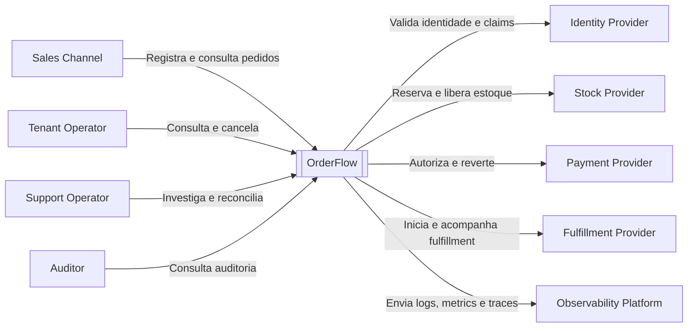
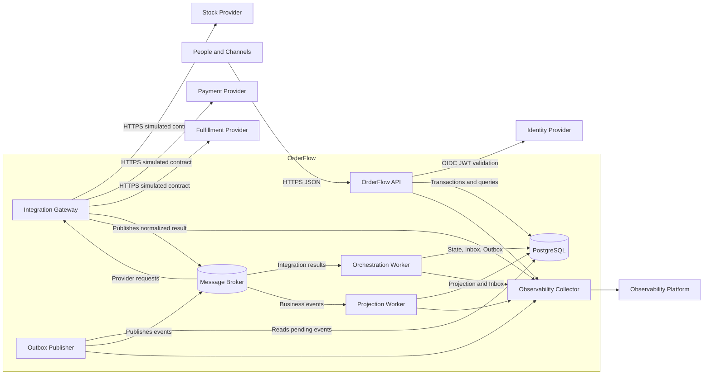
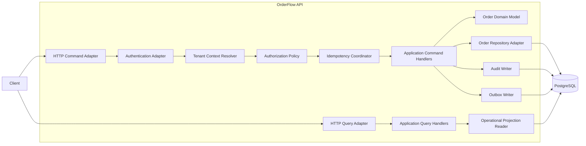
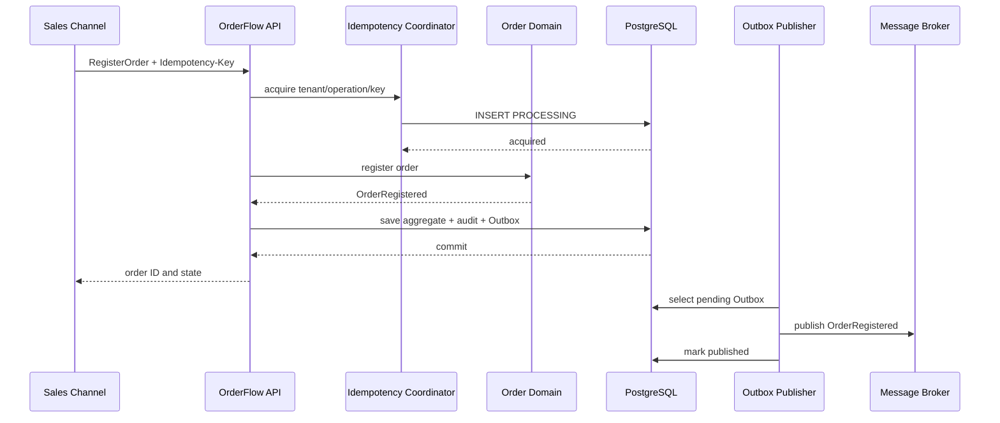
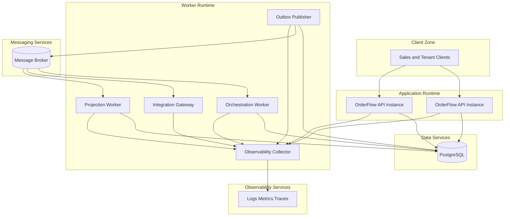

# 676 - M20.06 - Arquitetura C4 final

## Apresentação da aula

Na aula 675, você concluiu a modelagem de banco do OrderFlow.

O projeto passou a possuir:

- domínio `Order Orchestration`;
- aggregate root `OrderProcess`;
- value objects;
- invariantes;
- domain events;
- ports;
- schema PostgreSQL;
- tabelas autoritativas;
- optimistic locking;
- Idempotency Registry;
- Outbox;
- Inbox;
- auditoria;
- projection operacional;
- constraints;
- índices;
- migrations;
- rollback;
- backup e restore;
- testes e evidências.

Agora é necessário mostrar como todas essas partes se relacionam.

A arquitetura C4 final deve responder:

```text
quem usa o OrderFlow;

quais sistemas externos participam;

quais containers existem;

qual responsabilidade pertence
a cada container;

como comandos e eventos fluem;

onde o dominio vive;

onde os dados sao autoritativos;

como providers sao isolados;

como mensagens sao publicadas;

como consumers deduplicam;

como consultas sao atendidas;

como seguranca e observabilidade
atravessam a arquitetura;

como a solucao e implantada;

como falhas, compensacoes
e reconciliacao aparecem.
```

O modelo C4 organiza arquitetura em níveis.

Nesta aula, serão utilizados:

```text
Nivel 1:
System Context.

Nivel 2:
Container.

Nivel 3:
Component.

Deployment View:
implantacao logica.

Dynamic View:
fluxos importantes.
```

O nível de código não será desenhado integralmente.

O projeto já possui exemplos suficientes de packages, classes, ports e adapters.

O objetivo agora é comunicar arquitetura.

O erro comum seria criar um diagrama com muitas caixas e nenhuma responsabilidade.

Outro erro seria usar uma única caixa chamada:

```text
Backend.
```

Essa caixa esconderia:

- entrada de comandos;
- execução da orquestração;
- integração com providers;
- publicação de eventos;
- processamento de respostas;
- projeções;
- persistência;
- segurança;
- observabilidade.

Também seria incorreto criar um container para cada classe ou bounded context sem justificar deployment, escala e isolamento.

A arquitetura final adotará uma aplicação Java modular e workers separados para processamento assíncrono, isolamento de falha, retry independente e backlog operacional.

Proposta:

```text
OrderFlow API;

Orchestration Worker;

Integration Gateway;

Outbox Publisher;

Projection Worker;

PostgreSQL;

Message Broker;

Observability Platform.
```

Essa proposta será documentada no C4.

As decisões e alternativas formais serão registradas na próxima aula.

O laboratório será:

```text
labs/m20/aula-676-arquitetura-c4-final/orderflow-final-c4
```

Você criará:

- C4 Charter;
- catálogo de pessoas;
- catálogo de sistemas;
- System Context;
- catálogo de containers;
- Container View;
- componentes da API;
- componentes do worker;
- componentes do Integration Gateway;
- componentes dos workers de infraestrutura;
- dynamic views;
- deployment view;
- catálogo de relações;
- trust boundaries;
- mapa de dados;
- mapa de observabilidade;
- mapa de responsabilidade;
- validações arquiteturais;
- reports, evidence e gate.

A próxima aula será:

```text
677 - M20.07 - ADRs do projeto
```

Na aula 677, as decisões arquiteturais serão registradas formalmente com contexto, alternativas, decisão, consequências, evidências e review triggers.

Nesta aula, os ADRs finais não serão escritos.

Regra central:

```text
um diagrama C4
nao serve para decorar;

ele serve para tornar
responsabilidades,
relacoes,
limites,
dados
e operacao
compreensiveis.
```

---

## Onde estamos na formação

A sequência oficial é:

```text
673:
Escopo funcional.

674:
Modelagem dominio final.

675:
Modelagem banco final.

676:
Arquitetura C4 final.

677:
ADRs do projeto.

678:
Configuracao repositorio profissional.
```

---

## Objetivo prático

Será criada a estrutura:

```text
labs/m20/aula-676-arquitetura-c4-final
└── orderflow-final-c4
    ├── README.md
    ├── architecture
    │   ├── C4_CHARTER.md
    │   ├── PERSON_CATALOG.md
    │   ├── SOFTWARE_SYSTEM_CATALOG.md
    │   ├── SYSTEM_CONTEXT.md
    │   ├── CONTAINER_CATALOG.md
    │   ├── CONTAINER_VIEW.md
    │   ├── API_COMPONENT_VIEW.md
    │   ├── ORCHESTRATION_WORKER_COMPONENT_VIEW.md
    │   ├── INTEGRATION_GATEWAY_COMPONENT_VIEW.md
    │   ├── INFRASTRUCTURE_WORKERS_COMPONENT_VIEW.md
    │   ├── DYNAMIC_VIEW_REGISTER_ORDER.md
    │   ├── DYNAMIC_VIEW_SUCCESS_FLOW.md
    │   ├── DYNAMIC_VIEW_PAYMENT_REJECTED.md
    │   ├── DYNAMIC_VIEW_AMBIGUOUS_TIMEOUT.md
    │   ├── DYNAMIC_VIEW_CANCELLATION.md
    │   ├── DEPLOYMENT_VIEW.md
    │   ├── RELATIONSHIP_CATALOG.md
    │   ├── TRUST_BOUNDARY_MAP.md
    │   ├── DATA_FLOW_MAP.md
    │   ├── OBSERVABILITY_MAP.md
    │   ├── RESPONSIBILITY_MATRIX.md
    │   ├── ARCHITECTURE_CONSTRAINTS.md
    │   ├── ADR_INPUT_CATALOG.md
    │   ├── C4_TRACEABILITY.md
    │   ├── C4_RISK_REGISTER.md
    │   ├── C4_OPEN_QUESTIONS.md
    │   └── NEXT_LESSON_BOUNDARY.md
    ├── diagrams
    │   ├── workspace.dsl
    │   ├── system-context.mmd
    │   ├── container-view.mmd
    │   ├── API-components.mmd
    │   ├── orchestration-worker-components.mmd
    │   ├── integration-gateway-components.mmd
    │   ├── register-order-sequence.mmd
    │   ├── success-flow-sequence.mmd
    │   ├── payment-rejected-sequence.mmd
    │   ├── ambiguous-timeout-sequence.mmd
    │   ├── cancellation-sequence.mmd
    │   └── deployment-view.mmd
    ├── contracts
    │   ├── final-C4-contract.yaml
    │   ├── context-policy.yaml
    │   ├── container-policy.yaml
    │   ├── component-policy.yaml
    │   ├── relationship-policy.yaml
    │   ├── deployment-policy.yaml
    │   ├── trust-boundary-policy.yaml
    │   ├── traceability-policy.yaml
    │   └── non-anticipation-policy.yaml
    ├── src
    │   ├── main
    │   │   └── java
    │   │       └── br/com/formacao/orderflow/architecture
    │   │           ├── ArchitectureElement.java
    │   │           ├── ArchitectureRelationship.java
    │   │           ├── ArchitectureElementType.java
    │   │           ├── RelationshipMode.java
    │   │           ├── DataClassification.java
    │   │           ├── TrustBoundary.java
    │   │           ├── ArchitectureConstraint.java
    │   │           └── FinalC4Gate.java
    │   └── test
    │       └── java
    │           └── br/com/formacao/orderflow/architecture
    │               ├── OrphanContainerTest.java
    │               ├── RelationshipCompletenessTest.java
    │               ├── DataOwnershipTest.java
    │               ├── TrustBoundaryCoverageTest.java
    │               ├── ComponentResponsibilityTest.java
    │               ├── DynamicViewCoverageTest.java
    │               ├── AdrNonAnticipationTest.java
    │               └── FinalC4GateTest.java
    └── reports
        ├── context-report.yaml
        ├── container-report.yaml
        ├── component-report.yaml
        ├── relationship-report.yaml
        ├── trust-boundary-report.yaml
        ├── dynamic-view-report.yaml
        ├── deployment-report.yaml
        ├── traceability-report.yaml
        └── final-C4-gate-report.yaml
```

Scripts:

```text
scripts/m20/orderflow-final-c4
├── validate-C4-contract.ps1
├── validate-system-context.ps1
├── validate-containers.ps1
├── validate-components.ps1
├── validate-relationships.ps1
├── validate-trust-boundaries.ps1
├── validate-dynamic-views.ps1
├── validate-deployment-view.ps1
├── validate-C4-traceability.ps1
├── run-orderflow-C4-tests.ps1
├── collect-orderflow-C4-evidence.ps1
└── verify-orderflow-C4-gate.ps1
```

---

## Conceito essencial

### System Context mostra o ecossistema

O System Context mostra:

- pessoas;
- OrderFlow;
- sistemas externos;
- relações de alto nível.

Ele não mostra:

- packages;
- classes;
- tabelas;
- filas internas;
- detalhes de código.

### Container não significa Docker

No C4, container é uma unidade executável ou data store.

Exemplos:

- aplicação web;
- API;
- worker;
- banco;
- broker;
- aplicação móvel.

Um container pode ser executado em Docker.

Mas não é definido por Docker.

### Component mostra responsabilidade interna

Component é uma parte relevante de um container.

Exemplos na API:

- HTTP Command Adapter;
- Tenant Context;
- Application Command Handler;
- Domain Model;
- Repository Adapter;
- Idempotency Coordinator;
- Audit Writer;
- Outbox Writer.

Não desenhe cada classe.

### Dynamic View mostra uma história

Dynamic View apresenta interações para um cenário específico.

Ela ajuda a responder:

```text
quem chama quem;

em qual ordem;

onde ocorre transacao;

quando evento e publicado;

como falha e tratada;

onde compensacao acontece.
```

### Deployment View mostra execução

Deployment View apresenta:

- nós lógicos;
- instâncias;
- containers implantados;
- redes;
- bancos;
- broker;
- observabilidade.

Nesta aula, a visão será lógica.

Não será criado um desenho de produção real.

### Relações precisam de semântica

Seta sem descrição não é suficiente.

Cada relação precisa registrar:

- propósito;
- protocolo;
- modo síncrono ou assíncrono;
- autenticação;
- timeout;
- dados;
- classificação;
- SLO;
- failure mode;
- owner.

---

## Mão na massa guiada

### 1. Criar o laboratório

Execute:

```powershell
New-Item `
  -ItemType Directory `
  -Force `
  labs/m20/aula-676-arquitetura-c4-final/orderflow-final-c4

Set-Location `
  labs/m20/aula-676-arquitetura-c4-final/orderflow-final-c4
```

---

### 2. Criar C4 Charter

Arquivo:

```text
architecture/C4_CHARTER.md
```

Conteúdo:

```markdown
# C4 Charter

Projeto

OrderFlow.

Objetivo

Comunicar pessoas,
sistemas,
containers,
componentes,
relacoes,
dados,
trust boundaries,
fluxos
e implantacao logica.

Principios

- one responsibility per element;
- relationship has meaning;
- data authority is explicit;
- sync and async are visible;
- security crosses every boundary;
- observability follows journeys;
- diagrams reflect implementation intent;
- ADRs belong to lesson 677;
- no production topology secrets.
```

---

### 3. Criar contrato principal

Arquivo:

```text
contracts/final-C4-contract.yaml
```

Conteúdo:

```yaml
finalC4:
  project:
    OrderFlow

  required:
    - charter
    - people
    - external-systems
    - system-context
    - container-catalog
    - container-view
    - API-components
    - orchestration-components
    - integration-components
    - infrastructure-workers
    - dynamic-register-order
    - dynamic-success
    - dynamic-payment-rejected
    - dynamic-ambiguous-timeout
    - dynamic-cancellation
    - deployment-view
    - relationship-catalog
    - trust-boundaries
    - data-flow
    - observability-map
    - responsibility-matrix
    - constraints
    - ADR-inputs
    - traceability
    - tests
    - reports
    - evidence
    - gate

  forbidden:
    - orphan-container
    - relationship-without-purpose
    - duplicated-data-authority
    - database-used-by-external-system
    - provider-model-inside-domain
    - hidden-async-flow
    - trust-boundary-without-control
    - final-ADR-content
    - production-secret
    - real-production-topology

  nextLesson:
    code:
      M20.07
```

---

### 4. Criar catálogo de pessoas

Arquivo:

```text
architecture/PERSON_CATALOG.md
```

Pessoas:

```text
P-01:
Sales Channel Operator.

P-02:
Tenant Operator.

P-03:
Tenant Administrator.

P-04:
Support Operator.

P-05:
Auditor.

P-06:
Platform Operator.
```

Cada pessoa possui:

- objetivo;
- acesso;
- journeys;
- restrições;
- autenticação;
- owner da experiência.

---

### 5. Criar catálogo de sistemas

Arquivo:

```text
architecture/SOFTWARE_SYSTEM_CATALOG.md
```

Sistemas:

```text
S-01:
OrderFlow.

S-02:
Identity Provider.

S-03:
Stock Provider.

S-04:
Payment Provider.

S-05:
Fulfillment Provider.

S-06:
Message Broker.

S-07:
Observability Platform.

S-08:
Source Control and CI Platform.
```

O broker e a plataforma de observabilidade aparecem como sistemas externos ao boundary lógico do OrderFlow.

---

### 6. Criar System Context

Arquivo:

```text
architecture/SYSTEM_CONTEXT.md
```

Descrição:

```text
Sales Channel
registra e consulta pedidos.

Tenant Operator
acompanha e cancela pedidos.

Support Operator
investiga falhas e reconciliacoes.

Auditor
consulta trilha auditavel.

Identity Provider
autentica pessoas e workloads.

Stock Provider
reserva e libera estoque.

Payment Provider
autoriza e reverte autorizacao.

Fulfillment Provider
inicia, atualiza e cancela preparacao.

Observability Platform
recebe telemetry.

OrderFlow
orquestra a jornada.
```

---

### 7. Criar diagrama System Context

Arquivo:

```text
diagrams/system-context.mmd
```

Conteúdo:



---

### 8. Criar catálogo de containers

Arquivo:

```text
architecture/CONTAINER_CATALOG.md
```

Containers:

```text
C-01:
OrderFlow API.

C-02:
Orchestration Worker.

C-03:
Integration Gateway.

C-04:
Outbox Publisher.

C-05:
Projection Worker.

C-06:
PostgreSQL Database.

C-07:
Message Broker.

C-08:
Observability Collector.
```

---

### 9. Definir OrderFlow API

Responsabilidade:

- receber comandos;
- autenticar e autorizar;
- estabelecer tenant context;
- coordenar idempotência;
- executar application handlers;
- carregar e salvar aggregate;
- registrar audit;
- inserir Outbox;
- atender consultas simples;
- consultar projection operacional.

Tecnologia candidata:

```text
Java 21;
Spring Boot.
```

A escolha formal será registrada em ADR.

---

### 10. Definir Orchestration Worker

Responsabilidade:

- consumir resultados externos;
- usar Inbox;
- carregar aggregate;
- aplicar resultados;
- decidir próximo passo;
- planejar compensações;
- criar novos eventos;
- agendar reconciliação;
- registrar audit;
- salvar estado e Outbox.

Ele não chama providers diretamente.

---

### 11. Definir Integration Gateway

Responsabilidade:

- consumir solicitações de integração;
- traduzir contratos internos;
- chamar providers simulados;
- aplicar timeout, retry e deadline;
- traduzir resposta externa;
- publicar resultado normalizado;
- isolar SDKs e protocolos;
- medir latência e falhas.

Ele implementa Anti-Corruption Layers.

---

### 12. Definir Outbox Publisher

Responsabilidade:

- buscar eventos pendentes;
- usar locking seguro;
- publicar no broker;
- atualizar status;
- aplicar backoff;
- expor lag e attempts;
- encaminhar falhas persistentes para operação.

Ele não altera estado do aggregate.

---

### 13. Definir Projection Worker

Responsabilidade:

- consumir eventos;
- deduplicar;
- atualizar projection operacional;
- manter versão;
- tratar evento fora de ordem;
- permitir rebuild;
- medir freshness;
- não escrever nas tabelas autoritativas.

---

### 14. Definir PostgreSQL

Responsabilidade:

- estado autoritativo;
- idempotência;
- Outbox;
- Inbox;
- audit;
- projection;
- constraints;
- locking.

O banco é acessado apenas por containers do OrderFlow autorizados.

Providers externos nunca acessam o banco.

---

### 15. Criar Container View

Arquivo:

```text
architecture/CONTAINER_VIEW.md
```

Relações principais:

```text
People
-> OrderFlow API.

OrderFlow API
-> PostgreSQL.

OrderFlow API
-> Message Broker
indiretamente via Outbox Publisher.

Message Broker
-> Orchestration Worker.

Message Broker
-> Integration Gateway.

Message Broker
-> Projection Worker.

Integration Gateway
-> external providers.

All runtime containers
-> Observability Collector.

Observability Collector
-> Observability Platform.
```

---

### 16. Criar diagrama de containers

Arquivo:

```text
diagrams/container-view.mmd
```

Conteúdo:



---

### 17. Criar componentes da API

Arquivo:

```text
architecture/API_COMPONENT_VIEW.md
```

Componentes:

```text
CMP-API-01:
HTTP Command Adapter.

CMP-API-02:
HTTP Query Adapter.

CMP-API-03:
Authentication Adapter.

CMP-API-04:
Tenant Context Resolver.

CMP-API-05:
Authorization Policy.

CMP-API-06:
Idempotency Coordinator.

CMP-API-07:
Application Command Handlers.

CMP-API-08:
Application Query Handlers.

CMP-API-09:
Order Domain Model.

CMP-API-10:
Order Repository Adapter.

CMP-API-11:
Audit Writer.

CMP-API-12:
Outbox Writer.

CMP-API-13:
Operational Projection Reader.
```

---

### 18. Criar diagrama de componentes da API

Arquivo:

```text
diagrams/API-components.mmd
```

Conteúdo:



---

### 19. Definir transação da API

Na escrita:

```text
Idempotency Registry;

OrderProcess;

children;

audit;

Outbox;

commit.
```

O `Outbox Publisher` atua depois.

A API não publica diretamente no broker.

---

### 20. Criar componentes do Orchestration Worker

Arquivo:

```text
architecture/ORCHESTRATION_WORKER_COMPONENT_VIEW.md
```

Componentes:

```text
CMP-ORCH-01:
Message Consumer Adapter.

CMP-ORCH-02:
Inbox Coordinator.

CMP-ORCH-03:
External Result Translator.

CMP-ORCH-04:
Result Application Handler.

CMP-ORCH-05:
Order Domain Model.

CMP-ORCH-06:
Next Step Policy.

CMP-ORCH-07:
Compensation Planner.

CMP-ORCH-08:
Reconciliation Scheduler.

CMP-ORCH-09:
Order Repository Adapter.

CMP-ORCH-10:
Audit Writer.

CMP-ORCH-11:
Outbox Writer.
```

---

### 21. Definir transação do worker

Na mesma transação:

```text
insert Inbox;

load aggregate;

apply normalized result;

save aggregate;

insert audit;

insert Outbox;

mark Inbox processed;

commit.
```

Mensagem duplicada não reaplica efeito.

---

### 22. Criar componentes do Integration Gateway

Arquivo:

```text
architecture/INTEGRATION_GATEWAY_COMPONENT_VIEW.md
```

Componentes:

```text
CMP-INT-01:
Provider Request Consumer.

CMP-INT-02:
Request Router.

CMP-INT-03:
Stock Adapter.

CMP-INT-04:
Payment Adapter.

CMP-INT-05:
Fulfillment Adapter.

CMP-INT-06:
Deadline Policy.

CMP-INT-07:
Retry Policy.

CMP-INT-08:
Response Normalizer.

CMP-INT-09:
Result Publisher.

CMP-INT-10:
Provider Telemetry.
```

---

### 23. Proteger provider model

O `Response Normalizer` converte:

```text
provider response
-> internal integration result.
```

O worker converte:

```text
integration result
-> domain result.
```

Esse duplo boundary evita que DTOs externos entrem no domínio.

---

### 24. Criar componentes de infraestrutura

Arquivo:

```text
architecture/INFRASTRUCTURE_WORKERS_COMPONENT_VIEW.md
```

Outbox Publisher:

- Pending Event Reader;
- Lease Coordinator;
- Broker Publisher;
- Retry Scheduler;
- Publish Result Writer;
- Outbox Metrics.

Projection Worker:

- Event Consumer;
- Inbox Coordinator;
- Projection Handler;
- Version Guard;
- Projection Repository;
- Freshness Metrics;
- Rebuild Coordinator.

---

### 25. Criar Relationship Catalog

Arquivo:

```text
architecture/RELATIONSHIP_CATALOG.md
```

Campos:

- source;
- destination;
- purpose;
- protocol;
- mode;
- authentication;
- timeout;
- retry;
- data classification;
- owner;
- SLO;
- failure mode;
- observability.

---

### 26. Modelar relação HTTP de entrada

Exemplo:

```text
R-001

Source:
Sales Channel.

Destination:
OrderFlow API.

Purpose:
Register order.

Protocol:
HTTPS JSON.

Mode:
Synchronous.

Authentication:
OIDC client credentials
or user token.

Timeout:
2 seconds.

Retry:
only with same idempotency key.

Data:
Internal business data.

Owner:
OrderFlow API.

Failure:
predictable functional error.

Observability:
trace, latency, outcome.
```

---

### 27. Modelar relação assíncrona de integração

Exemplo:

```text
R-010

Source:
Outbox Publisher.

Destination:
Message Broker.

Purpose:
Publish provider request.

Mode:
Asynchronous.

Authentication:
Workload identity.

Ordering:
order ID.

Retry:
bounded with backoff.

Failure:
Outbox remains pending.

Observability:
outbox age, attempts, lag.
```

---

### 28. Criar ArchitectureRelationship

```java
package br.com.formacao.orderflow.architecture;

import java.time.Duration;
import java.util.Objects;

public record ArchitectureRelationship(
        String id,
        String sourceId,
        String destinationId,
        String purpose,
        String protocol,
        RelationshipMode mode,
        String authentication,
        Duration timeout,
        DataClassification dataClassification,
        String owner,
        String failureMode) {

    public ArchitectureRelationship {
        Objects.requireNonNull(id);
        Objects.requireNonNull(sourceId);
        Objects.requireNonNull(destinationId);
        Objects.requireNonNull(purpose);
        Objects.requireNonNull(protocol);
        Objects.requireNonNull(mode);
        Objects.requireNonNull(authentication);
        Objects.requireNonNull(dataClassification);
        Objects.requireNonNull(owner);
        Objects.requireNonNull(failureMode);
    }
}
```

---

### 29. Criar Dynamic View de registro

Arquivo:

```text
architecture/DYNAMIC_VIEW_REGISTER_ORDER.md
```

Sequência:

```text
1. Sales Channel chama API.

2. API autentica.

3. Tenant Context e resolvido.

4. Authorization valida acao.

5. Idempotency Coordinator
tenta registrar key.

6. Command Handler
cria OrderProcess.

7. Repository grava aggregate.

8. Audit Writer grava audit.

9. Outbox Writer grava evento.

10. Transaction commits.

11. API devolve resultado.

12. Outbox Publisher publica depois.
```

---

### 30. Criar sequence de registro

Arquivo:

```text
diagrams/register-order-sequence.mmd
```

Conteúdo:



---

### 31. Criar Dynamic View de sucesso

Arquivo:

```text
architecture/DYNAMIC_VIEW_SUCCESS_FLOW.md
```

Fluxo:

```text
OrderRegistered;

StockReservationRequested;

Integration Gateway chama estoque;

StockReserved;

Orchestration Worker aplica resultado;

PaymentAuthorizationRequested;

Integration Gateway chama pagamento;

PaymentAuthorized;

Orchestration Worker aplica resultado;

FulfillmentStarted;

Integration Gateway chama fulfillment;

FulfillmentCompleted;

OrderCompleted;

Projection atualizada.
```

---

### 32. Criar Dynamic View de pagamento recusado

Arquivo:

```text
architecture/DYNAMIC_VIEW_PAYMENT_REJECTED.md
```

Fluxo:

```text
estoque confirmado;

pagamento solicitado;

provider rejeita;

Integration Gateway normaliza;

worker aplica PaymentRejected;

domain inicia compensacao;

Outbox publica ReleaseStockRequested;

gateway chama estoque;

resultado retorna;

worker conclui compensacao;

pedido termina em FAILED
ou CANCELLED
conforme regra documentada.
```

Para o projeto:

```text
Payment rejection
after stock reservation
ends as FAILED
after successful stock release.
```

O cancelamento explícito termina em `CANCELLED`.

---

### 33. Criar Dynamic View de timeout ambíguo

Arquivo:

```text
architecture/DYNAMIC_VIEW_AMBIGUOUS_TIMEOUT.md
```

Fluxo:

```text
gateway chama provider;

deadline termina;

resultado real e desconhecido;

gateway publica AmbiguousResult;

worker aplica resultado;

aggregate entra
PENDING_RECONCILIATION;

scheduler cria consulta;

gateway consulta provider;

resultado normalizado retorna;

worker resolve estado;

audit e projection sao atualizados.
```

---

### 34. Criar Dynamic View de cancelamento

Arquivo:

```text
architecture/DYNAMIC_VIEW_CANCELLATION.md
```

Fluxo:

```text
operator solicita cancelamento;

API valida tenant e elegibilidade;

aggregate registra solicitacao;

Outbox publica evento;

worker planeja compensacoes;

gateway executa acoes externas;

worker recebe resultados;

Inbox deduplica;

aggregate conclui
ou entra em reconciliacao;

projection reflete estado.
```

---

### 35. Criar Trust Boundary Map

Arquivo:

```text
architecture/TRUST_BOUNDARY_MAP.md
```

Boundaries:

```text
TB-01:
External Client to API.

TB-02:
API to Identity Provider.

TB-03:
Runtime Containers to Database.

TB-04:
Runtime Containers to Broker.

TB-05:
Integration Gateway to Providers.

TB-06:
Runtime to Observability Collector.

TB-07:
CI Platform to Artifact Registry.
```

Controles:

- TLS;
- workload identity;
- least privilege;
- tenant enforcement;
- input validation;
- secret manager;
- broker ACL;
- database roles;
- audit;
- telemetry sanitization.

---

### 36. Criar TrustBoundary

```java
package br.com.formacao.orderflow.architecture;

import java.util.List;
import java.util.Objects;

public record TrustBoundary(
        String id,
        String name,
        List<String> crossingRelationships,
        List<String> requiredControls,
        String owner) {

    public TrustBoundary {
        Objects.requireNonNull(id);
        Objects.requireNonNull(name);
        crossingRelationships =
                List.copyOf(crossingRelationships);
        requiredControls =
                List.copyOf(requiredControls);
        Objects.requireNonNull(owner);
    }
}
```

---

### 37. Criar Data Flow Map

Arquivo:

```text
architecture/DATA_FLOW_MAP.md
```

Dados:

```text
Order Command:
Client -> API.

Order State:
API/Worker -> PostgreSQL.

Domain Event:
Domain -> Outbox.

Integration Request:
Outbox -> Broker -> Gateway.

Provider Response:
Provider -> Gateway -> Broker.

Normalized Result:
Broker -> Worker.

Projection:
Event -> Projection Worker -> PostgreSQL.

Telemetry:
All containers -> Collector.

Audit:
API/Worker -> PostgreSQL.
```

Classificações:

- public;
- internal;
- confidential;
- sensitive.

Nenhum dado sensível desnecessário deve entrar em eventos ou telemetry.

---

### 38. Criar Observability Map

Arquivo:

```text
architecture/OBSERVABILITY_MAP.md
```

Signals:

```text
API:
request latency;
functional outcome;
idempotency result.

Worker:
message lag;
Inbox duplicate;
transition outcome;
reconciliation backlog.

Gateway:
provider latency;
timeout;
retry;
circuit state;
normalized result.

Outbox:
age;
attempts;
publish rate.

Projection:
freshness;
out-of-order count;
rebuild status.

Database:
connection saturation;
lock wait;
query latency.
```

---

### 39. Definir correlation

Correlation atravessa:

- HTTP request;
- Outbox event;
- broker message;
- provider request;
- provider result;
- worker processing;
- audit;
- projection;
- trace.

`order_id` não deve virar label de métrica.

Ele pode existir em trace e log controlado.

---

### 40. Criar Responsibility Matrix

Arquivo:

```text
architecture/RESPONSIBILITY_MATRIX.md
```

Exemplo:

```text
Receive command:
OrderFlow API.

Decide transition:
Order Domain Model.

Persist authority:
PostgreSQL.

Publish event:
Outbox Publisher.

Call provider:
Integration Gateway.

Apply provider result:
Orchestration Worker.

Build read model:
Projection Worker.

Store audit:
PostgreSQL Audit.

Collect telemetry:
Observability Collector.
```

Nenhuma responsabilidade crítica possui dois owners.

---

### 41. Criar constraints arquiteturais

Arquivo:

```text
architecture/ARCHITECTURE_CONSTRAINTS.md
```

Constraints:

```text
AC-001:
domain does not depend on framework.

AC-002:
external systems do not access database.

AC-003:
API does not publish directly to broker.

AC-004:
workers use Inbox for external messages.

AC-005:
state and Outbox share transaction.

AC-006:
projection is not command authority.

AC-007:
tenant participates in access.

AC-008:
provider DTO does not enter domain.

AC-009:
all runtime containers emit telemetry.

AC-010:
every container has owner and runbook.
```

---

### 42. Criar ArchitectureElement

```java
package br.com.formacao.orderflow.architecture;

import java.util.List;
import java.util.Objects;

public record ArchitectureElement(
        String id,
        String name,
        ArchitectureElementType type,
        String responsibility,
        String owner,
        List<String> technologies,
        List<String> dataOwned) {

    public ArchitectureElement {
        Objects.requireNonNull(id);
        Objects.requireNonNull(name);
        Objects.requireNonNull(type);
        Objects.requireNonNull(responsibility);
        Objects.requireNonNull(owner);
        technologies = List.copyOf(technologies);
        dataOwned = List.copyOf(dataOwned);
    }
}
```

---

### 43. Criar Structurizr DSL inicial

Arquivo:

```text
diagrams/workspace.dsl
```

Conteúdo:

```text
workspace "OrderFlow" "Final C4 Architecture" {

    model {
        sales = person "Sales Channel"
        operator = person "Tenant Operator"
        support = person "Support Operator"

        stock = softwareSystem "Stock Provider"
        payment = softwareSystem "Payment Provider"
        fulfillment = softwareSystem "Fulfillment Provider"
        identity = softwareSystem "Identity Provider"

        orderflow = softwareSystem "OrderFlow" {
            API = container "OrderFlow API" {
                technology "Java 21, Spring Boot"
            }

            orchestration = container "Orchestration Worker" {
                technology "Java 21, Spring Boot"
            }

            integration = container "Integration Gateway" {
                technology "Java 21, Spring Boot"
            }

            publisher = container "Outbox Publisher" {
                technology "Java 21"
            }

            projection = container "Projection Worker" {
                technology "Java 21"
            }

            database = container "PostgreSQL" {
                technology "PostgreSQL"
            }

            broker = container "Message Broker" {
                technology "Corporate Broker"
            }
        }

        sales -> API "Registers and queries orders"
        operator -> API "Queries and cancels orders"
        support -> API "Investigates and reconciles"
        API -> identity "Validates identities"
        API -> database "Persists state and queries projections"
        publisher -> database "Reads Outbox"
        publisher -> broker "Publishes events"
        broker -> orchestration "Delivers results"
        broker -> integration "Delivers provider requests"
        broker -> projection "Delivers business events"
        integration -> stock "Reserves and releases stock"
        integration -> payment "Authorizes and reverses payment"
        integration -> fulfillment "Starts and cancels fulfillment"
        orchestration -> database "Applies results atomically"
        projection -> database "Updates query models"
    }

    views {
        systemContext orderflow "SystemContext" {
            include *
            autolayout lr
        }

        container orderflow "Containers" {
            include *
            autolayout lr
        }

        theme default
    }
}
```

---

### 44. Criar Deployment View

Arquivo:

```text
architecture/DEPLOYMENT_VIEW.md
```

Nós lógicos:

```text
Client Zone;

Application Runtime;

Worker Runtime;

Data Services;

Messaging Services;

Observability Services;

CI/CD Services.
```

A implantação pode usar containers de processo.

A quantidade de instâncias é configurável.

---

### 45. Criar diagrama de deployment

Arquivo:

```text
diagrams/deployment-view.mmd
```

Conteúdo:



---

### 46. Criar ADR Input Catalog

Arquivo:

```text
architecture/ADR_INPUT_CATALOG.md
```

Entradas para a aula 677:

```text
ADR candidate:
modular Java API
plus asynchronous workers.

ADR candidate:
PostgreSQL as authority.

ADR candidate:
Outbox and Inbox.

ADR candidate:
Integration Gateway.

ADR candidate:
single logical database schema.

ADR candidate:
event-driven orchestration.

ADR candidate:
separate operational projection.

ADR candidate:
optimistic locking.

ADR candidate:
tenant-scoped keys.

ADR candidate:
OpenTelemetry-based observability.
```

Nesta aula, registre somente:

- questão;
- contexto resumido;
- alternativas a comparar;
- evidências disponíveis.

Não escreva decisão formal.

---

### 47. Criar C4 Traceability

Arquivo:

```text
architecture/C4_TRACEABILITY.md
```

Exemplo:

```text
UC-01 Register Order
-> P-01 Sales Channel
-> C-01 OrderFlow API
-> CMP-API-06 Idempotency Coordinator
-> CMP-API-09 Order Domain Model
-> C-06 PostgreSQL
-> C-04 Outbox Publisher
-> C-07 Message Broker
-> Dynamic View Register Order.

UC-12 Execute Compensation
-> C-02 Orchestration Worker
-> CMP-ORCH-07 Compensation Planner
-> C-03 Integration Gateway
-> C-07 Message Broker
-> Dynamic View Payment Rejected.
```

---

### 48. Criar riscos C4

Arquivo:

```text
architecture/C4_RISK_REGISTER.md
```

Riscos:

```text
containers demais
para uma pessoa operar;

Integration Gateway
virar God Container;

worker acumular
regras de dominio;

projection virar autoridade;

banco virar ponto unico;

broker ocultar dependencias;

telemetry expor dados;

relacoes sem timeout;

API e worker
divergirem no domain model;

diagramas ficarem stale.
```

---

### 49. Criar perguntas abertas

Arquivo:

```text
architecture/C4_OPEN_QUESTIONS.md
```

Perguntas:

```text
Outbox Publisher
fica no mesmo processo
da API ou separado?

Projection Worker
precisa de deploy independente?

Integration Gateway
deve ser dividido no futuro?

qual broker sera usado?

qual estrategia
de schema registry?

qual platform runtime?

qual topologia
de alta disponibilidade?

qual policy
de network egress?

qual mecanismo
de workload identity?
```

Essas perguntas alimentarão ADRs e configuração futura.

---

### 50. Criar boundary da próxima aula

Arquivo:

```text
architecture/NEXT_LESSON_BOUNDARY.md
```

Conteúdo:

```text
A aula 676 define:

- pessoas;
- sistemas;
- containers;
- components;
- relationships;
- dynamic views;
- deployment view;
- trust boundaries;
- data flows;
- observability;
- responsibilities;
- constraints.

A aula 677 define:

- contexto da decisao;
- alternativas;
- decisao;
- consequencias;
- evidence;
- owner;
- status;
- review trigger;
- supersession.

Nenhum ADR final
e produzido nesta aula.
```

---

### 51. Testar container órfão

Container sem:

- pessoa;
- sistema;
- relação;
- dado;
- responsibility;
- owner.

Resultado:

```text
FAIL_ORPHAN_CONTAINER
```

---

### 52. Testar relação incompleta

Relação sem propósito, protocolo ou failure mode.

Resultado:

```text
FAIL_RELATIONSHIP_COMPLETENESS
```

---

### 53. Testar autoridade duplicada

API e Projection Worker declarados como writers da tabela autoritativa.

Resultado:

```text
FAIL_DATA_AUTHORITY
```

---

### 54. Testar trust boundary

Relação externa sem controle.

Resultado:

```text
FAIL_TRUST_BOUNDARY_CONTROL
```

---

### 55. Testar componentes

Falhas:

- component sem responsabilidade;
- domain dentro do Gateway;
- provider DTO dentro do domain;
- API publicando diretamente;
- worker sem Inbox;
- projection alterando aggregate.

---

### 56. Testar dynamic views

Views obrigatórias:

- registro;
- sucesso;
- pagamento recusado;
- timeout ambíguo;
- cancelamento.

Cada view deve mostrar:

- início;
- transação;
- mensagem;
- resultado;
- falha;
- estado final.

---

### 57. Criar reports

Exemplo:

```yaml
finalC4:
  people:
    total:
      6

  softwareSystems:
    total:
      8

  containers:
    total:
      8
    orphan:
      0

  components:
    API:
      13
    orchestration:
      11
    integration:
      10
    infrastructure:
      12

  relationships:
    total:
      27
    complete:
      27

  trustBoundaries:
    total:
      7
    withControls:
      7

  dynamicViews:
    required:
      5
    complete:
      5

  dataAuthorities:
    duplicated:
      0

  ADRs:
    finalized:
      false

  gate:
    PASS
```

---

### 58. Criar evidence

Arquivo:

```text
contracts/final-C4-evidence.yaml
```

Campos permitidos:

- lesson;
- project;
- person count;
- software system count;
- container count;
- orphan container count;
- API component count;
- orchestration component count;
- integration component count;
- infrastructure component count;
- relationship count;
- complete relationship count;
- trust boundary count;
- trust boundary control coverage;
- dynamic view count;
- complete dynamic view count;
- duplicated data authority count;
- observability coverage;
- traceability coverage;
- deployment view status;
- ADR input count;
- ADR finalized;
- architecture test status;
- documentation status;
- gate status;
- timestamp.

Não inclua:

- produção real;
- IP;
- hostname;
- credenciais;
- secrets;
- cluster real;
- namespace real;
- provider real;
- conteúdo completo dos ADRs da aula 677.

---

### 59. Criar gate

O gate valida:

- charter;
- people;
- systems;
- context;
- containers;
- components;
- relationships;
- dynamic views;
- deployment;
- trust boundaries;
- data flow;
- observability;
- responsibilities;
- constraints;
- ADR inputs;
- traceability;
- risks;
- tests;
- reports;
- evidence;
- não antecipação.

Status:

```text
PASS;

FAIL_C4_CHARTER;

FAIL_PERSON;

FAIL_SOFTWARE_SYSTEM;

FAIL_SYSTEM_CONTEXT;

FAIL_CONTAINER;

FAIL_ORPHAN_CONTAINER;

FAIL_COMPONENT;

FAIL_RELATIONSHIP;

FAIL_DYNAMIC_VIEW;

FAIL_DEPLOYMENT_VIEW;

FAIL_TRUST_BOUNDARY;

FAIL_DATA_AUTHORITY;

FAIL_OBSERVABILITY_MAP;

FAIL_RESPONSIBILITY;

FAIL_ARCHITECTURE_CONSTRAINT;

FAIL_ADR_ANTICIPATION;

FAIL_TRACEABILITY;

FAIL_TEST;

INCONCLUSIVE.
```

---

### 60. Executar validação completa

```powershell
.\scripts\m20\orderflow-final-c4\validate-C4-contract.ps1

.\scripts\m20\orderflow-final-c4\validate-system-context.ps1

.\scripts\m20\orderflow-final-c4\validate-containers.ps1

.\scripts\m20\orderflow-final-c4\validate-components.ps1

.\scripts\m20\orderflow-final-c4\validate-relationships.ps1

.\scripts\m20\orderflow-final-c4\validate-trust-boundaries.ps1

.\scripts\m20\orderflow-final-c4\validate-dynamic-views.ps1

.\scripts\m20\orderflow-final-c4\validate-deployment-view.ps1

.\scripts\m20\orderflow-final-c4\validate-C4-traceability.ps1

.\scripts\m20\orderflow-final-c4\run-orderflow-C4-tests.ps1

.\scripts\m20\orderflow-final-c4\collect-orderflow-C4-evidence.ps1

.\scripts\m20\orderflow-final-c4\verify-orderflow-C4-gate.ps1
```

Finalize:

```powershell
git diff --check

git status
```

---

### 61. Encerrar o laboratório

Confirme:

- charter;
- people;
- systems;
- context;
- containers;
- API components;
- orchestration components;
- integration components;
- infrastructure components;
- relationships;
- register flow;
- success flow;
- payment rejected flow;
- ambiguous timeout flow;
- cancellation flow;
- deployment view;
- trust boundaries;
- data flow;
- observability;
- responsibilities;
- constraints;
- ADR inputs;
- traceability;
- risks;
- questions;
- tests;
- reports;
- evidence;
- gate aprovado;
- ADRs não finalizados.

---

## Entendendo o que foi feito

A arquitetura conectou pessoas, containers, domínio, PostgreSQL, Outbox, broker, workers, providers, projections, segurança e observabilidade. Fluxos de sucesso, falha, compensação e reconciliação ficaram explícitos, enquanto as justificativas formais permanecem reservadas para os ADRs da aula 677.

---

## Erros comuns importantes

### Banco compartilhado sem ownership

Qualquer container começa a escrever qualquer dado.

### Seta sem protocolo

O fluxo não pode ser avaliado.

### Provider DTO no domínio

O boundary perde proteção.

### Produzir ADR completo agora

A decisão formal pertence à aula 677.

---

## Comandos úteis

### Validar contexto

```powershell
.\scripts\m20\orderflow-final-c4\validate-system-context.ps1
```

### Validar containers

```powershell
.\scripts\m20\orderflow-final-c4\validate-containers.ps1
```

### Validar relações

```powershell
.\scripts\m20\orderflow-final-c4\validate-relationships.ps1
```

### Validar dynamic views

```powershell
.\scripts\m20\orderflow-final-c4\validate-dynamic-views.ps1
```

### Executar testes

```powershell
.\scripts\m20\orderflow-final-c4\run-orderflow-C4-tests.ps1
```

### Verificar gate

```powershell
.\scripts\m20\orderflow-final-c4\verify-orderflow-C4-gate.ps1
```

---

## Exercício guiado

Modele o fluxo:

```text
pagamento recusado
apos estoque reservado.
```

Crie:

1. pessoas envolvidas;
2. containers;
3. components;
4. relação síncrona;
5. relações assíncronas;
6. transação do worker;
7. Outbox;
8. Inbox;
9. compensação;
10. trust boundaries;
11. telemetry;
12. estado final;
13. risk;
14. ADR input.

Não escreva o ADR final.

---

## Critérios de aceite

- arquivo, H1, número, módulo, título e nome seguem a grade oficial;
- continuidade com a aula 675 e ponte para a aula 677 foram preservadas;
- laboratório `orderflow-final-c4` foi criado;
- C4 Charter foi criado;
- contrato principal foi criado;
- Person Catalog foi criado;
- Software System Catalog foi criado;
- System Context foi criado;
- diagrama de contexto foi criado;
- Container Catalog foi criado;
- OrderFlow API foi definida;
- Orchestration Worker foi definido;
- Integration Gateway foi definido;
- Outbox Publisher foi definido;
- Projection Worker foi definido;
- PostgreSQL foi definido;
- Container View foi criada;
- diagrama de containers foi criado;
- quantidade de containers foi justificada;
- API Component View foi criada;
- componentes de segurança, idempotência, domínio, audit e Outbox foram definidos;
- transaction da API foi definida;
- Orchestration Worker Component View foi criada;
- transaction do worker foi definida;
- Integration Gateway Component View foi criada;
- provider model foi protegido;
- infrastructure workers foram detalhados;
- Relationship Catalog foi criado;
- relação HTTP foi detalhada;
- relação assíncrona foi detalhada;
- ArchitectureRelationship foi criado;
- Dynamic View de registro foi criada;
- sequence de registro foi criada;
- Dynamic View de sucesso foi criada;
- Dynamic View de pagamento recusado foi criada;
- Dynamic View de timeout ambíguo foi criada;
- Dynamic View de cancelamento foi criada;
- Trust Boundary Map foi criado;
- TrustBoundary foi criado;
- Data Flow Map foi criado;
- Observability Map foi criado;
- correlation foi definida;
- Responsibility Matrix foi criada;
- constraints arquiteturais foram criadas;
- ArchitectureElement foi criado;
- Structurizr DSL inicial foi criado;
- Deployment View foi criada;
- diagrama de deployment foi criado;
- escala e disponibilidade foram discutidas;
- ADR Input Catalog foi criado;
- C4 Traceability foi criada;
- riscos e perguntas abertas foram registrados;
- boundary da aula 677 foi criado;
- testes de containers, relações, autoridade, trust boundaries, components e dynamic views foram definidos;
- reports, evidence e gate foram criados;
- commit recomendado e diário de bordo estão presentes;
- ADRs finais não foram antecipados.

---

## Commit recomendado

Antes do commit:

```powershell
git status

git diff

git diff --check

git diff --stat
```

Adicione:

```powershell
git add `
  labs/m20/aula-676-arquitetura-c4-final/orderflow-final-c4 `
  scripts/m20/orderflow-final-c4 `
  docs/diario-de-bordo.md
```

Revise:

```powershell
git diff `
  --cached `
  --name-only
```

Procure conteúdo proibido:

```powershell
git diff `
  --cached `
  | Select-String `
      -Pattern `
      "password|authorization: Bearer|access_token|refresh_token|client_secret|private_key|productionHost|realCluster|realNamespace|realProvider"
```

Commit recomendado:

```powershell
git commit -m "docs(m20): consolidar arquitetura C4 final do OrderFlow"
```

Valide:

```powershell
git log -1 --oneline

git status --short
```

Não inclua:

- topologia real;
- hosts;
- IPs;
- clusters;
- namespaces;
- credenciais;
- providers reais;
- ADRs completos;
- conteúdo detalhado da aula 677.

---

## Fechamento e ponte para a próxima aula

Nesta aula, você criou a arquitetura C4 final do OrderFlow.

Você definiu:

```text
People;

Software Systems;

System Context;

Containers;

API Components;

Orchestration Components;

Integration Components;

Infrastructure Workers;

Relationships;

Dynamic Views;

Deployment View;

Trust Boundaries;

Data Flow;

Observability Map;

Responsibility Matrix;

Architecture Constraints;

ADR Inputs;

Traceability;

tests, reports, evidence e gate.
```

Você consolidou domínio, banco, APIs, eventos, providers, workers, mensageria, segurança e observabilidade em uma arquitetura compreensível.

Você mostrou fluxos de sucesso, pagamento recusado, timeout ambíguo e cancelamento.

A próxima aula será:

```text
677 - M20.07 - ADRs do projeto
```

Nela, você registrará formalmente as decisões sobre aplicação modular, workers, PostgreSQL, Outbox, Inbox, Integration Gateway, projection, locking, multi-tenancy e observabilidade.

Nenhum ADR final foi produzido nesta aula.

---

# Material complementar

## Checkpoint final

- [ ] Criei System Context.
- [ ] Criei Container View.
- [ ] Defini components.
- [ ] Criei dynamic views.
- [ ] Criei Deployment View.
- [ ] Registrei relações.
- [ ] Mapeei trust boundaries.
- [ ] Mapeei dados.
- [ ] Mapeei observabilidade.
- [ ] Defini responsabilidades.
- [ ] Criei constraints.
- [ ] Criei ADR inputs.
- [ ] Preservei ADRs para a aula 677.

---

## Troubleshooting adicional

### O diagrama possui caixas demais

Volte à responsabilidade e ao nível C4.

### O container não possui owner

A arquitetura está incompleta.

### API e worker possuem domínio diferente

Compartilhe o mesmo módulo de domínio ou proteja compatibilidade.

### O Gateway cresceu demais

Separe por owner, risco ou escala quando houver evidence.

### O broker parece dependência invisível

Adicione relações, ordering, lag, retry e failure mode.

### A projection está stale

Exponha freshness e nunca use como autoridade.

### Dynamic View não mostra transação

Marque o commit local e a publicação posterior.

### Trust boundary não possui controle

Registre identity, encryption, validation e least privilege.

### Deployment View parece produção real

Mantenha nós lógicos e remova segredos.

### Quero escrever decisões formais

Essa etapa pertence à aula 677.

### O C4 diverge do banco

Corrija a autoridade e a traceability antes do gate.

---

## Perguntas de revisão

1. O que é C4?
2. O que mostra System Context?
3. O que é container no C4?
4. Container é Docker?
5. O que é component?
6. O que é Dynamic View?
7. O que é Deployment View?
8. Quais são os containers do OrderFlow?
9. Por que existe Orchestration Worker?
10. Por que existe Integration Gateway?
11. Por que existe Outbox Publisher?
12. Por que existe Projection Worker?
13. Quem possui o domínio?
14. Quem possui os dados?
15. Quem chama providers?
16. Como eventos são publicados?
17. Como mensagens são deduplicadas?
18. O que é trust boundary?
19. Como correlation atravessa o sistema?
20. Projection pode decidir comando?
21. Por que não criar um serviço por provider?
22. O que é ADR Input?
23. O que a aula 677 fará?
24. Qual é a próxima aula?
25. Qual é a regra central?

---

## Roteiro de resposta

1. Modelo visual em níveis.
2. Pessoas, sistema e ecossistema.
3. Unidade executável ou data store.
4. Não.
5. Responsabilidade interna relevante.
6. Sequência de interações.
7. Implantação lógica.
8. API, workers, banco, broker e collector.
9. Para aplicar resultados assíncronos.
10. Para isolar providers.
11. Para publicar após commit.
12. Para criar query model.
13. Order Domain Model.
14. PostgreSQL sob OrderFlow.
15. Integration Gateway.
16. Outbox Publisher.
17. Inbox.
18. Limite entre níveis de confiança.
19. HTTP, eventos, providers, audit e traces.
20. Não.
21. Porque owner, risco e escala ainda são semelhantes.
22. Entrada resumida para decisão futura.
23. Formalizar decisões.
24. ADRs do projeto.
25. C4 comunica responsabilidades e relações.

---

## Atualização do diário de bordo

Adicione em:

```text
docs/diario-de-bordo.md
```

```markdown
# Aula 676 - M20.06 - Arquitetura C4 final

- Continuei após Modelagem banco final.
- Criei o laboratório `orderflow-final-c4`.
- Criei C4 Charter.
- Criei o contrato principal.
- Criei Person Catalog.
- Criei Software System Catalog.
- Criei System Context.
- Criei diagrama de contexto.
- Criei Container Catalog.
- Defini OrderFlow API.
- Defini Orchestration Worker.
- Defini Integration Gateway.
- Defini Outbox Publisher.
- Defini Projection Worker.
- Defini PostgreSQL e Message Broker.
- Criei Container View.
- Criei diagrama de containers.
- Justifiquei quantidade de containers.
- Criei API Component View.
- Defini transaction da API.
- Criei Orchestration Worker Component View.
- Defini transaction do worker.
- Criei Integration Gateway Component View.
- Protegi provider models.
- Criei Infrastructure Workers Component View.
- Criei Relationship Catalog.
- Detalhei relação HTTP.
- Detalhei relação assíncrona.
- Criei ArchitectureRelationship.
- Criei Dynamic View de registro.
- Criei sequence de registro.
- Criei Dynamic View de sucesso.
- Criei Dynamic View de pagamento recusado.
- Criei Dynamic View de timeout ambíguo.
- Criei Dynamic View de cancelamento.
- Criei Trust Boundary Map.
- Criei TrustBoundary.
- Criei Data Flow Map.
- Criei Observability Map.
- Defini correlation.
- Criei Responsibility Matrix.
- Criei Architecture Constraints.
- Criei ArchitectureElement.
- Criei Structurizr DSL inicial.
- Criei Deployment View.
- Criei diagrama de deployment.
- Analisei escala e disponibilidade.
- Criei ADR Input Catalog.
- Criei C4 Traceability.
- Registrei riscos e perguntas abertas.
- Criei boundary para a aula 677.
- Defini testes arquiteturais.
- Criei reports, evidence e gate.
- Não antecipei ADRs finais.
- Próxima aula: ADRs do projeto.
```

---

## Referência técnica curta

- C4 Model.
- Person.
- Software System.
- System Context.
- Container.
- Component.
- Dynamic View.
- Deployment View.
- Relationship.
- Trust Boundary.
- Data Flow.
- Observability Map.
- Responsibility Matrix.
- Structurizr DSL.
- Outbox Publisher.
- Orchestration Worker.
- Integration Gateway.
- Projection Worker.

Regra final:

```text
A arquitetura C4 final do OrderFlow deve comunicar o ecossistema e a execução sem esconder responsabilidades: pessoas e canais usam a OrderFlow API, o Identity Provider valida identidades, a API resolve tenant, autorização e idempotência, executa handlers, usa o Order Domain Model e persiste aggregate, audit e Outbox no PostgreSQL, o Outbox Publisher publica eventos no Message Broker depois do commit, o Orchestration Worker consome resultados com Inbox, aplica transições, planeja compensações, agenda reconciliação e grava novos eventos, o Integration Gateway consome solicitações, aplica Anti-Corruption Layers, deadlines e retries, chama Stock, Payment e Fulfillment Providers e publica resultados normalizados, e o Projection Worker mantém uma visão operacional derivada sem assumir autoridade; System Context mostra pessoas, OrderFlow e sistemas externos, Container View mostra API, workers, database, broker e collector, Component Views mostram adapters, policies, handlers, domain, repositories e telemetry, Dynamic Views mostram registro, sucesso, pagamento recusado, timeout ambíguo e cancelamento, Deployment View mostra nós lógicos e escala independente, relationships registram purpose, protocol, mode, authentication, timeout, data, SLO e failure mode, trust boundaries exigem identity, encryption, validation e least privilege, correlation atravessa HTTP, Outbox, broker, providers, audit e traces, e constraints impedem publicação direta, writes externos, provider DTO no domínio, projection como authority e mensagens sem Inbox; o gate termina com charter, people, systems, context, containers, components, relationships, dynamic views, deployment, trust boundaries, data flow, observability, responsibilities, constraints, ADR inputs, traceability, risks, tests, reports e evidence aprovados, enquanto contexto, alternativas, decisão, consequências e review triggers formais permanecem reservados para a aula 677.
```
