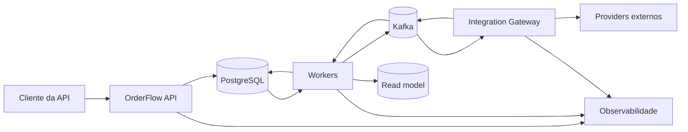
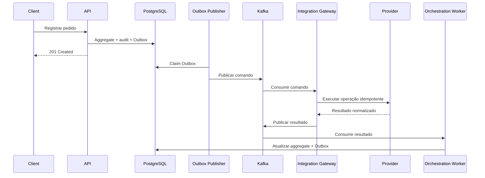
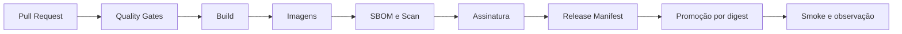

# 696 - M20.26 - README profissional

## Apresentação da aula

Na aula 695, você criou a Postman Collection do OrderFlow.

O projeto passou a possuir:

- collection no formato Postman v2.1;
- environments local e homologação simulada;
- variáveis organizadas por escopo;
- obtenção de token em runtime;
- token de workload separado;
- geração de correlation ID;
- geração e reutilização correta de idempotency keys;
- cenários de criação, replay e conflito;
- assertions de contrato;
- validação de Problem Details;
- jornadas positivas;
- jornada de pagamento recusado com compensação;
- cenários negativos;
- execução data-driven;
- execução pelo Postman CLI ou Newman;
- reports sanitizados;
- evidence e gate.

O OrderFlow já possui código, arquitetura, segurança, observabilidade, testes, containers, pipeline, deploy simulado, OpenAPI e coleção executável.

Agora falta uma porta de entrada profissional.

Nesta aula, você criará o README principal do repositório.

O README será a primeira experiência de:

- recrutadores;
- desenvolvedores;
- arquitetos;
- avaliadores;
- colegas;
- entrevistadores;
- consumidores técnicos;
- pessoas que estudam o projeto.

Um README fraco pode esconder um projeto excelente.

Um README profissional precisa responder rapidamente:

- o que é o projeto?
- qual problema ele resolve?
- quais decisões técnicas demonstra?
- como a arquitetura está organizada?
- quais tecnologias foram usadas?
- como a segurança funciona?
- como o fluxo assíncrono funciona?
- como o projeto é testado?
- como a qualidade é comprovada?
- onde está a documentação da API?
- onde está a collection do Postman?
- como executar uma validação rápida?
- quais evidências existem?
- qual é o nível real de maturidade?
- quais limitações foram assumidas?
- o que este projeto demonstra sobre o autor?

O README não deve ser:

- uma cópia do `pom.xml`;
- uma lista extensa de tecnologias sem contexto;
- um tutorial operacional completo;
- um histórico de todas as aulas;
- um arquivo cheio de badges sem valor;
- uma promessa de produção que não pode ser provada;
- uma coleção de screenshots sem narrativa;
- um texto genérico gerado sem conexão com o repositório.

O README precisa traduzir engenharia em uma narrativa clara.

A próxima aula será:

```text
697 - M20.27 - Guia de execucao local
```

Na aula 697, você criará o guia operacional detalhado para clonar, configurar, iniciar dependências, executar migrations, subir aplicações, validar saúde, rodar smoke tests, encerrar e resolver problemas comuns.

Nesta aula, o README terá apenas um quickstart curto e seguro.

O laboratório será:

```text
labs/m20/aula-696-readme-profissional/orderflow-readme
```

Regra central:

```text
um README profissional
nao tenta mostrar tudo;

ele apresenta valor,
organiza evidencias
e conduz o leitor
para o detalhe certo.
```

---

## Onde estamos na formação

A sequência oficial é:

```text
693:
Performance e carga basica final.

694:
Documentacao OpenAPI.

695:
Postman Collection.

696:
README profissional.

697:
Guia de execucao local.

698:
Runbook operacional.
```

O README conecta os artifacts criados anteriormente.

Ele aponta para:

- documentação arquitetural;
- ADRs;
- OpenAPI;
- Postman;
- reports;
- evidence;
- dashboards;
- pipeline;
- deployment simulation;
- performance report;
- testes;
- segurança;
- decisões;
- limitações.

O README não substitui esses documentos.

Ele funciona como:

```text
mapa;

resumo executivo;

narrativa tecnica;

indice confiavel.
```

A aula 697 aprofundará a execução local.

A aula 698 aprofundará a operação e resposta a incidentes.

Por isso, esta aula precisa preservar fronteiras:

- quickstart curto no README;
- troubleshooting detalhado fora dele;
- runbooks fora dele;
- comandos essenciais somente;
- links relativos estáveis;
- nenhuma duplicação de centenas de linhas.

---

## Objetivo prático

Será criado ou revisado:

```text
README.md
```

Também serão criados:

```text
docs/readme
├── README_CHARTER.md
├── README_AUDIENCE_MAP.md
├── README_INFORMATION_ARCHITECTURE.md
├── README_BADGE_POLICY.md
├── README_VISUAL_POLICY.md
├── README_LINK_POLICY.md
├── README_EVIDENCE_POLICY.md
├── README_REVIEW_CHECKLIST.md
├── README_MATRIX.md
├── README_RISK_REGISTER.md
├── README_TRACEABILITY.md
└── NEXT_LESSON_BOUNDARY.md
```

Scripts:

```text
scripts/readme
├── validate-readme.ps1
├── validate-links.ps1
├── validate-mermaid.ps1
├── validate-badges.ps1
├── validate-evidence-links.ps1
├── validate-readme-secrets.ps1
├── generate-readme-report.ps1
└── collect-readme-evidence.ps1
```

Artifacts:

```text
reports/readme-professional-report.yaml

contracts/readme-professional-evidence.yaml
```

Assets permitidos:

```text
docs/assets
├── orderflow-architecture.svg
├── orderflow-sequence.svg
├── orderflow-dashboard-overview.png
├── orderflow-openapi.png
└── orderflow-postman.png
```

Os assets devem representar o projeto real.

Não use imagens decorativas desconectadas.

---

## Conceito essencial

### README é arquitetura de informação

A ordem das seções importa.

Um leitor geralmente decide em poucos segundos se continuará.

A parte superior precisa comunicar:

```text
nome;

proposta;

diferencial;

maturidade;

caminhos principais.
```

Depois, o README aprofunda:

```text
problema;

solucao;

arquitetura;

stack;

qualidade;

execucao;

evidencias.
```

### O README possui múltiplas camadas de leitura

Leitura de 20 segundos:

- título;
- resumo;
- destaques;
- arquitetura visual;
- links principais.

Leitura de 3 minutos:

- problema;
- solução;
- fluxo;
- stack;
- segurança;
- testes;
- deploy.

Leitura profunda:

- ADRs;
- OpenAPI;
- reports;
- evidence;
- runbooks;
- código.

### Badge não substitui evidência

Um badge pode mostrar:

- Java;
- build;
- tests;
- license;
- coverage.

Mas um badge quebrado ou inventado reduz confiança.

Use apenas badges:

- verificáveis;
- estáveis;
- ligados ao repositório;
- sem revelar informação sensível;
- com valor real para o leitor.

### Honestidade técnica aumenta credibilidade

O README precisa dizer quando algo é:

- implementado;
- simulado;
- validado em ambiente local;
- planejado;
- fora de escopo.

Não chame homologação simulada de produção.

Não chame capacidade básica de benchmark definitivo.

---

## Mão na massa guiada

### 1. Criar README Charter

Arquivo:

```text
docs/readme/README_CHARTER.md
```

Princípios:

```text
value appears first;

claims require evidence;

architecture is visual;

security is explicit;

execution is concise;

deep detail stays in dedicated docs;

links are relative when possible;

assets represent the real project;

limitations are honest;

local guide belongs to lesson 697.
```

---

### 2. Criar Audience Map

Arquivo:

```text
docs/readme/README_AUDIENCE_MAP.md
```

Audiências:

```text
recrutador:
entender maturidade e escopo.

engenheiro:
entender arquitetura e codigo.

arquiteto:
entender decisoes e trade-offs.

QA:
entender estrategia de testes.

DevOps:
entender containers, pipeline e deploy.

consumidor:
encontrar OpenAPI e Postman.

entrevistador:
encontrar evidencias tecnicas.
```

---

### 3. Criar Information Architecture

Arquivo:

```text
docs/readme/README_INFORMATION_ARCHITECTURE.md
```

Ordem proposta:

1. título e proposta;
2. destaques;
3. visão do problema;
4. arquitetura;
5. fluxo principal;
6. stack;
7. módulos;
8. segurança;
9. confiabilidade;
10. testes;
11. execução rápida;
12. documentação;
13. evidências;
14. decisões;
15. limitações;
16. roadmap controlado;
17. licença e autoria.

---

### 4. Auditar o README atual

Antes de substituir, registre:

- se existe;
- quais links ainda são válidos;
- quais comandos continuam corretos;
- quais trechos possuem valor;
- quais promessas estão desatualizadas;
- quais informações são sensíveis;
- quais assets existem.

Não apague conteúdo útil sem análise.

---

### 5. Definir título

Título recomendado:

```markdown
# OrderFlow
```

Subtítulo:

```markdown
Plataforma backend para orquestração resiliente
de pedidos, integrações e processamento assíncrono.
```

Evite títulos exagerados como:

```text
A melhor API do mercado.
```

---

### 6. Criar parágrafo de abertura

O primeiro parágrafo precisa explicar:

- domínio;
- objetivo;
- arquitetura;
- maturidade;
- natureza educacional ou demonstrativa.

Exemplo:

```markdown
O OrderFlow é um projeto backend em Java 21 e Spring Boot
que demonstra a construção de uma plataforma distribuída
para registrar pedidos, orquestrar estoque, pagamento e
fulfillment, aplicar compensações, integrar providers,
processar eventos com Kafka e manter rastreabilidade
ponta a ponta. O projeto foi desenvolvido como formação
prática de engenharia backend e reúne arquitetura,
segurança, testes, observabilidade, containers, CI/CD,
deploy simulado e documentação executável.
```

---

### 7. Criar navegação rápida

Links:

```markdown
[Arquitetura](#arquitetura)

[Execução rápida](#execução-rápida)

[OpenAPI](#documentação-da-api)

[Postman](#postman)

[Testes](#estratégia-de-testes)

[Evidências](#evidências)
```

Use anchors que funcionem no renderizador do repositório.

---

### 8. Criar highlights

Destaques em lista curta:

- Java 21 e Spring Boot;
- arquitetura hexagonal e modular;
- PostgreSQL com Flyway;
- Kafka com Outbox e Inbox;
- segurança OAuth2/JWT e multi-tenant;
- OpenTelemetry, Prometheus e Grafana;
- Testcontainers, contract tests e performance;
- Docker e CI/CD com supply chain controls.

A lista precisa refletir implementação real.

---

## Badges

### 9. Criar Badge Policy

Arquivo:

```text
docs/readme/README_BADGE_POLICY.md
```

Badges permitidos:

- Java version;
- build;
- test;
- coverage quando publicado;
- license quando existe;
- OpenAPI version.

---

### 10. Remover badges decorativos

Evite badges de:

- quantidade de café;
- estrelas inventadas;
- status manual;
- coverage sem relatório;
- produção sem ambiente;
- dependência não utilizada.

---

### 11. Validar links de badges

O script verifica:

- URL acessível;
- branch correta;
- workflow correto;
- repositório correto;
- ausência de token;
- texto alternativo.

---

### 12. Omitir badge não comprovado

É melhor não possuir badge do que exibir informação falsa.

---

## Problema e solução

### 13. Criar seção O problema

Explique:

```text
pedidos distribuídos atravessam
estoque,
pagamento,
fulfillment
e sistemas externos.

falhas parciais,
duplicidade,
timeout
e concorrencia
podem produzir inconsistencias.
```

---

### 14. Criar seção A solução

Explique:

- aggregate controla invariantes;
- application handlers coordenam casos de uso;
- ports isolam adapters;
- Outbox publica eventos;
- Inbox deduplica;
- Kafka conecta workers;
- ACL normaliza providers;
- compensações tratam falhas;
- projection atende consultas;
- observabilidade explica a jornada.

---

### 15. Explicar o diferencial

Diferenciais:

- projeto end-to-end;
- decisões registradas;
- contratos executáveis;
- segurança negativa testada;
- deploy e rollback simulados;
- capacidade básica medida;
- evidências versionadas.

---

## Arquitetura

### 16. Criar seção Arquitetura

Apresente:

- visão de contexto;
- módulos;
- fluxo síncrono;
- fluxo assíncrono;
- boundaries.

---

### 17. Criar diagrama Mermaid de contexto



O diagrama deve ser validado pelo renderizador usado.

---

### 18. Explicar os boundaries

Camadas:

```text
domain:
regras e invariantes.

application:
casos de uso e ports.

adapters:
HTTP, JPA, Kafka e providers.

runtime:
aplicacoes executaveis.

infrastructure:
Docker, observabilidade e pipeline.
```

---

### 19. Criar diagrama de sequência

Fluxo:



---

### 20. Explicar consistência

Diga claramente:

- escrita transacional no PostgreSQL;
- publicação assíncrona;
- consistência eventual do read model;
- reprocessamento seguro;
- nenhuma promessa de exactly-once global.

---

### 21. Explicar compensações

Exemplo:

```text
estoque reservado;

pagamento recusado;

liberacao de estoque planejada;

pedido cancelado.
```

Compensação não é rollback distribuído automático.

---

## Stack

### 22. Criar seção Stack tecnológica

Agrupe por propósito.

Backend:

- Java 21;
- Spring Boot;
- Spring Security;
- Spring Data JPA;
- Flyway;
- Maven.

Dados e mensageria:

- PostgreSQL;
- Kafka;
- Transactional Outbox;
- Inbox.

Qualidade:

- JUnit 5;
- AssertJ;
- Mockito;
- Testcontainers;
- WireMock;
- Awaitility;
- PIT;
- k6.

Operação:

- Docker;
- OpenTelemetry;
- Micrometer;
- Prometheus;
- Grafana;
- GitHub Actions ou pipeline adotado.

---

### 23. Evitar tabela sem contexto

Para cada grupo, explique por que a tecnologia existe.

Não liste bibliotecas transitivas.

---

## Estrutura do repositório

### 24. Criar árvore resumida

```text
apps/
  orderflow-api/
  outbox-publisher/
  orchestration-worker/
  integration-gateway/
  projection-worker/

libs/
  orderflow-domain/
  orderflow-application/
  orderflow-persistence/
  orderflow-contracts/
  orderflow-observability/

docs/
infrastructure/
testing/
reports/
contracts/
```

---

### 25. Explicar cada aplicação

`orderflow-api`:

- fronteira HTTP;
- autenticação;
- commands e queries.

`outbox-publisher`:

- publicação confiável.

`orchestration-worker`:

- resultados e transições.

`integration-gateway`:

- ACL e providers.

`projection-worker`:

- read model.

---

### 26. Explicar cada biblioteca

Inclua:

- responsabilidade;
- dependências permitidas;
- o que não pertence ao módulo.

---

## Fluxos principais

### 27. Criar seção Fluxos demonstrados

Fluxos:

- happy path;
- pagamento recusado;
- cancelamento;
- reconciliação;
- replay idempotente;
- duplicate delivery;
- provider timeout.

---

### 28. Descrever happy path

Sequência curta:

```text
registro
-> estoque
-> pagamento
-> fulfillment
-> concluido.
```

---

### 29. Descrever falha com compensação

Explique decisão e evidência.

---

### 30. Descrever ambiguidade

Timeout não significa falha confirmada.

O estado entra em reconciliação.

---

## Segurança

### 31. Criar seção Segurança

Inclua:

- OAuth2 Resource Server;
- JWT;
- issuer e audience;
- scopes e roles;
- token type;
- tenant claim;
- IDOR protection;
- workload identity;
- sanitização;
- security headers;
- secret scanning.

---

### 32. Explicar multi-tenancy

Tenant efetivo:

```text
claim autenticada.
```

Não vem de:

- body;
- query;
- header arbitrário.

---

### 33. Explicar negações

```text
401:
identidade invalida.

403:
sem permissao.

404:
recurso invisivel no tenant.
```

---

### 34. Evitar alegação absoluta

Não escreva:

```text
100% seguro.
```

Escreva:

```text
controles implementados e testados
para os riscos definidos no escopo.
```

---

## Confiabilidade e mensageria

### 35. Criar seção Confiabilidade

Inclua:

- idempotência HTTP;
- operation IDs;
- Outbox;
- Inbox;
- retry;
- DLQ;
- replay;
- circuit breaker;
- bulkhead;
- rate limit;
- reconciliation.

---

### 36. Explicar delivery semantics

Use:

```text
at-least-once
com consumidores idempotentes.
```

Não prometa exactly-once global.

---

### 37. Explicar retry

Retry acontece apenas quando:

- erro é transitório;
- operação é idempotente;
- limite existe;
- backoff é aplicado.

---

### 38. Explicar DLQ

DLQ é:

- área de quarentena;
- fonte de investigação;
- origem de replay controlado.

Não é arquivo morto sem owner.

---

## Observabilidade

### 39. Criar seção Observabilidade

Sinais:

- logs estruturados;
- metrics;
- traces;
- dashboards;
- SLOs;
- alerts;
- runbooks.

---

### 40. Explicar correlation e trace

Correlation ajuda suporte.

Trace conecta spans distribuídos.

Eles não são a mesma coisa.

---

### 41. Incluir imagem real de dashboard

Somente quando:

- dados são sintéticos;
- não há secrets;
- legenda explica cenário;
- imagem está atualizada;
- arquivo possui tamanho razoável.

---

### 42. Criar Visual Policy

Arquivo:

```text
docs/readme/README_VISUAL_POLICY.md
```

Regras:

- imagem precisa ensinar;
- texto alternativo obrigatório;
- resolução legível;
- sem dado sensível;
- sem screenshot de tela vazia;
- SVG preferido para diagramas;
- PNG apenas quando necessário.

---

## Estratégia de testes

### 43. Criar seção Estratégia de testes

Camadas:

```text
unitarios;

integracao;

contratos;

seguranca;

Postman;

performance.
```

---

### 44. Apresentar qualidade sem inventar números

Use valores gerados de reports.

O script extrai:

- total;
- falhas;
- coverage;
- mutation score;
- integration count;
- contract count;
- security count.

Se um número não estiver disponível, omita.

---

### 45. Explicar testes unitários

Foco:

- invariantes;
- policies;
- handlers;
- mappers;
- security units;
- telemetry units.

---

### 46. Explicar testes de integração

Foco:

- PostgreSQL;
- Flyway;
- JPA;
- transactions;
- Kafka;
- WireMock;
- projection;
- telemetry.

---

### 47. Explicar contratos e segurança

Foco:

- OpenAPI;
- provider contracts;
- message schemas;
- JWT;
- authorization;
- tenant;
- IDOR;
- secret leaks.

---

### 48. Explicar performance

Chame de:

```text
capacidade basica em ambiente controlado.
```

Não chame de capacidade de produção.

---

## CI/CD e supply chain

### 49. Criar seção CI/CD

Fluxo:

```text
pull request;

quality gates;

build;

images;

SBOM;

scan;

signature;

provenance;

release manifest;

promotion;

rollback.
```

---

### 50. Incluir diagrama curto



---

### 51. Explicar build once

O mesmo digest é promovido.

Não se reconstrói em cada ambiente.

---

### 52. Explicar supply chain

Inclua:

- actions fixadas;
- permissions mínimas;
- OIDC quando disponível;
- SBOM;
- vulnerability policy;
- signing;
- provenance.

---

## Deploy

### 53. Criar seção Deploy

Diga com honestidade:

```text
deploy validado em ambiente de homologacao simulada
com imagens por digest,
migrations,
health,
smoke,
observacao
e rollback.
```

---

### 54. Explicar processo

- validar manifest;
- verificar signature;
- validar config;
- aplicar migration;
- iniciar dependências;
- rollout;
- smoke;
- observação;
- acceptance;
- rollback.

---

### 55. Não fingir ambiente real

Use expressão:

```text
simulação operacional reproduzível.
```

---

## Execução rápida

### 56. Criar seção Execução rápida

O quickstart precisa ser curto.

Pré-requisitos:

- Java 21;
- Docker;
- Git;
- PowerShell;
- portas livres.

---

### 57. Incluir clone genérico

```powershell
git clone <URL-do-repositorio>

Set-Location orderflow
```

No README real, use a URL correta do repositório.

O arquivo de aula não inventa URL.

---

### 58. Incluir validação

```powershell
.\mvnw.cmd `
  --batch-mode `
  clean `
  verify
```

---

### 59. Incluir subida do ambiente

```powershell
docker compose `
  -f infrastructure/docker/compose.yaml `
  --profile core `
  --profile observability `
  up `
  -d
```

---

### 60. Incluir smoke

```powershell
.\infrastructure\docker\scripts\smoke-test.ps1
```

---

### 61. Incluir encerramento

```powershell
docker compose `
  -f infrastructure/docker/compose.yaml `
  down
```

---

### 62. Linkar o guia futuro sem quebrar o README

Durante esta aula, não adicione link para arquivo inexistente.

Na aula 697, o link será incluído após o guia ser criado e validado.

---

## Documentação da API

### 63. Criar seção Documentação da API

Links relativos:

- JSON;
- YAML;
- HTML;
- guia;
- error catalog;
- versioning policy.

---

### 64. Criar seção Postman

Links:

- collection;
- environment template;
- README da collection;
- CLI report;
- evidence.

---

### 65. Criar seção ADRs

Liste decisões principais:

- arquitetura;
- persistence authority;
- Outbox e Inbox;
- mensageria;
- segurança;
- observabilidade;
- deployment.

Não liste ADR inexistente.

---

## Evidências

### 66. Criar Evidence Policy

Arquivo:

```text
docs/readme/README_EVIDENCE_POLICY.md
```

Toda claim relevante deve apontar para:

- teste;
- report;
- contract;
- screenshot real;
- script;
- ADR;
- artifact.

---

### 67. Criar seção Evidências

Categorias:

```text
build e testes;

seguranca;

mensageria;

observabilidade;

performance;

containers;

CI CD;

deploy;

OpenAPI;

Postman.
```

---

### 68. Criar tabela de evidências

Colunas:

- área;
- artifact;
- o que prova;
- status.

Evite tabelas com dezenas de linhas.

Use links para catálogo completo.

---

### 69. Criar Evidence Catalog link

Aponte para diretório ou índice validado.

Se o índice ainda não existir, crie:

```text
docs/EVIDENCE_CATALOG.md
```

com links relativos reais.

---

### 70. Não usar screenshot como única prova

Screenshot complementa.

Reports e scripts aumentam reprodutibilidade.

---

## Decisões e trade-offs

### 71. Criar seção Decisões técnicas

Escolha cinco a oito decisões fortes:

- aggregate para invariantes;
- arquitetura hexagonal;
- PostgreSQL como autoridade;
- Outbox e Inbox;
- Kafka;
- ACL de providers;
- JWT multi-tenant;
- OpenTelemetry;
- build once.

---

### 72. Explicar trade-offs

Exemplo:

```text
Outbox aumenta complexidade operacional,
mas reduz risco de perda entre banco e broker.
```

---

### 73. Evitar linguagem de superioridade

Não escreva:

```text
Kafka e sempre melhor.
```

Escreva:

```text
Kafka foi escolhido para o cenário
por throughput, retenção e integração
com o modelo orientado a eventos.
```

---

## Limitações e escopo

### 74. Criar seção Limitações conhecidas

Exemplos honestos:

- providers são simulados;
- homologação é simulada;
- capacidade é básica;
- alta disponibilidade completa não foi validada;
- Kubernetes ainda pode estar fora do release atual;
- dados são sintéticos;
- projeto é educacional e demonstrativo.

Use somente limitações reais.

---

### 75. Criar seção Fora de escopo

Exemplos:

- cobrança real;
- dados pessoais reais;
- operação de produção;
- SLA contratual;
- multi-region;
- disaster recovery completo.

---

### 76. Não usar roadmap fantasioso

Roadmap deve conter apenas próximos passos plausíveis.

---

## Posicionamento profissional

### 77. Criar seção O que este projeto demonstra

Competências:

- Java moderno;
- Spring Boot;
- domínio;
- arquitetura;
- SQL;
- mensageria;
- segurança;
- observabilidade;
- testes;
- containers;
- pipelines;
- operação;
- comunicação técnica.

---

### 78. Evitar texto autobiográfico excessivo

O projeto é o centro.

A autoria aparece de forma curta ao final.

---

### 79. Criar seção Como avaliar

Sugestão:

1. leia a arquitetura;
2. abra os ADRs;
3. execute unit tests;
4. veja integration tests;
5. consulte OpenAPI;
6. rode Postman;
7. examine reports;
8. revise commit history.

---

## Links e manutenção

### 80. Criar Link Policy

Arquivo:

```text
docs/readme/README_LINK_POLICY.md
```

Regras:

- links internos relativos;
- case-sensitive;
- sem caminhos locais;
- sem `/mnt/data`;
- sem `C:\`;
- links externos mínimos;
- link check no CI.

---

### 81. Validar anchors

Headers com acentos podem gerar anchors diferentes.

Teste no renderizador real.

---

### 82. Evitar link para arquivo gerado não versionado

O link precisa existir no repositório ou em publicação estável.

---

### 83. Criar política de atualização

Mudanças em:

- arquitetura;
- execução;
- OpenAPI;
- Postman;
- stack;
- pipeline;
- deploy;

precisam revisar o README.

---

## Revisão do conteúdo

### 84. Criar Review Checklist

Arquivo:

```text
docs/readme/README_REVIEW_CHECKLIST.md
```

Perguntas:

- proposta aparece no topo?
- claims possuem evidência?
- arquitetura está legível?
- segurança está explícita?
- execução é curta?
- links funcionam?
- imagens são reais?
- limitações são honestas?
- linguagem está profissional?
- nenhum secret aparece?
- guia local detalhado não foi antecipado?

---

### 85. Revisar linguagem

Prefira:

- frases diretas;
- termos definidos;
- verbos ativos;
- parágrafos curtos;
- bullets controlados;
- títulos informativos.

Evite:

- buzzwords;
- superlativos;
- promessa sem prova;
- texto repetitivo;
- excesso de emojis;
- informalidade.

---

### 86. Revisar acessibilidade

Valide:

- alt text;
- heading hierarchy;
- contraste dos assets;
- tabelas compreensíveis;
- diagramas com descrição textual;
- links com texto significativo.

---

### 87. Revisar segurança

Procure:

- tokens;
- secrets;
- endpoints reais;
- IPs privados;
- dados pessoais;
- tenant real;
- credenciais;
- screenshots sensíveis.

---

### 88. Revisar consistência

Compare README com:

- `pom.xml`;
- compose;
- OpenAPI;
- collection;
- reports;
- ADRs;
- scripts.

---

## Validações automáticas

### 89. Criar `validate-readme.ps1`

Valide:

- H1 único;
- seções obrigatórias;
- tamanho razoável;
- code fences;
- links relativos;
- ausência de placeholders;
- ausência de secrets;
- quickstart presente;
- limitations presente;
- próxima aula não antecipada.

---

### 90. Criar `validate-links.ps1`

O script verifica arquivos e anchors internos.

---

### 91. Criar `validate-mermaid.ps1`

Valide blocos Mermaid com ferramenta compatível.

---

### 92. Criar `validate-badges.ps1`

Valide somente badges existentes.

---

### 93. Criar `validate-evidence-links.ps1`

Cada link da seção Evidências precisa existir.

---

### 94. Criar `validate-readme-secrets.ps1`

Procure padrões e sentinelas.

---

### 95. Criar README Matrix

Arquivo:

```text
docs/readme/README_MATRIX.md
```

Colunas:

- seção;
- audiência;
- claim;
- evidence;
- link;
- owner;
- status.

---

### 96. Criar Risk Register

Arquivo:

```text
docs/readme/README_RISK_REGISTER.md
```

Riscos:

```text
claim sem evidencia;

badge quebrado;

link quebrado;

asset desatualizado;

segredo em screenshot;

arquitetura divergente;

quickstart incorreto;

produção simulada como real;

capacidade básica como benchmark;

README excessivamente longo;

guia local duplicado;

tecnologia listada sem uso.
```

---

### 97. Criar Traceability

Arquivo:

```text
docs/readme/README_TRACEABILITY.md
```

Exemplo:

```text
claim: multi-tenant security
-> security policy
-> authorization tests
-> IDOR evidence.

claim: reliable messaging
-> Outbox ADR
-> integration tests
-> messaging evidence.

claim: observed capacity
-> performance report
-> performance evidence.

claim: executable API
-> OpenAPI
-> Postman Collection
-> CLI report.
```

---

### 98. Criar boundary da próxima aula

Arquivo:

```text
docs/readme/NEXT_LESSON_BOUNDARY.md
```

Conteúdo:

```text
A aula 696 define:

- professional README;
- project pitch;
- highlights;
- problem and solution;
- architecture diagrams;
- modules;
- stack;
- security;
- reliability;
- observability;
- testing;
- CI CD;
- deployment;
- quickstart;
- documentation links;
- evidence;
- trade-offs;
- limitations;
- professional positioning.

A aula 697 define:

- complete local execution guide;
- prerequisites;
- installation validation;
- environment configuration;
- dependency startup;
- migrations;
- application startup;
- health validation;
- smoke tests;
- logs;
- shutdown;
- reset;
- troubleshooting;
- local evidence.

O guia detalhado de execucao local
nao e produzido nesta aula.
```

---

## Montagem do README final

### 99. Criar skeleton

```text
OrderFlow

Plataforma backend para orquestração resiliente
de pedidos, integrações e processamento assíncrono.

Destaques
O problema
A solução
Arquitetura
Fluxos demonstrados
Stack tecnológica
Estrutura do repositório
Segurança
Confiabilidade
Observabilidade
Estratégia de testes
CI/CD
Deploy
Execução rápida
Documentação da API
Postman
Evidências
Decisões técnicas
Limitações conhecidas
O que este projeto demonstra
Como avaliar
Licença e autoria
```

---

### 100. Preencher a partir de artifacts

Cada seção precisa ser escrita após consultar o artifact correspondente.

Não use memória como única fonte.

---

### 101. Gerar assets reais

Exporte diagrams como SVG quando necessário.

Capture dashboards e UI somente com dados sintéticos.

---

### 102. Executar revisão em três passagens

Passagem 1:

- conteúdo.

Passagem 2:

- links e evidências.

Passagem 3:

- linguagem, acessibilidade e segurança.

---

### 103. Revisar em viewport estreito

Tabelas largas e diagramas podem ficar ilegíveis.

Reduza complexidade.

---

### 104. Validar renderização

Abra no GitHub ou renderizador equivalente.

Confirme:

- anchors;
- Mermaid;
- images;
- code blocks;
- tables;
- badges.

---

### 105. Criar report

Arquivo:

```text
reports/readme-professional-report.yaml
```

Exemplo:

```yaml
READMEProfessional:
  sections:
    required:
      24
    present:
      24

  links:
    internal:
      37
    broken:
      0

  visuals:
    Mermaid:
      3
    assets:
      4
    invalid:
      0

  claims:
    evidenceBacked:
      18
    unsupported:
      0

  security:
    secretLeaks:
      0
    sensitiveAssets:
      0

  localGuide:
    completed:
      false

  gate:
    PASS
```

---

### 106. Criar evidence

Arquivo:

```text
contracts/readme-professional-evidence.yaml
```

Campos:

- lesson;
- project;
- README path;
- H1 status;
- project pitch status;
- highlight count;
- architecture diagram count;
- module documentation status;
- stack documentation status;
- security section status;
- reliability section status;
- observability section status;
- testing section status;
- CI/CD section status;
- deploy section status;
- quickstart status;
- OpenAPI link status;
- Postman link status;
- evidence link count;
- decision count;
- limitation count;
- internal link count;
- broken link count;
- invalid anchor count;
- invalid Mermaid count;
- badge count;
- invalid badge count;
- unsupported claim count;
- secret leak count;
- sensitive asset count;
- local guide completed;
- documentation status;
- gate status;
- timestamp.

---

### 107. Criar gate do README

Status:

```text
PASS;

FAIL_README_STRUCTURE;

FAIL_PROJECT_PITCH;

FAIL_HIGHLIGHTS;

FAIL_PROBLEM_SOLUTION;

FAIL_ARCHITECTURE;

FAIL_MODULE_DOCUMENTATION;

FAIL_STACK_DOCUMENTATION;

FAIL_SECURITY_SECTION;

FAIL_RELIABILITY_SECTION;

FAIL_OBSERVABILITY_SECTION;

FAIL_TESTING_SECTION;

FAIL_CI_CD_SECTION;

FAIL_DEPLOY_SECTION;

FAIL_QUICKSTART;

FAIL_OPENAPI_LINK;

FAIL_POSTMAN_LINK;

FAIL_EVIDENCE_SECTION;

FAIL_DECISION_SECTION;

FAIL_LIMITATION_SECTION;

FAIL_LINK;

FAIL_ANCHOR;

FAIL_MERMAID;

FAIL_BADGE;

FAIL_ASSET;

FAIL_UNSUPPORTED_CLAIM;

FAIL_SECRET_LEAK;

FAIL_LOCAL_GUIDE_ANTICIPATION;

INCONCLUSIVE.
```

---

### 108. Executar validação final

Execute:

```powershell
.\scripts\validate-repository.ps1

.\scripts\validate-documentation.ps1

.\scripts\validate-secrets.ps1

.\scripts\readme\validate-readme.ps1

.\scripts\readme\validate-links.ps1

.\scripts\readme\validate-mermaid.ps1

.\scripts\readme\validate-badges.ps1

.\scripts\readme\validate-evidence-links.ps1

.\scripts\readme\collect-readme-evidence.ps1
```

Confirme:

- narrativa clara;
- claims comprovadas;
- arquitetura coerente;
- links válidos;
- assets seguros;
- quickstart curto;
- OpenAPI;
- Postman;
- evidence;
- limitações;
- guia local detalhado não antecipado.

---

### 109. Encerrar o laboratório

Confirme:

- Charter;
- audience map;
- information architecture;
- title;
- pitch;
- navigation;
- highlights;
- badges;
- problem;
- solution;
- architecture;
- diagrams;
- stack;
- repository structure;
- flows;
- security;
- reliability;
- observability;
- tests;
- CI/CD;
- deploy;
- quickstart;
- API docs;
- Postman;
- evidence;
- decisions;
- trade-offs;
- limitations;
- positioning;
- links;
- accessibility;
- security review;
- scripts;
- matrix;
- risk register;
- traceability;
- report;
- evidence;
- gate aprovado;
- guia local não produzido.

---

## Entendendo o que foi feito

### O projeto ganhou uma porta de entrada

O leitor entende valor antes de navegar pelo código.

### A arquitetura ficou visível

Diagramas e módulos mostram boundaries e fluxo.

### Claims ficaram ligadas a evidências

Testes, reports e artifacts sustentam a narrativa.

### Segurança deixou de ser detalhe escondido

JWT, scopes, roles, tenant e IDOR aparecem de forma objetiva.

### Confiabilidade ficou explicável

Idempotência, Outbox, Inbox, retry, DLQ e reconciliation foram contextualizados.

### A maturidade ficou honesta

Deploy simulado e capacidade básica são apresentados sem exagero.

### O projeto ficou avaliável

Uma pessoa consegue seguir arquitetura, testes, API, Postman e evidências.

### A próxima etapa ficou clara

O guia local detalhado será criado separadamente.

---

## Erros comuns importantes

### Escrever para quem já conhece o projeto

O leitor externo fica perdido.

### Listar tecnologia sem propósito

A stack parece decorativa.

### Colocar todos os comandos no README

A leitura fica pesada.

### Inventar números de testes

A confiança é perdida.

### Chamar simulação de produção

A maturidade é exagerada.

### Exibir badge quebrado

O topo transmite abandono.

### Usar screenshots com secrets

O README vira vazamento.

### Deixar links absolutos locais

Outras pessoas não conseguem abrir.

### Omitir limitações

O projeto parece pouco honesto.

### Criar guia completo agora

O guia detalhado pertence à aula 697.

---

## Comandos úteis

### Validar README

```powershell
.\scripts\readme\validate-readme.ps1
```

### Validar links

```powershell
.\scripts\readme\validate-links.ps1
```

### Validar Mermaid

```powershell
.\scripts\readme\validate-mermaid.ps1
```

### Coletar evidence

```powershell
.\scripts\readme\collect-readme-evidence.ps1
```

---

## Exercício guiado

Monte no README a narrativa do fluxo:

```text
pagamento recusado
com compensacao.
```

Inclua:

1. problema;
2. solução;
3. aggregate;
4. Outbox;
5. Kafka;
6. Gateway;
7. provider;
8. resultado recusado;
9. worker;
10. compensação;
11. read model;
12. correlation;
13. trace;
14. audit;
15. security;
16. teste unitário;
17. teste de integração;
18. contract test;
19. Postman;
20. performance;
21. report;
22. evidence;
23. trade-off;
24. limitação;
25. link para detalhe.

Não transforme a seção em tutorial de execução local.

---

## Critérios de aceite

- arquivo, H1, número, módulo, título e nome seguem a grade oficial;
- continuidade com a aula 695 e ponte para a aula 697 foram preservadas;
- README Charter foi criado;
- Audience Map foi criado;
- Information Architecture foi criada;
- README atual foi auditado;
- título foi definido;
- parágrafo de abertura foi criado;
- navegação rápida foi criada;
- highlights foram criados;
- Badge Policy foi criada;
- badges decorativos foram removidos;
- badges foram validados;
- badges não comprovados foram omitidos;
- problema foi explicado;
- solução foi explicada;
- diferenciais foram apresentados;
- seção Arquitetura foi criada;
- diagrama de contexto foi criado;
- boundaries foram explicados;
- diagrama de sequência foi criado;
- consistência foi explicada;
- compensações foram explicadas;
- stack foi agrupada;
- tabela sem contexto foi evitada;
- estrutura do repositório foi criada;
- aplicações foram explicadas;
- bibliotecas foram explicadas;
- fluxos foram demonstrados;
- happy path foi descrito;
- compensação foi descrita;
- ambiguidade foi descrita;
- Segurança foi criada;
- multi-tenancy foi explicada;
- negações foram explicadas;
- alegações absolutas foram evitadas;
- Confiabilidade foi criada;
- delivery semantics foi explicada;
- retry foi explicado;
- DLQ foi explicada;
- Observabilidade foi criada;
- correlation e trace foram diferenciados;
- dashboard real foi tratado;
- Visual Policy foi criada;
- Estratégia de testes foi criada;
- números inventados foram evitados;
- testes unitários foram explicados;
- testes de integração foram explicados;
- contratos e segurança foram explicados;
- performance foi apresentada honestamente;
- CI/CD foi criado;
- diagrama de pipeline foi criado;
- build once foi explicado;
- supply chain foi explicada;
- Deploy foi criado;
- processo foi explicado;
- ambiente simulado foi identificado;
- Execução rápida foi criada;
- pré-requisitos foram listados;
- validação foi incluída;
- subida foi incluída;
- smoke foi incluído;
- encerramento foi incluído;
- link futuro quebrado foi evitado;
- Documentação da API foi criada;
- Postman foi criado;
- ADRs foram apresentados;
- Evidence Policy foi criada;
- Evidências foram organizadas;
- tabela curta foi criada;
- Evidence Catalog foi criado;
- screenshot não foi usado como única prova;
- decisões foram selecionadas;
- trade-offs foram explicados;
- superioridade absoluta foi evitada;
- limitações foram criadas;
- fora de escopo foi criado;
- roadmap fantasioso foi evitado;
- competências demonstradas foram apresentadas;
- autobiografia excessiva foi evitada;
- seção Como avaliar foi criada;
- Link Policy foi criada;
- anchors foram validados;
- links para artifacts inexistentes foram evitados;
- manutenção foi definida;
- Review Checklist foi criado;
- linguagem foi revisada;
- acessibilidade foi revisada;
- segurança foi revisada;
- consistência foi revisada;
- validators foram criados;
- README Matrix foi criada;
- Risk Register foi criado;
- Traceability foi criada;
- boundary da aula 697 foi criado;
- skeleton foi criado;
- conteúdo foi preenchido com artifacts;
- assets reais foram criados;
- revisão em três passagens foi executada;
- viewport estreito foi revisado;
- renderização foi validada;
- report, evidence e gate foram criados;
- commit recomendado e diário de bordo estão presentes;
- guia detalhado de execução local não foi antecipado.

---

## Commit recomendado

Antes do commit:

```powershell
git status

git diff

git diff --check

.\scripts\validate-secrets.ps1

.\scripts\readme\validate-readme.ps1

.\scripts\readme\validate-links.ps1
```

Adicione:

```powershell
git add `
  README.md `
  docs/readme `
  docs/assets `
  docs/EVIDENCE_CATALOG.md `
  scripts/readme `
  reports/readme-professional-report.yaml `
  contracts/readme-professional-evidence.yaml `
  docs/diario-de-bordo.md
```

Procure conteúdo proibido:

```powershell
git diff `
  --cached `
| Select-String `
    -Pattern `
    "Bearer ey|client_secret|private_key|access_token|refresh_token|C:\\|/mnt/data|localhost:[0-9]+/real|productionUrl|realTenant|realCustomer"
```

Commit recomendado:

```powershell
git commit `
  -m `
  "docs(readme): present OrderFlow as professional project"
```

Valide:

```powershell
git log `
  -1 `
  --oneline

git status `
  --short
```

Não inclua:

- secret;
- endpoint real;
- dado pessoal;
- claim sem evidence;
- link local;
- guia detalhado da aula 697.

---

## Fechamento e ponte para a próxima aula

Nesta aula, você criou o README profissional do OrderFlow.

Você consolidou:

```text
project pitch;

highlights;

problem and solution;

architecture diagrams;

modules;

technology stack;

main flows;

security;

reliability;

observability;

testing;

CI CD;

deployment;

quickstart;

OpenAPI links;

Postman links;

evidence;

decisions;

trade-offs;

limitations;

professional positioning;

report e gate.
```

O projeto agora possui uma apresentação pública clara, honesta e comprovável.

A próxima aula será:

```text
697 - M20.27 - Guia de execucao local
```

Nela, você criará um guia detalhado e reproduzível para preparar a máquina, validar ferramentas, configurar variáveis, subir PostgreSQL, Kafka e observabilidade, executar migrations, iniciar API e workers, validar health, executar smoke tests, consultar logs, encerrar, resetar e resolver problemas.

O guia detalhado de execução local não foi produzido nesta aula.

---

# Material complementar

## Checkpoint final

- [ ] Criei pitch.
- [ ] Criei highlights.
- [ ] Expliquei problema e solução.
- [ ] Criei diagramas.
- [ ] Expliquei módulos e stack.
- [ ] Expliquei segurança.
- [ ] Expliquei confiabilidade.
- [ ] Expliquei observabilidade.
- [ ] Expliquei testes.
- [ ] Expliquei CI/CD e deploy.
- [ ] Criei quickstart curto.
- [ ] Liguei OpenAPI e Postman.
- [ ] Organizei evidências.
- [ ] Declarei limitações.
- [ ] Preservei o guia local para a aula 697.

---

## Troubleshooting adicional

### README ficou longo demais

Mova detalhes para documentos dedicados e mantenha resumos.

### Diagrama não renderiza

Valide sintaxe Mermaid e simplifique labels.

### Link funciona localmente e quebra no GitHub

Revise case e caminho relativo.

### Badge mostra status errado

Revise branch e workflow.

### Screenshot contém dado sensível

Remova, sanitize ou recrie com dados sintéticos.

### Stack possui tecnologia não usada

Remova ou prove onde é usada.

### Quickstart falha

Compare com scripts e compose atuais.

### Evidence link quebra

Atualize catálogo e validator.

### README parece marketing

Adicione trade-offs, limitações e evidências.

### Quero detalhar toda instalação

Essa etapa pertence à aula 697.

---

## Perguntas de revisão

1. Qual é o papel do README?
2. README substitui documentação profunda?
3. O que precisa aparecer no topo?
4. Badge prova qualidade?
5. Claim precisa de quê?
6. Por que mostrar arquitetura?
7. Por que explicar trade-off?
8. O que significa build once?
9. Como apresentar deploy simulado?
10. Como apresentar capacidade básica?
11. O que explicar sobre tenant?
12. O que explicar sobre Outbox?
13. O que explicar sobre observabilidade?
14. O que mostrar em testes?
15. Screenshot é evidence suficiente?
16. Por que usar links relativos?
17. O que declarar em limitações?
18. O que evitar na stack?
19. Quickstart deve ser completo?
20. Onde fica troubleshooting detalhado?
21. O que o projeto demonstra?
22. O que a aula 697 fará?
23. O que não foi produzido?
24. Qual é a próxima aula?
25. Qual é a regra central?

---

## Roteiro de resposta

1. Apresentar e orientar.
2. Não.
3. Valor, proposta e caminhos.
4. Não sozinho.
5. Evidence.
6. Explicar boundaries e fluxo.
7. Mostrar maturidade.
8. Promover o mesmo artifact.
9. Como simulação reproduzível.
10. Como resultado controlado.
11. Claim e isolamento.
12. Publicação confiável.
13. Logs, metrics e traces.
14. Estratégia e artifacts.
15. Não.
16. Portabilidade.
17. Escopo real.
18. Bibliotecas sem uso.
19. Não.
20. Guia e runbooks.
21. Engenharia backend end-to-end.
22. Guia de execução local.
23. Guia detalhado.
24. Guia de execucao local.
25. Mostrar valor e conduzir ao detalhe.

---

## Atualização do diário de bordo

Adicione em:

```text
docs/diario-de-bordo.md
```

```markdown
# Aula 696 - M20.26 - README profissional

- Continuei após Postman Collection.
- Criei README Charter.
- Criei Audience Map.
- Criei Information Architecture.
- Auditei o README anterior.
- Defini título e subtítulo.
- Criei pitch.
- Criei navegação rápida.
- Criei highlights.
- Criei Badge Policy.
- Removi badges decorativos.
- Validei badges.
- Expliquei problema.
- Expliquei solução.
- Apresentei diferenciais.
- Criei seção Arquitetura.
- Criei diagrama de contexto.
- Expliquei boundaries.
- Criei diagrama de sequência.
- Expliquei consistência.
- Expliquei compensações.
- Organizei stack por propósito.
- Criei estrutura do repositório.
- Expliquei aplicações.
- Expliquei bibliotecas.
- Apresentei fluxos.
- Descrevi happy path.
- Descrevi compensação.
- Descrevi ambiguidade.
- Criei seção Segurança.
- Expliquei multi-tenancy.
- Expliquei 401, 403 e 404.
- Evitei alegações absolutas.
- Criei seção Confiabilidade.
- Expliquei at-least-once.
- Expliquei retry.
- Expliquei DLQ.
- Criei seção Observabilidade.
- Diferenciei correlation e trace.
- Criei Visual Policy.
- Criei seção Estratégia de testes.
- Usei números somente quando comprovados.
- Expliquei unitários.
- Expliquei integração.
- Expliquei contratos e segurança.
- Expliquei performance básica.
- Criei seção CI/CD.
- Criei diagrama de pipeline.
- Expliquei build once.
- Expliquei supply chain.
- Criei seção Deploy.
- Identifiquei homologação simulada.
- Criei Execução rápida.
- Listei pré-requisitos.
- Incluí verify, compose e smoke.
- Evitei link futuro quebrado.
- Liguei documentação OpenAPI.
- Liguei Postman.
- Apresentei ADRs.
- Criei Evidence Policy.
- Organizei evidências.
- Criei Evidence Catalog.
- Selecionei decisões.
- Expliquei trade-offs.
- Criei limitações.
- Criei fora de escopo.
- Evitei roadmap fantasioso.
- Apresentei competências.
- Criei seção Como avaliar.
- Criei Link Policy.
- Validei anchors.
- Defini manutenção.
- Criei Review Checklist.
- Revisei linguagem.
- Revisei acessibilidade.
- Revisei segurança.
- Revisei consistência.
- Criei validators.
- Criei README Matrix.
- Criei README Risk Register.
- Criei README Traceability.
- Criei boundary para a aula 697.
- Montei o skeleton.
- Preenchi com artifacts reais.
- Criei assets seguros.
- Executei revisão em três passagens.
- Revisei viewport estreito.
- Validei renderização.
- Criei report, evidence e gate.
- Não antecipei o guia detalhado.
- Próxima aula: Guia de execucao local.
```

---

## Referência técnica curta

- README.
- Project Pitch.
- Information Architecture.
- Mermaid.
- Badge.
- Relative Link.
- Evidence.
- ADR.
- Quickstart.
- Architecture Diagram.
- Sequence Diagram.
- Accessibility.
- Alt Text.
- Trade-Off.
- Limitation.
- Portfolio Project.
- Technical Narrative.

Regra final:

```text
O README profissional do OrderFlow deve apresentar valor antes de detalhes e ligar cada claim importante a evidence: o topo contém título, pitch, navegação e highlights comprovados, badges são poucos e verificáveis, problema e solução explicam falhas parciais, idempotência, mensageria e compensações, Mermaid mostra contexto, sequência e pipeline, módulos distinguem domain, application, adapters, runtimes e infrastructure, stack é agrupada por propósito, flows demonstram happy path, payment decline, cancellation e reconciliation, security explica JWT, issuer, audience, scopes, roles, workload, tenant claim e IDOR sem prometer segurança absoluta, reliability explica Outbox, Inbox, at-least-once, retry, DLQ, replay e ambiguous outcomes, observability explica logs, metrics, traces, SLOs, alerts e runbooks, testing resume unit, integration, contracts, security, Postman e performance com números somente quando extraídos de reports, CI CD explica quality gates, SBOM, scans, signatures, provenance e promotion by digest, deployment é apresentado honestamente como homologação simulada com migrations, health, smoke e rollback, quickstart contém somente verify, compose, smoke e down, OpenAPI, Postman, ADRs e evidence usam links relativos validados, decisões mostram trade-offs, limitações e fora de escopo evitam exagero, accessibility, security, link, Mermaid, badge e evidence validators sustentam o gate, e o README termina como mapa confiável do projeto, enquanto instalação detalhada, configuração, startup por componente, migrations, health, logs, reset e troubleshooting permanecem reservados para a aula 697.
```
